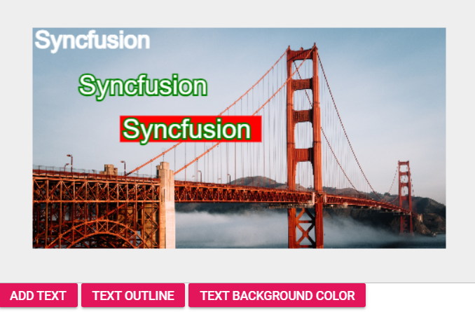
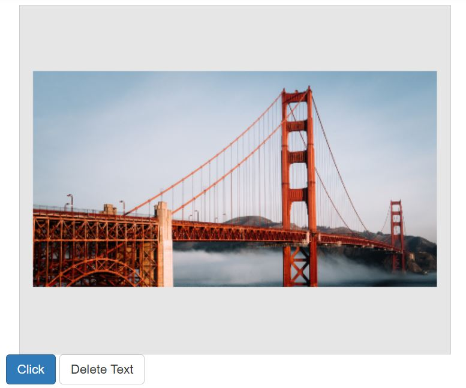
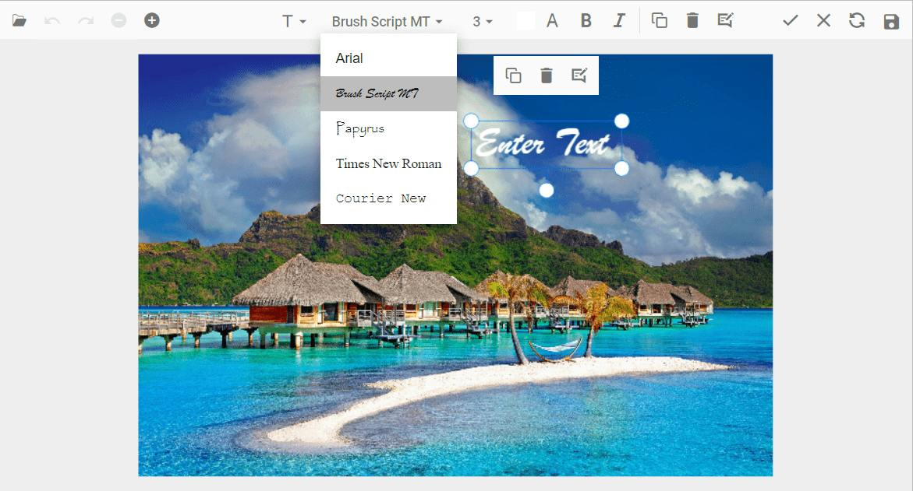
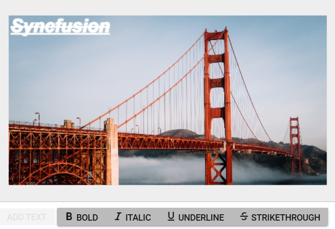
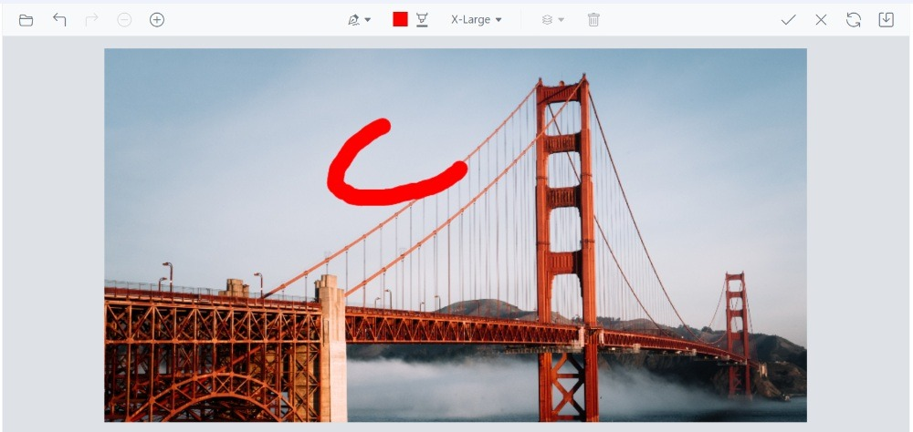
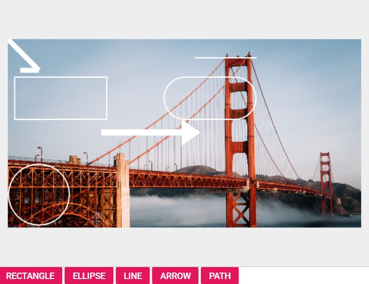
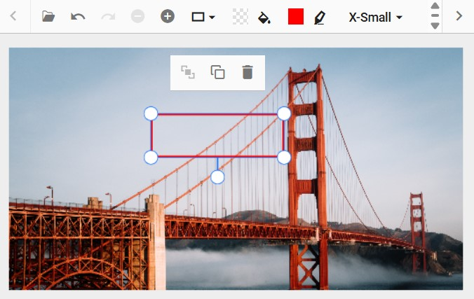
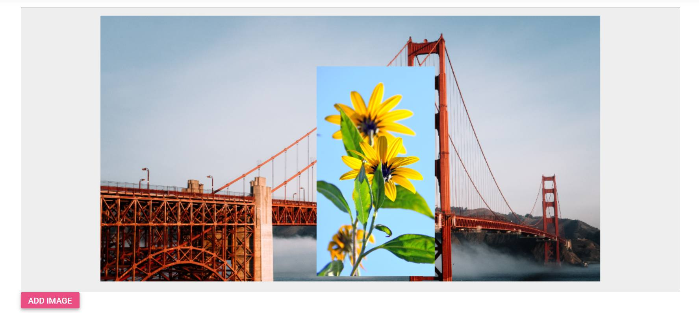

# Annotation in ##Platform_Name## ImageEditor

The Image Editor lets you add annotations to an image, including text, freehand drawings, and shapes such as rectangles, ellipses, arrows, paths, and lines. These tools help communicate and share ideas more clearly. Users can draw multiple annotations simultaneously, and every action—including customizations—is tracked in the undo/redo collection, so you can safely experiment with different designs.

> **Important:** This page is shared by ASP.NET Core and ASP.NET MVC. The `##Platform_Name##` placeholder and the `page.publishingplatform` value are resolved at build time to select the right snippet flavor.

## Text annotation

The text annotation feature in the Image Editor provides the capability to add and customize labels, captions, and other text elements directly onto the image. With this feature, you can easily insert text at specific locations within the image and customize various aspects of the text to meet your requirements. 

You have control over the customization options including text content, font family, font style, font color, fill color, stroke color, stroke width and font size for the text annotation. 

### Add text

The `drawText` method in the Image Editor allows you to insert a text annotation into the image with specific customization options. This method accepts the following parameters: 

| Parameter | Type | Default | Description |
| --- | --- | --- | --- |
| `text` | `string` | — | The text to render. Newline characters (`\n`) start a new line. |
| `x` | `number` | — | X-coordinate of the text, determining its horizontal position within the image. |
| `y` | `number` | — | Y-coordinate of the text, determining its vertical position within the image. |
| `fontFamily` | `string` | `"Arial"` | Specifies the font family of the text, allowing you to choose a specific typeface or style for the text. |
| `fontSize` | `number` | `12` | Specifies the font size of the text, determining its relative size within the image. |
| `bold` | `boolean` | `false` | Specifies whether the text should be displayed in bold style. Set to true for bold text, and false for regular text. |
| `italic` | `boolean` | `false` | Specifies whether the text should be displayed in italic style. Set to true for italic text, and false for regular text. |
| `underline` | `boolean` | `false` | Renders the text underlined. |
| `strikethrough` | `boolean` | `false` | Specifies whether the text should have a strikethrough. |
| `color` | `string` | `"#000000"` | Specifies the font color of the text, allowing you to define the desired color using appropriate color values or names. |
| `fillColor` | `string` | `"transparent"` | Specifies the background color of the text. |
| `strokeColor` | `string` | `"transparent"` | Specifies the outline color of the text annotation. |
| `strokeWidth` | `number` | `1` | Specifies the outline stroke width of the text annotation. |
| `degree` | `number` | `0` | Rotation angle, in degrees (-360 to 360). |
| `isSelected` | `boolean` | `false` | Specifies to show the text in the selected state. |
| `transformCollection` | `ImageEditorTransform[]` | `[]` | Specifies the transform collection of the text annotation. |

Use `drawText` with these parameters to position and customize text annotations. Add labels, captions, or any text with specific font styles, sizes, and colors to enhance the image's visual clarity. 

Here is an example of adding a text in a button click using `drawText` method. 
























Output be like the below.

### Add multiline text

The `drawText` method in the Image Editor control is commonly used to insert text annotations into an image. If the provided text parameter contains a newline character (\n), the text will be automatically split into multiple lines, with each line appearing on a separate line in the annotation. 

Here is an example of adding a multiline text in a button click using `drawText` method.
























Output be like the below.

### Delete text

The `deleteShape` method in the Image Editor control allows you to remove a text annotation from the Image Editor. To use this method, you need to pass the `shapeId` of the annotation as a parameter.

The `shapeId` is a unique identifier assigned to each text annotation within the Image Editor. It serves as a reference to a specific annotation, enabling targeted deletion of the desired text element. By specifying the `shapeId` associated with the text annotation you want to remove, you can effectively delete it from the Image Editor.

To retrieve inserted text annotations, call the `getShapeSetting` method, which returns a collection of `ShapeSettings` you can use to find the `shapeId` of the annotation you want to remove.

> **Important:** The `shapeId` assigned to an annotation is also available in the `onShapeInserted` and `shapeSelecting` event payloads, so you don't need to traverse `getShapeSetting` if you capture the id at insertion time.

The following example deletes a text annotation in a button click handler using `deleteShape`.
























Output be like the below.

### Customize font family and text color

The `shapeChanging` event fires when a text annotation is modified through the toolbar. It lets you change the text's color and font family by adjusting the relevant properties before the change is committed.

Use the `shapeChanging` event to enhance the customization options for text annotations and provide a tailored, interactive experience within the Image Editor control.

The following example changes the text's color and font family using the `shapeChanging` event.
























Output be like the below.

### Add a custom font family

The `FontFamily` property in the Image Editor control accepts an array of font entries so you can supplement the default font list. Each entry is identified by its `id`, which the toolbar uses to look up the rendered font.

Use the `FontFamily` property to broaden the customization options for text annotations. Users then choose from a wider font list in the toolbar.

> **Important:** A custom font must be registered with CSS `@font-face`, a web font service, or a system fallback before the editor initializes, or the toolbar label will list the family but the canvas will fall back to the system font.

The following example adds an additional font family to the text annotation using the `FontFamily` property.
























Output be like the below.

### Format text with bold, italic, underline, and strikethrough

The `drawText` method in the Image Editor control allows you to insert a text annotation into the image with specific customization options. Applying these styles enhances the text by improving readability and emphasizing key information, where bold increases visual weight to highlight important points, italic adds a slanted emphasis or creative touch, underline draws a line beneath the text for clarity or separation, and strikethrough places a line through text to indicate removal or outdated content. These formatting options enable users to make their annotations more visually distinctive and effective in conveying information.
























Output be like the below.

## Freehand drawing

The Freehand Draw annotation tool in the Image Editor control lets users draw and sketch directly on the image using mouse or touch input. Use it to add freehand drawings or annotations to the image.

The `freehandDraw` method enables or disables freehand drawing in the Image Editor control.

The following example toggles freehand drawing in a button click handler.
























Output be like the below.

### Adjust stroke width and color

The `shapeChanging` event fires when a freehand annotation is modified through the toolbar. It lets you change the freehand annotation's color and stroke width by adjusting the relevant properties before the change is committed.

Use the `shapeChanging` event to enhance the customization options for freehand annotations and provide a tailored, interactive experience within the Image Editor control.

The following example changes the freehand draw stroke width and color using the `shapeChanging` event.
























Output be like the below.

### Delete a freehand drawing

The `deleteShape` method in the Image Editor allows you to remove a freehand annotation from the Image Editor. To use this method, you need to pass the `shapeId` of the annotation as a parameter.

The `shapeId` is a unique identifier assigned to each freehand annotation within the Image Editor. It serves as a reference to a specific annotation, enabling targeted deletion of the desired annotation. By specifying the `shapeId` associated with the freehand annotation you want to remove, you can effectively delete it from the Image Editor.

To retrieve inserted freehand annotations, call the `getShapeSetting` method, which returns a collection of `ShapeSettings` you can use to find the `shapeId` of the annotation you want to remove.

> **Important:** The `shapeId` assigned to an annotation is also available in the `onShapeInserted` and `shapeSelecting` event payloads, so you don't need to traverse `getShapeSetting` if you capture the id at insertion time.

The following example deletes a freehand annotation in a button click handler using `deleteShape`.
























Output be like the below.

## Shape annotations

The Image Editor control provides the ability to add shape annotations to an image. These shape annotations include rectangles, ellipses, arrows, paths, and lines, allowing you to highlight, emphasize, or mark specific areas or elements within the image. 

### Add a rectangle, ellipse, line, arrow, or path

The `drawRectangle` method is used to insert a rectangle into the Image Editor control. Rectangle annotations are valuable tools for highlighting, emphasizing, or marking specific areas of an image to draw attention or provide additional context.

The `drawRectangle` method in the Image Editor control takes ten parameters to define the properties of the rectangle annotation: 

* x: Specifies the x-coordinate of the top-left corner of the rectangle. 

* y: Specifies the y-coordinate of the top-left corner of the rectangle. 

* width: Specifies the width of the rectangle. 

* height: Specifies the height of the rectangle. 

* strokeWidth: Specifies the stroke width of the rectangle's border. 

* strokeColor: Specifies the stroke color of the rectangle's border. 

* fillColor: Specifies the fill color of the rectangle.

* degree: Specifies the degree to rotate the rectangle.

* isSelected: Specifies to show the rectangle in the selected state.

* borderRadius: Specifies the radius to apply border radius to rectangle.

The `drawEllipse` method is used to insert an ellipse into the Image Editor control. Ellipse annotations are valuable for highlighting, emphasizing, or marking specific areas of an image.

The `drawEllipse` method in the Image Editor control takes nine parameters to define the properties of the ellipse annotation: 

* x: Specifies the x-coordinate of the center of the ellipse. 

* y: Specifies the y-coordinate of the center of the ellipse. 

* radiusX: Specifies the horizontal radius (radiusX) of the ellipse. 

* radiusY: Specifies the vertical radius (radiusY) of the ellipse. 

* strokeWidth: Specifies the width of the ellipse's stroke (border). 

* strokeColor: Specifies the color of the ellipse's stroke (border). 

* fillColor: Specifies the fill color of the ellipse. 

* degree: Specifies the degree to rotate the ellipse.

* isSelected: Specifies to show the ellipse in the selected state.

The `drawLine` method is used to insert a line into the Image Editor control. Line annotations are valuable for highlighting, emphasizing, or marking specific areas of an image.

The `drawLine` method in the Image Editor control takes six parameters to define the properties of the line annotation:

* startX - Specifies the x-coordinate of the start point.

* startY - Specifies the y-coordinate of the start point.

* endX - Specifies the x-coordinate of the end point.

* endY - Specifies the y-coordinate of the end point.

* strokeWidth - Specifies the stroke width of the line.

* strokeColor - Specifies the stroke color of the line.

* isSelected: Specifies to show the line in the selected state.

The `drawArrow` method is used to insert an arrow into the Image Editor control. Arrow annotations are valuable for highlighting, emphasizing, or marking specific areas of an image.

The `drawArrow` method in the Image Editor control takes nine parameters to define the properties of the arrow annotation: 

* startX - Specifies the x-coordinate of the start point. 

* startY - Specifies the y-coordinate of the start point. 

* endX - Specifies the x-coordinate of the end point. 

* endY - Specifies the y-coordinate of the end point. 

* strokeWidth - Specifies the stroke width of the arrow. 

* strokeColor - Specifies the stroke color of the arrow. 

* arrowStart - Specifies the arrowhead as ImageEditorArrowHeadType at the start of arrow.

* arrowEnd - Specifies the arrowhead as ImageEditorArrowHeadType at the end of the arrow.

* isSelected: Specifies to show the arrow in the selected state.

The `drawPath` method is used to insert a path into the Image Editor control. Path annotations are valuable for highlighting, emphasizing, or marking specific areas of an image.

The `drawPath` method in the Image Editor control takes four parameters to define the properties of the path annotation: 

* points - Specifies collection of x and y coordinates as ImageEditorPoint to draw a path. 

* strokeWidth - Specifies the stroke width of the path. 

* strokeColor - Specifies the stroke color of the path. 

* isSelected: Specifies to show the path in the selected state.

Here is an example of inserting rectangle, ellipse, arrow, path, and line in a button click event.
























Output be like the below.

### Delete a shape 

The `deleteShape` method in the Image Editor allows you to remove a shape annotation from the Image Editor. To use this method, you need to pass the `shapeId` of the annotation as a parameter. 

The `shapeId` is a unique identifier assigned to each shape annotation within the Image Editor. It serves as a reference to a specific annotation, enabling targeted deletion of the desired annotation. By specifying the `shapeId` associated with the shape annotation you want to remove, you can effectively delete it from the Image Editor.

To retrieve inserted shape annotations, call the `getShapeSetting` method, which returns a collection of `ShapeSettings` you can use to find the `shapeId` of the annotation you want to remove.

> **Important:** The `shapeId` assigned to an annotation is also available in the `onShapeInserted` and `shapeSelecting` event payloads, so you don't need to traverse `getShapeSetting` if you capture the id at insertion time.

The following example deletes a shape annotation in a button click handler using `deleteShape`. 
























Output be like the below.

### Customize default stroke color for shapes

Default settings for stroke color, stroke width, fill color, and other customizations are exposed on the editor. To modify only the defaults while preserving previously selected customizations, use the `shapeChanging` event. Inside the event handler, update the values in the `currentShapeSettings` object to apply your own preferences instead of the defaults. This lets you conditionally update `currentShapeSettings`, so only the desired defaults change while the other settings remain intact.
























Output be like the below.

## Image annotations

The image annotation feature in the Image Editor provides the capability to add and customize images directly onto the image. With this feature, you can easily insert images or icons at specific locations within the image and customize various aspects of the image to meet your requirements. You have control over the customization options including rotate, flip, transparency for the image annotation.

### Add an image annotation

The `drawImage` method serves the purpose of inserting an image into the Image Editor control, allowing for image annotations to be added. These image annotations can be used for various purposes, such as adding logos, watermarks, or decorative elements to the image.

The `drawImage` method in the Image Editor control takes nine parameters to define the properties of the image annotation:

* data: Specifies the image data or URL of the image to be inserted.

* x: Specifies the x-coordinate of the top-left corner of the image.

* y: Specifies the y-coordinate of the top-left corner of the image.

* width: Specifies the width of the image.

* height: Specifies the height of the image.

* isAspectRatio: Specifies whether the image is rendered with aspect ratio or not.

* degree: Specifies the degree to rotate the image.

* opacity: Specifies the value for the image.

* isSelected: Specifies to show the image in the selected state.

In the following example, you can use the `drawImage` method in the button click event.
























Output be like the below.

> **Important:** Verify the API names below against the Syncfusion Essential Studio release notes for your target version. Earlier releases used different method signatures for `drawArrow`, `drawPath`, and `drawEllipse`. See the [ImageEditor release notes](../../Release-notes) for version-specific changes.

> **Important:** Verify the API names below against the Syncfusion Essential Studio release notes for your target version. Earlier releases used different method signatures for `drawArrow`, `drawPath`, and `drawEllipse`. See the [ImageEditor release notes](../../Release-notes) for version-specific changes.
