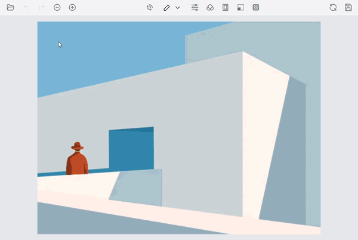
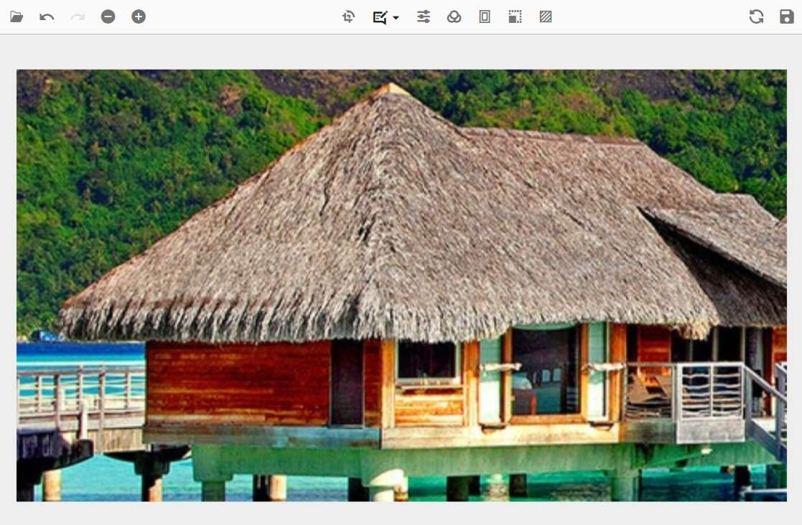
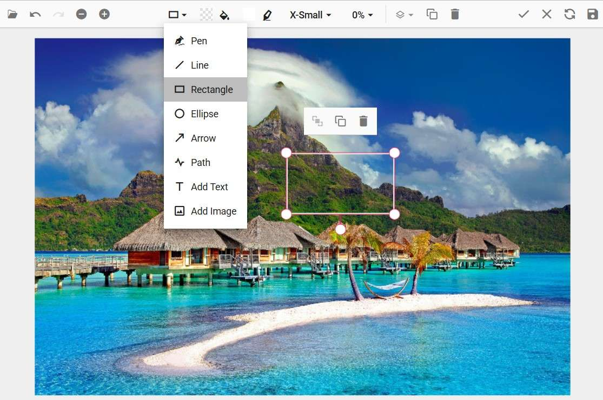

# End-user capabilities in ##Platform_Name## ImageEditor

The following operations are available to end users and are explained briefly in the sections below.

## Opening an image

To open an image in the Image Editor, follow these steps:

* Click the Open icon on the left side of the toolbar.

* The file explorer lists only JPEG, PNG, WEBP, and BMP formats.

* Select the image in the file explorer window to load it.

{:width="600"}

> **Important:** You can also drag an image from your desktop directly onto the canvas, or paste one with <kbd>Ctrl + V</kbd>.

## Zooming

Use any of the following methods to zoom an image in or out:

* Using the toolbar
* Using pinch zoom on touch-enabled devices
* Using the mouse wheel
* Using a keyboard shortcut

{:width="600"}

### Using the toolbar

Click the Zoom In or Zoom Out button on the toolbar. The Zoom In / Zoom Out options are enabled only after an image is opened.

### Using pinch

Touch with two fingers and spread or pinch them to zoom in or out. Zoom is controlled by the touch gesture.

### Using the mouse wheel

Press <kbd>Ctrl</kbd> and scroll the mouse wheel to zoom in or out.

### Using the keyboard

* Press <kbd>Ctrl + +</kbd> to zoom in.
* Press <kbd>Ctrl + -</kbd> to zoom out.
* Press <kbd>Ctrl + 0</kbd> to reset to 100% (fit-to-screen on mobile).

> **Important:** On macOS use <kbd>⌘</kbd> in place of <kbd>Ctrl</kbd>. On macOS trackpads, two-finger pinch also zooms when the canvas is focused.

> **Important:** Double-click the canvas to reset the zoom to 100%; the toolbar's Fit button fills the editor area with the entire image.

## Panning

Click and drag the image to pan the visible area. Panning is enabled in the following cases:

* When you have an active crop selection.
* When the image size exceeds the canvas size while zoomed in.

{:width="600"}

> **Important:** On touch devices, two-finger drag pans the canvas instead of drawing a freehand stroke.

## Cropping and image transformation

Click the Crop button on the toolbar to open the contextual toolbar with crop, rotate, flip, and straightening options. To crop or transform the image, follow these steps:

* Cropping is performed on an active selection in the Image Editor.

* From the contextual toolbar, select a selection type—custom, circle, square, or a preset ratio (1:1, 4:3, 16:9, 3:4, 9:16, free)—to draw the crop region.

* Once the selection is drawn, drag the canvas to reposition the cropped region.

* Use the rotate and flip buttons, plus the Straighten slider, to apply transformations to the image and any inserted annotations.

* When the region is correct, click the tick icon at the top-right of the toolbar to apply the crop.

{:width="600"}

> **Important:** The Straighten slider range is ±45°. Rotate and flip are applied to inserted annotations as well. Cropping is destructive: pixels outside the region are discarded unless you cancel before clicking the tick icon.

## Annotations

To add annotations to the image, follow these steps:

* Click the annotation button on the toolbar and select the annotation type—Line, Rectangle, Ellipse, Path, Arrow, Text, Image, or Freehand drawing.

* Once an annotation is added, you can reposition it by clicking and dragging, and resize it by dragging the selection handle around it.

* To rotate an annotation, drag the rotation handle at the bottom of the annotation. Rotation through the handle is not available for text annotations; rotate them through the API instead (see [annotation.md](annotation.md)).

* Customize the annotation's color, stroke width, fill, font family, and font size in the contextual toolbar that appears when the annotation is selected.

* When an annotation is selected, the quick-access toolbar offers duplicate, delete, and (for text) edit-in-place actions.

{:width="600"}

> **Important:** Single-click an annotation to select it. Press <kbd>Shift</kbd> + click to add or remove an annotation from a multi-selection. Sizing handles and the rotation handle are keyboard-focusable.

## Filtering and fine-tuning

### Fine-tune

To fine-tune the image, follow these steps:

* Click the Fine-Tune button to display the available fine-tune controls—Brightness, Contrast, Hue, Saturation, Blur, Sharpen, Exposure, and Noise.

* Select a fine-tune option to display its adjustment slider.

* Click the canvas or the tick icon at the top-right of the toolbar to apply the change. Press <kbd>Esc</kbd> while the slider is focused to discard the change.

{:width="600"}

### Filters

To apply a filter to the image, follow these steps:

* Click the Filter button to display the available filters.

* Click a filter from the list to apply it to the image.

* Click the canvas or the tick icon at the top-right of the toolbar to apply the change. Press <kbd>Esc</kbd> while the filter menu is open to discard.

{:width="600"}

> **Important:** Fine-tune sliders operate on a −100 to +100 range and are non-destructive until you click the canvas or the tick icon. Background processing may take a few seconds for very large images.

## Undo and redo

To undo or redo an action, follow these steps:

* The Undo button is enabled once you make an edit.

* The Redo button is enabled once you click Undo.

* Click the Undo or Redo button on the left side of the toolbar.

* Press <kbd>Ctrl + Z</kbd> to undo or <kbd>Ctrl + Y</kbd> to redo. On macOS use <kbd>⌘ + Z</kbd> and <kbd>⌘ + Shift + Z</kbd>.

{:width="600"}

> **Important:** The maximum history depth depends on the Syncfusion Essential Studio build. See the [ImageEditor release notes](../../Release-notes) for version-specific limits.

## Resetting an image

Click the Reset button on the right side of the toolbar to discard all changes and return the image to its original state.

> **Important:** The Reset action clears the undo and redo history; previous changes cannot be restored after a reset.

## Exporting an image

To save the modifications, follow these steps:

### Save with the toolbar

* Click the Save button on the right side of the toolbar.
* In the export popup, choose the file format—PNG, JPEG, SVG, or WEBP.
* For JPEG, use the Image Quality slider to set the quality (0–100). Higher values retain more detail but increase file size.
* Click *Download* to save the modified image.

{:width="600"}

### Save with the keyboard shortcut

Press <kbd>Ctrl + S</kbd> (or <kbd>⌘ + S</kbd> on macOS) to download the image in the same format and quality as the loaded source image without opening the Save dialog. For example, if the loaded image is PNG, the file is saved as PNG.

> **Important:** SVG export preserves rasterized shapes only; for vector fidelity, serialize annotations to JSON through the API. Cross-origin or unsupported sources fail silently—use same-origin or data: URLs.

> **Important:** Verify the toolbar layout in this page against the Syncfusion Essential Studio release notes for your target version. The toolbar position and icon order changed across ImageEditor releases. See the [ImageEditor release notes](../../Release-notes) for version-specific changes.

## See also

* [Getting started with the ##Platform_Name## ImageEditor](getting-started.md)
* [Annotations](annotation.md)
* [Accessibility in the ##Platform_Name## ImageEditor](accessibility.md)
* [Toolbar customization](toolbar.md)
* [Syncfusion® Essential Studio release notes](../../Release-notes)