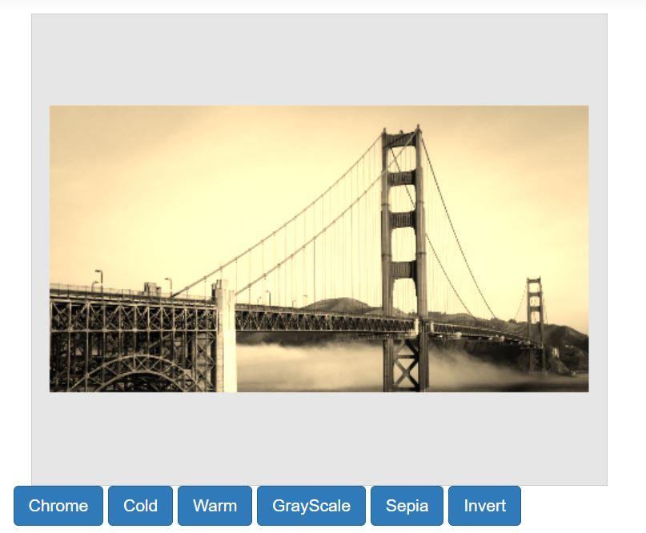

# Filters in the ##Platform_Name## Image Editor control

Filters are pre-defined effects that can be applied to an image to alter its appearance or mood. Image filters can be used to add visual interest or to enhance certain features of the image. Some common types of image filters include cold, warm, chrome, sepia, and invert. This can be done by either using the toolbar or the [`applyImageFilter`] method which takes a single parameter: the filter applied to an image.

## Apply filter effect

The `applyImageFilter` method is utilized to apply filters to an image. By passing the desired filter type as the first parameter of the method, specified as `ImageFilterOption` the method applies the corresponding filter to the image. This allows for easy and convenient application of various filters to enhance or modify the image based on the chosen filter type.

The `applyImageFilter` method is used to perform filtering by specifying the type of filter as ImageFilterOption and send it a first parameter of the method. 

Here is an example of filtering using the `applyImageFilter` method.
























Output be like the below.

## Image filtering event 

The [`imageFiltering`](https://help.syncfusion.com/cr/aspnetmvc-js2/Syncfusion.EJ2.ImageEditor.ImageEditor.html#Syncfusion_EJ2_ImageEditor_ImageEditor_ImageFiltering) event is triggered when applying filtering on the image. This event is passed an object that contains information about the filtering event, such as the type of filtering. 

The parameter available in the `ImageFilterEventArgs` event is, 

ImageFilterEventArgs.filter - The type of filtering as ImageFilterOption to be applied in the image editor. 

ImageFilterEventArgs.cancel – Specifies to cancel the filtering action. 
