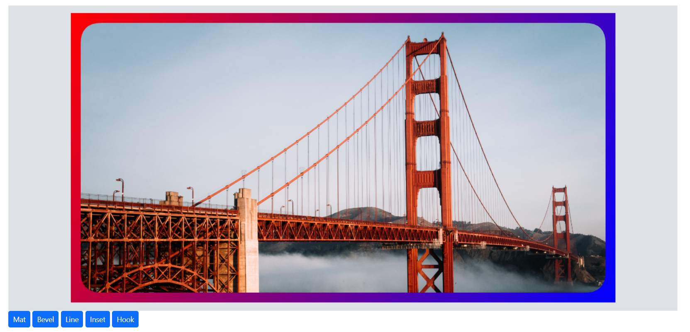

# Frames in the ##Platform_Name## Image Editor control

The frame feature in an Image Editor provides users with the capability to add decorative borders or frames around their images. Frames are a visual design element that can enhance the overall appearance and appeal of an image.

## Apply frame to the image

The `drawFrame` method is a function designed to enable the application of various frame options to an image. This method simplifies the process of adding decorative frames, such as mat, bevel, line, hook, and inset, to an image by allowing users to specify their desired frame type.

Depending on the frame type selected, users may have additional customization options, such as adjusting the frame's thickness, color, texture, or other attributes. This allows for fine-tuning the appearance of the frame to match the image's theme or the user's preferences

The `drawFrame` method in the Image Editor control takes nine parameters to define the properties of the frame to the image:

* frameType - Specified the image data or url of the image to be inserted.

* Color - Specifies the color for the frame.

* gradientColor - Specifies the gradient color for the frame.

* size - Specifies the size of the frame.

* inset - Specifies the inset value for line, hook, and inset type frames.

* offset - Specifies the offset value for line and inset type frames.

* borderRadius - Specifies the border radius for line type frame.

* frameLineStyle - Specifies the frame line style for line type frame.

* lineCount - Specifies the line count for the line type frame. 

Here is an example of Frame using the `drawFrame` method.
























Output be like the below.

## Frame changing event

The [`frameChanging](https://help.syncfusion.com/cr/aspnetmvc-js2/Syncfusion.EJ2.ImageEditor.ImageEditor.html#Syncfusion_EJ2_ImageEditor_ImageEditor_FrameChange) event is triggered when applying frame on the image. This event provides information encapsulated within an object, which includes details about the frame applied in an image. This information encompasses:

Frame Type: This indicates the specific type of frame being applied, whether it's a mat, bevel, line, or hook.

Customization Values: These values contain information about any adjustments or modifications made to the frame. For instance, if the frame can be customized with attributes like color, size, or style, these details are conveyed within the event object.

The parameter available in the [`FrameChangeEventArgs`](https://help.syncfusion.com/cr/aspnetmvc-js2/Syncfusion.EJ2.ImageEditor.ImageEditor.html#Syncfusion_EJ2_ImageEditor_ImageEditor_FrameChange) is

* `FrameChangeEventArgs.previousFrameSetting` - The frame settings including size, color, inset, offset, gradient color which is applied before changing the frame.

* `FrameChangeEventArgs.currentFrameSetting` - The frame settings including size, color, inset, offset, gradient color which is going to apply after changing the frame.

* `FrameChangeEventArgs.cancel` - Specifies a boolean value to cancel the frame changing action.  