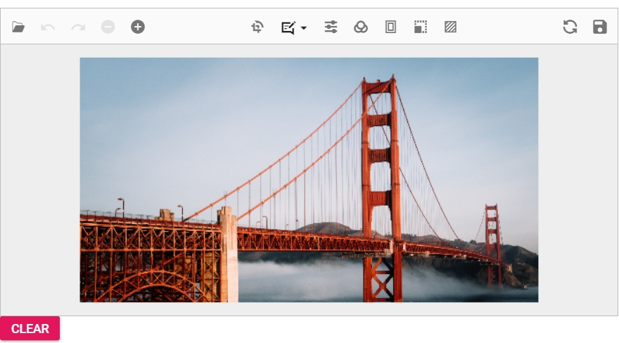

# Clear an Image ##Platform_Name## Image Editor control

The `clearImage` method in the image editor control is indeed useful for scenarios where you need to ensure that the image editor is emptied before reopening it, especially if the editor is used within a dialog. By using clearImage before closing the dialog, you can ensure that the editor does not retain the previously loaded image when the dialog is reopened. This allows users to start fresh with a new image selection.

Here is an example of clearing an Image using `clearImage` method. 
























Output be like the below.

