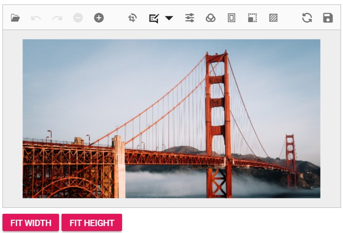

# Fit Image to Editor Width and Height

The Image Editor's `zoom` method to fit an image to the editor by width or height. Programmatically increase the zoom level until the image dimension matches the editor container's width or height. 

This example demonstrates scenarios that include buttons for fitting the image to its width (Fit Width) or height (Fit Height).
























Output be like the below.

