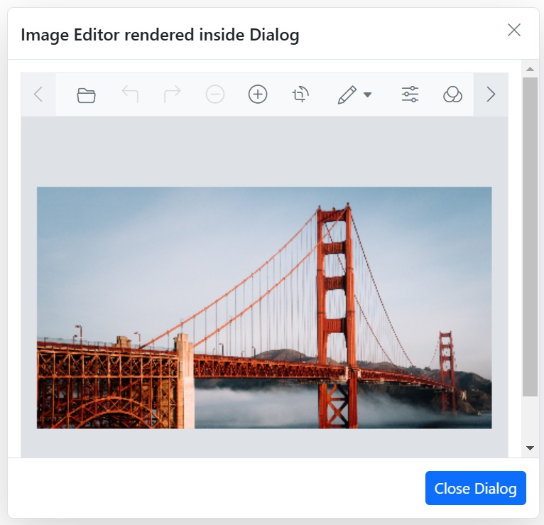

# Render Image Editor in Dialog

Rendering the [Image Editor](https://www.syncfusion.com/aspnet-core-ui-controls/image-editor) in a dialog involves displaying the image editor control within a modal dialog window, allowing users to edit images in a pop-up interface. This can be useful for maintaining a clean layout and providing a focused editing experience without navigating away from the current page.
























Output be like the below.

