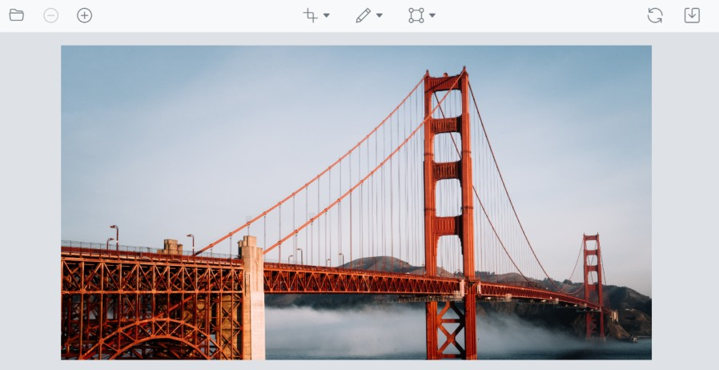

# Render Image Editor in Dialog

Image Editor is rendered within a dialog and opens an image by passing its URL path to the `open` method of the Image Editor control.

The following operations are supported in the Image Editor:

* Selection : Multiple selection options are available. The selection region can be a square or circle, customized to various aspect ratios, and customized by dragging and resizing.
* Crop : The image can be cropped based on the selection.
* Rotate : The image can be rotated both clockwise and anticlockwise by 90 degrees.
























Output be like the below.

