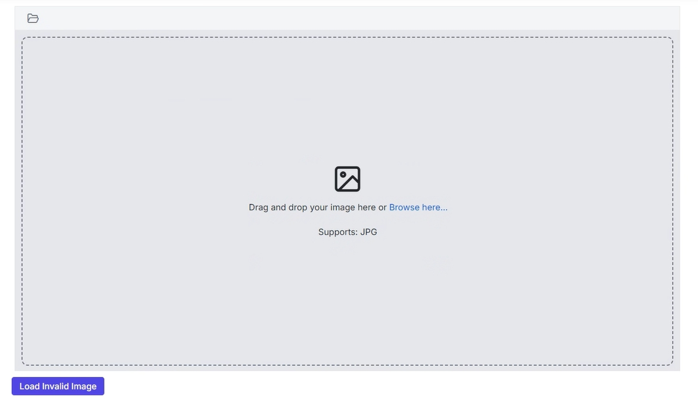

# Image Restrictions in the ##Platform_Name## Image Editor control

The Image Editor allows users to specify image extensions, as well as the minimum and maximum image sizes for uploaded or loaded images using the [`UploadSettings`](https://help.syncfusion.com/cr/aspnetmvc-js2/Syncfusion.EJ2.ImageEditor.ImageEditor.html#Syncfusion_EJ2_ImageEditor_ImageEditor_UploadSettings) property. End users will receive a clear alert message if an uploaded image does not meet the defined criteria, ensuring a seamless and user-friendly upload experience.

`Note:` File restrictions apply when uploading images to the Image Editor, whether through the open method or the built-in uploader.

## Allowed Image Extensions

The Image Editor allows users to specify acceptable file extensions for uploaded images using the `UploadSettings.AllowedExtensions` property, ensuring that only supported formats, such as `.jpg`, `.png`, and `.webp` and `.svg` are allowed. This helps maintain compatibility and prevents errors caused by unsupported file types. By default, the Image Editor allows files with .jpg, .png, .webp, and .svg extensions.

`Note:` To specify allowed extensions in upload settings, use the format: .png, .svg to denote the permitted file types.

Here is an example of configuring image restrictions using the [`UploadSettings`] property.
























Output be like the below.

## Minimum and Maximum Image Size

The Image Editor allows users to specify the minimum and maximum size limits for uploaded image files by using the `UploadSettings.MinFileSize` and `UploadSettings.MaxFileSize` properties. This ensures that images meet specific requirements, maintaining consistency and preventing oversized or undersized files from being processed.

`Note:` Users can also upload images as base64 strings, in which case file extension validation is bypassed, but file size restrictions still apply.

Here is an example of configuring image restrictions using the [`UploadSettings`] property.
























Output be like the below.

