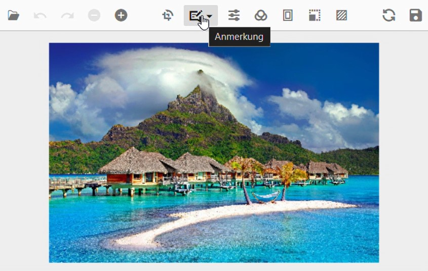

# Localization in the ##Platform_Name## Image Editor control

The `Localization` library allows you to localize the default text content of the Image Editor. The Image Editor has static text that can be changed to other cultures (Arabic, Deutsch, French, etc.) by defining the `locale` value and translation object.

The following list of properties and its values are used in the Image  Editor.

| Locale key words | Text |
| ------------ | ----------------------- |
| Crop | Crop |
| ZoomIn | Zoom In |
| ZoomOut | Zoom Out |
| Undo | Undo |
| Redo | Redo |
| Transform | Transform |
| Annotation | Annotation |
| Finetune | Finetune |
| Brightness | Brightness |
| Contrast | Contrast |
| Hue | Hue |
| Saturation | Saturation |
| Opacity | Opacity |
| Blur | Blur |
| Sharpen | Sharpen |
| Exposure | Exposure |
| Filter | Filter |
| Default | Default |
| Chrome | Chrome |
| Cold | Cold |
| Warm | Warm |
| Grayscale | Grayscale |
| BlackAndWhite | Black and White |
| Sepia | Sepia |
| Invert | Invert |
| Text | Add Text |
| Pen | Pen |
| Reset | Reset |
| Save | Save |
| Select | Select |
| RotateLeft | Rotate Left |
| RotateRight | Rotate Right |
| HorizontalFlip | Horizontal Flip |
| VerticalFlip | Vertical Flip |
| OK | Apply |
| Cancel | Discard |
| FillColor | Fill Color |
| StrokeColor | Stroke Color |
| StrokeWidth | Stroke Width |
| FontFamily | Font Family |
| FontStyle | Font Style |
| FontSize | Font Size |
| FontColor | Font Color |
| Pan | Pan |
| Move | Move |
| Load | Load |
| Custom | Custom |
| Square | Square |
| Circle | Circle |
| Ellipse | Ellipse |
| Rectangle | Rectangle |
| Line | Line |
| Arrow | Arrow |
| Path | Path |
| Bold | Bold |
| Italic | Italic |
| BoldItalic | Bold Italic |
| XSmall | X-Small |
| Small | Small |
| Medium | Medium |
| Large | Large |
| XLarge | X-Large |
| ABC | ABC |
| Browse | Browse |
| Duplicate | Duplicate |
| Remove | Remove |
| EditText | Edit Text |
| Start | Start |
| End | End |
| Bar | Bar |
| ArrowSolid | Arrow Solid |
| CircleSolid | Circle Solid |
| SquareSolid | Square Solid |
| None | None |
| CropAndTransform | Crop and Transform |
| CropSelection | Crop Selection |
| Image | Add Image |
| Transparency | Transparency |
| Height | Height |
| Width | Width |
| AspectRatio | Maintain aspect ratio |
| W | W |
| H | H |
| DragText | Drag and drop your image here or |
| DropText | Drop your image here or |
| BrowseText | Browse here... |
| SupportText | Supports: |
| Frame | Frame |
| Mat | Mat |
| Bevel | Bevel |
| Inset | Inset |
| Hook | Hook |
| Color | Color |
| Size | Size |
| Offset | Offset |
| Radius | Radius |
| Amount | Amount |
| Resize | Resize |
| 0 | 0% |
| 20 | 20% |
| 40 | 40% |
| 60 | 60% |
| 80 | 80% |
| 100 | 100% |
| 1 | 1 |
| 2 | 2 |
| 3 | 3 |
| 4 | 4 |
| 5 | 5 |
| Border | Border |
| Solid | Solid |
| Dashed | Dashed |
| Dotted | Dotted |
| GradientColor | Gradient Color |
| ConfirmDialogHeader | Confirm Save Changes |
| ConfirmDialogContent | Do you want to save the changes you made to the image? |
| AlertDialogHeader | Unsupported file |
| AlertDialogContent | The selected file is unsupported. |
| MinMaxSize | with file size between |
| MinMaxSizeAlert | File size between |
| MinSize | with minimum file size of |
| MinSizeAlert | A minimum file size of |
| MaxSize | with maximum file size of |
| MaxSizeAlert | A maximum file size of |
| To | to |
| Bytes | bytes |
| Yes | Yes |
| No | No |
| ImageErrorDialogHeader | Image Selection Error |
| ImageErrorDialogContent | Please select only one image to open. |
| Straighten | Straighten |
| NoOutline | No outline |
| DlgOK | OK |
| SaveAs | Save As |
| ImageName | Image name |
| Format | Format |
| Quality | Quality |
| Download | Download |
| Close | Close |
| ImageSize | Image Size |
| QualityInfo | The image quality option is only available for JPEG format |
| Good | Good |
| Great | Great |
| Highest | Highest |
| BringForward | Bring Forward |
| SendBackward | Send Backward |
| SendToBack | Send to Back |
| BringToFront | Bring to Front |
| ZOrder | Z-Order |
| Redact | Redact |
| Pixelate | Pixelate |
| BorderRadius | Border Radius |
| TextOutlineColor | Outline Color |
| TextOutlineWidth | Outline Width |
| PixelSize | Pixel Size |
| And | and |
























Output be like the below.

