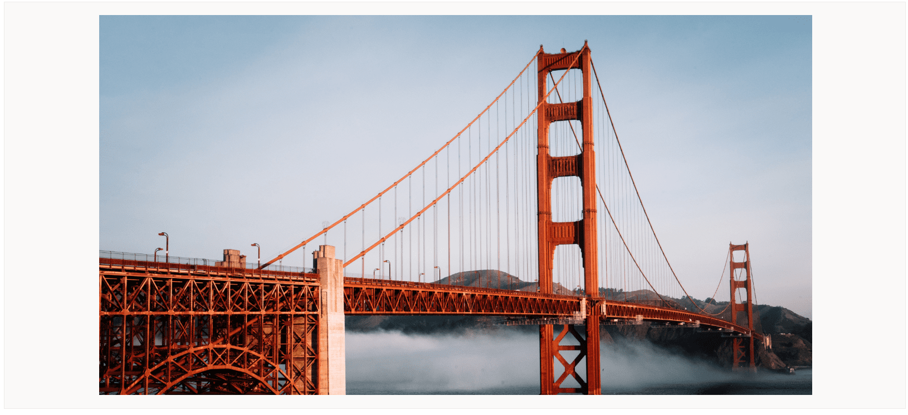
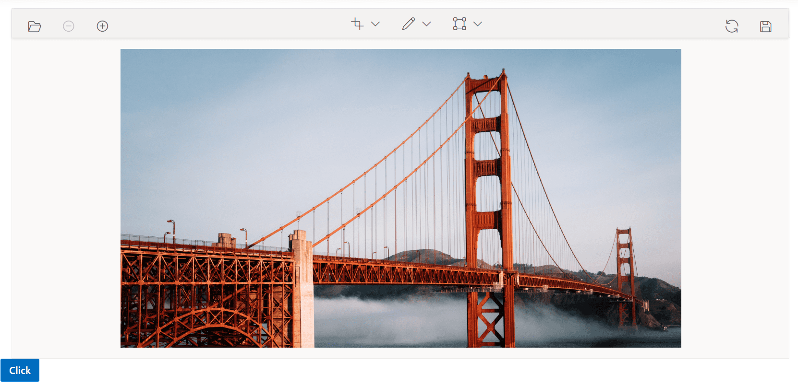

# Open and Save

The Image Editor control supports opening the image by using a hosted/online URL, Image Data, or base64. It also supports save options like image and base64.

## Open

The Image Editor control opens an image by using base64, Image Data, or a hosted/online URL using the `open` method. It also opens an image by clicking the open button from the toolbar. The supported file types are PNG, JPEG, SVG, and base64.
























Output be like the below.

## Save

The Image Editor control component saves the edited image as Image Data or images like PNG, JPEG, and SVG.

### Save as ImageData

The getImageData method is used to get the image as ImageData and this can be loaded to our Image Editor control using the open method.

### Save as Image

The `export` method is used to save the modified image as an image, and it accepts a file name and file type as parameters. The file type parameter supports PNG, JPEG, and SVG and the default file type is PNG. It also saves an image by clicking the save button from the toolbar and the supported file types are PNG, JPEG, and SVG.
























Output be like the below.

