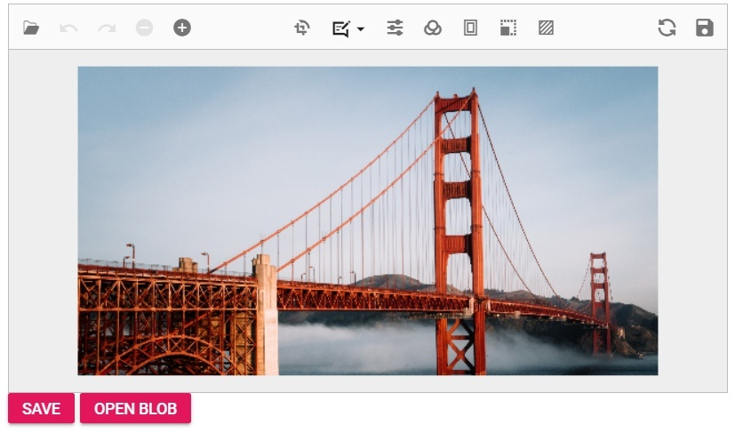
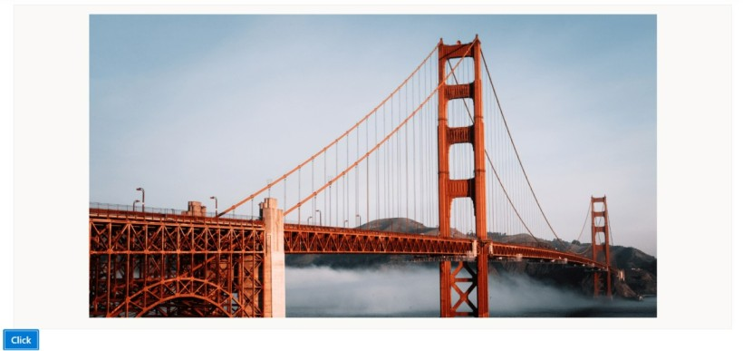

# Open and Save in the ##Platform_Name## Image Editor control

To import an image into the canvas, it must first be converted into a blob object. The Uploader component can be used to facilitate the process of uploading an image from the user interface. Once the image has been uploaded, it can then be converted into a blob and drawn onto the canvas. 

To save an edited image in the Image Editor control, use the toBlob method to convert it to a blob object. This will save the image with any annotations or filters that have been applied during the editing process. The saved image can be stored as raw image data or as an image file. 

## Open

The `open` method in the Image Editor control offers the capability to open an image by providing it in different formats. This method accepts various types of arguments, such as a base64-encoded string, raw image data, or a hosted/online URL. You can pass either the file name or the actual image data as an argument to the `open` method, and it will load the specified image into the Image Editor control. This flexibility allows you to work with images from different sources and formats, making it easier to integrate and manipulate images within the Image Editor control. 
























Output be like the below.

### Open an image from Base64 format

Users can easily open images in the Image Editor using a Base64-encoded string. This method allows you to load images directly from their Base64 representation, ensuring seamless integration and flexibility in your application. Simply pass the Base64 string to the open method, and the image will be loaded into the editor.

**Note:**: You can obtain the Base64 representation of an image from the Image Editor using the `getImageData` method. This process will be explained in the upcoming section.
























Output be like the below.

### Open an image from Blob storage.

User can easily open images in the Image Editor from Blob storage. This method allows you to load images directly from Blob storage, ensuring seamless integration and flexibility in your application. Simply retrieve the image Blob from storage and pass it to the open method, and the image will be loaded into the editor.

**Note:**: You can obtain the Base64 representation of an image from the Image Editor using the [`getImageData`] method. This process will be explained in the upcoming section.
























Output be like the below.

### Add Watermarks while opening an image

You can utilize the [`FileOpened`](https://help.syncfusion.com/cr/aspnetmvc-js2/Syncfusion.EJ2.ImageEditor.ImageEditor.html#Syncfusion_EJ2_ImageEditor_ImageEditor_FileOpened) event, which triggers once the image is loaded into the image editor. After this event, you can use the ‘drawText’ method to add a watermark. This approach allows the watermark to be automatically drawn on the canvas every time an image is opened in the editor, making it useful for handling copyright-related content.
























Output be like the below.

## Supported image formats 

The Image Editor control supports three common image formats: PNG, JPEG, and SVG. These formats allow you to work with a wide range of image files within the Image Editor. 

When it comes to saving the edited image, the default file type is set as PNG. This means that when you save the edited image without specifying a different file type, it will be saved as a PNG file. However, it's important to note that the Image Editor typically provides options or methods to specify a different file type if desired. This allows you to save the edited image in formats other than the default PNG, such as JPEG or SVG, based on your specific requirements or preferences. 

### Save as image

The `export` method in the Image Editor control enables you to save the modified image as a file on the local device. This method accepts two parameters: the file name and the file type. 

By providing a file name, you can specify the desired name for the saved image file. Additionally, you can also specify the quality and file type to determine the format in which the image should be saved. This allows you to save the image according to your specific requirements or preferences, such as PNG, JPEG, or SVG.

By utilizing the `export` method with the appropriate file name and file type, you can conveniently save the modified image as a file on the local device, ensuring that it is easily accessible and shareable.

In the following example, the `export` method is used in the button click event.
























Output be like the below.

### Save the image as base64 format

To save an image as a base64 format, use the [`getImageData`] method of the editor to retrieve the image data and convert it into a Data URL, which contains the base64-encoded string. By invoking the open method on the Syncfusion Image Editor instance, you can load this Data URL into the editor. The resulting base64 string can then be embedded directly in HTML or CSS or transmitted over data channels without requiring an external file.
























Output be like the below.

### Save the image aa byte[]

To save an image as a byte array (byte[]), use the [`getImageData`] method of the editor to retrieve the image data and convert it into a byte array. You can then invoke the open method on the Syncfusion Image Editor instance to load this byte array into the editor. The resulting byte array can be stored in a database for data management and maintenance.

### Save the image as blob

To save an image as a blob, use the [`getImageData`] method of the editor to retrieve the image data and convert it into a blob. You can then invoke the open method on the Syncfusion Image Editor instance to load this byte array into the editor. The resulting byte array can be stored in a database for data management and maintenance.
























Output be like the below.

### Add Watermarks while saving the image

You can utilize the [`FileOpened`]((https://help.syncfusion.com/cr/aspnetmvc-js2/Syncfusion.EJ2.ImageEditor.ImageEditor.html#Syncfusion_EJ2_ImageEditor_ImageEditor_FileOpened)) event, which triggers once the image is loaded into the image editor. After this event, you can use the [`drawText`](https://help.syncfusion.com/cr/aspnetcore-js2/syncfusion.ej2.imageeditor.imageeditor.html#Syncfusion_EJ2_ImageEditor_ImageEditor_DrawText) method to add a watermark. This approach allows the watermark to be automatically drawn on the canvas every time an image is opened in the editor, making it useful for handling copyright-related content.
























Output be like the below.

### Remove default Save button and add custom button to save the image to server

User can leverage the [`Toolbar`](https://help.syncfusion.com/cr/aspnetcore-js2/syncfusion.ej2.imageeditor.imageeditor.html#Syncfusion_EJ2_ImageEditor_ImageEditor_Toolbar) property to replace the default save button with a custom one. By doing so, you can use the [`getImageData`] method to retrieve the image data, convert it to base64 format, and then save it to the server. This approach gives you more control over the image-saving process.

### Prevent default save option and save the image to specific location

User can make use of the [`BeforeSave`](https://help.syncfusion.com/cr/aspnetcore-js2/syncfusion.ej2.imageeditor.imageeditor.html#Syncfusion_EJ2_ImageEditor_ImageEditor_BeforeSave) event, which triggers just before the image is downloaded, to override the default save option by setting [`args.cancel`] to true. Afterward, you can utilize the getImageData method to retrieve the current image data and convert it into a format like byte[], blob, or base64 for further processing. This gives you greater flexibility in handling the image data.

## File opened event

The [`FileOpened`](https://help.syncfusion.com/cr/aspnetmvc-js2/Syncfusion.EJ2.ImageEditor.ImageEditor.html#Syncfusion_EJ2_ImageEditor_ImageEditor_FileOpened) event is triggered in the Image Editor control after an image is successfully loaded. It provides the `FileOpenEventArgs` as the event argument, which contains two specific arguments: 

* FileName: This argument is a string that contains the file name of the opened image. It represents the name of the file that was selected or provided when loading the image into the Image Editor. 

* FileType: This argument is a string that contains the type of the opened image. It specifies the format or file type of the image that was loaded, such as PNG, JPEG, or SVG. 

By accessing these arguments within the FileOpened event handler, you can retrieve information about the loaded image, such as its file name and file type. This can be useful for performing additional actions or implementing logic based on the specific image that was opened in the Image Editor control.

## Saving event 

The [`saving`](https://help.syncfusion.com/cr/aspnetmvc-js2/Syncfusion.EJ2.ImageEditor.ImageEditor.html#Syncfusion_EJ2_ImageEditor_ImageEditor_Saved) event is triggered in the Image Editor control when an image is being saved to the local disk. It provides the `SaveEventArgs` as the event argument, which includes the following specific arguments: 

* FileName: This argument is a string that holds the file name of the saved image. It represents the name of the file that will be used when saving the image to the local disk. 

* FileType: This argument is a string indicating the type or format of the saved image. It specifies the desired file type in which the image will be saved, such as PNG, JPEG, or SVG. 

* Cancel: This argument is a boolean value that can be set to true in order to cancel the saving action. By default, it is set to false, allowing the saving process to proceed. However, if you want to prevent the saving action from occurring, you can set Cancel to true within the event handler. 

By accessing these arguments within the Saving event handler, you can retrieve information about the file name and file type of the image being saved. Additionally, you have the option to cancel the saving action if necessary.

## Created event 

The [`created`](https://help.syncfusion.com/cr/aspnetmvc-js2/Syncfusion.EJ2.ImageEditor.ImageEditor.html#Syncfusion_EJ2_ImageEditor_ImageEditor_Created) event is triggered once the Image Editor control is created. This event serves as a notification that the component has been fully initialized and is ready to be used. It provides a convenient opportunity to render the Image Editor with a predefined set of initial settings, including the image, annotations, and transformations. 

## Destroyed event

The [`destroyed`](https://help.syncfusion.com/cr/aspnetmvc-js2/Syncfusion.EJ2.ImageEditor.ImageEditor.html#Syncfusion_EJ2_ImageEditor_ImageEditor_Destroyed) event is triggered once the Image Editor control is destroyed or removed from the application. This event serves as a notification that the component and its associated resources have been successfully cleaned up and are no longer active.

## Reset an image

The `reset` method in the Image Editor control provides the capability to undo all the changes made to an image and revert it back to its original state. This method is particularly useful when multiple adjustments, annotations, or transformations have been applied to an image and you want to start over with the original, unmodified version of the image.

By invoking the `reset` method, any modifications or edits made to the image will be undone, and the image will be restored to its initial state. This allows you to easily discard any changes and begin again with the fresh, unaltered image.
