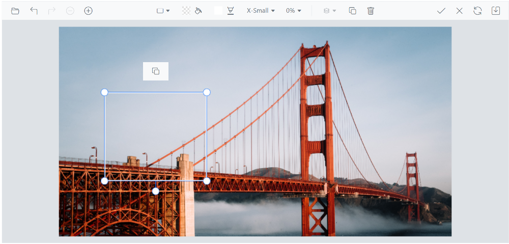

# Quick access toolbar in the ##Platform_Name## Image Editor control

The quick access toolbars in the Image Editor play a vital role in facilitating interactions with annotations like Rectangle, Ellipse, Line, Arrow, and Path. These toolbars offer a diverse array of tools and options that can be tailored to match the specific requirements and preferences associated with each annotation type. The toolbar is only displayed when an annotation is selected, ensuring a focused and contextual user experience.

The [`showQuickAccessToolbar`](https://help.syncfusion.com/cr/aspnetmvc-js2/Syncfusion.EJ2.ImageEditor.ImageEditor.html#Syncfusion_EJ2_ImageEditor_ImageEditor_ShowQuickAccessToolbar) property controls the visibility of the quick access toolbar. Users have the flexibility to enable or disable this toolbar, add or remove items, and create a personalized set of tools.

## Add a custom toolbar item

The quick access toolbar that appears when inserting annotations in the Image Editor is customizable using the [`QuickAccessToolbarOpening`](https://help.syncfusion.com/cr/aspnetmvc-js2/Syncfusion.EJ2.ImageEditor.ImageEditor.html#Syncfusion_EJ2_ImageEditor_ImageEditor_QuickAccessToolbarOpen) event. This event is triggered when the quick access toolbar is opened, allowing you to modify its contents. To add additional toolbar items to the quick access toolbar, you can access the ToolbarItems property of the [`QuickAccessToolbarEventArgs`](https://help.syncfusion.com/cr/aspnetmvc-js2/Syncfusion.EJ2.ImageEditor.ImageEditor.html#Syncfusion_EJ2_ImageEditor_ImageEditor_QuickAccessToolbarItemClick) object within the event handler. By adding or removing items from the ToolbarItems property based on the Item property, you can customize the options available in the quick access toolbar according to your needs. This gives you the ability to extend the functionality of the quick access toolbar and provide additional tools and options for working with inserted annotations.

Here is an example of adding the custom toolbar item to the quick access toolbar. 
























Output be like the below.

