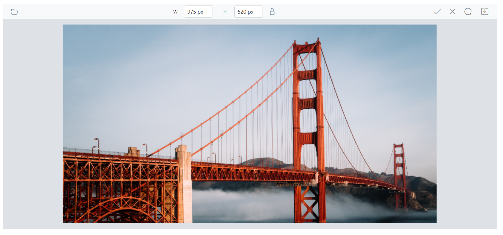

# Redact in the ##Platform_Name## Image Editor control

The redact feature in an Image Editor is a valuable tool that empowers users to conceal sensitive information by applying blur or pixel effects to specific areas of an image. This feature is particularly valuable for protecting privacy and complying with data protection regulations, making it easier to securely share images without compromising sensitive information.

## Apply redact to the image

The Image Editor control includes a `drawRedact` method, which allows you to draw redaction on an image. This method takes six parameters that define how the redact should be carried out:

* type: Specifies the type of redaction to be drawn on the image such as blur or pixelate. If not specified, the redaction drawing is initiated with the default blur value.

* x: Specifies x-coordinate of redaction. If not specified, the redaction drawing is initiated with the first parameter.

* y: Specifies y-coordinate of redaction. If not specified it draws redaction from the center point of the image.

* width: Specifies the width of redaction. The default value is 100.

* height: Specifies the height of redaction. The default value is 50.

* value: Specifies the blur value for blur-type redaction or the pixel size for pixelate-type redaction. Defaults to 20 since the default redaction is blur.

## Selecting a redact

The Image Editor control includes a `selectRedact` method, which allows you to select a redaction based on the given redaction id. Use `getRedacts` method to get the redaction id which is then passed to perform selection. This method takes one parameter that define how the redact should be carried out:

* id: Specifies the shape id to select a redact on an image.

## Deleting a redact

The Image Editor control includes a `deleteRedact` method, which allows you to delete a redaction based on the given redaction id. Use `getRedacts` method to get the redaction id which is then passed to perform selection. This method takes one parameter that define how the redact should be carried out:

* id: Specifies the shape id to delete a redact on an image.

## Updating a redact

The Image Editor control includes a `updateRedact` method, which allows you to update the existing redacts by changing its height, width, blur, and pixel size in the component. Use `getRedacts` method to get the redacts which is then passed to change the options of a redacts. This method takes two parameters that define how the redact should be carried out:

* setting: Specifies the redact settings to be updated for the shape on an image.

* isSelected: Specifies to show the redacts in the selected state.

## Getting redacts

The Image Editor control includes a `getRedacts` method, which allows you to get all the redact details which is drawn on an image editor.

Here's an example demonstrating how to draw, select, delete, update, and get redacts on an image using the `drawRedact`, `selectRedact`, `deleteRedact`, `updateRedact` and `getRedacts` methods.
























Output be like the below.

