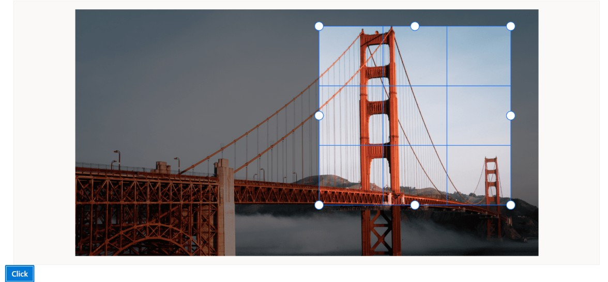

# Selection cropping in React Image editor component

The cropping feature in the Image Editor allows you to select and crop specific regions of an image. It offers different selection options, including custom shapes, squares, circles, and various aspect ratios such as 3:2, 4:3, 5:4, 7:5, and 16:9. 

To perform a selection, you can use the `select` method, which allows you to define the desired selection area within the image. Once the selection is made, you can then use the `crop` method to crop the image based on the selected region. This enables you to extract and focus on specific parts of the image while discarding the rest.

## Insert custom / square / circle region 

The `select` method allows to perform selection based on the type of selection. Here, the `select` method is used to perform the selection as custom, circle, or square. The selection region can also be customized using the select method based on the parameters below. 

* type - Specify the type of selection 

* startX - Specify the x-coordinate of the selection region’s starting point 

* startY - Specify the y-coordinate of the selection region’s starting point 

* width - Specify the width of the selection region 

* height - Specify the height of the selection region 

Here is an example of square selection using the `select` method. 
























Output be like the below.

## Insert selection based on aspect ratio 

The `select` method is used to perform the selection with the various aspect ratios such as 3:2, 4:3, 5:4, 7:5, and 16:9. The selection region can also be customized using the `select` method based on the parameters below. 

* type - Specify the type of selection 

* startX - Specify the x-coordinate of the selection region’s starting point 

* startY - Specify the y-coordinate of the selection region’s starting point 

Here is an example of ratio selection using the `select` method.
























Output be like the below.

## Crop an image 

The `crop` method allows cropping based on the selected region. Here is an example of cropping the selection region using the `crop` method. 

Here is an example of circle cropping using the `select` and `crop` method.
























Output be like the below.

## Cropping event 

The `cropping` event is triggered when performing cropping on the image. This event is passed an object that contains information about the cropping event, such as the start and end point of the selection region. 

The parameter available in the `cropping` event is, 

CroppingEventArgs.startPoint – The x and y coordinates of a start point as ImageEditorPoint of the selection region. 

CroppingEventArgs.endPoint - The x and y coordinates of an end point as ImageEditorPoint of the selection region. 

CroppingEventArgs.cancel - To cancel the cropping action. 
