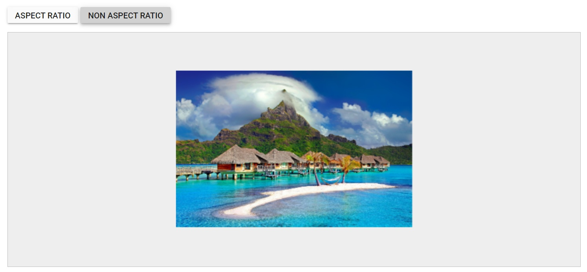

# Straightening in the ##Platform_Name## Image Editor control

The straightening feature in an Image Editor allows users to adjust an image by rotating it clockwise or counter clockwise. The rotating degree value should be within the range of -45 to +45 degrees for accurate straightening. Positive values indicate clockwise rotation, while negative values indicate counter clockwise rotation.

## Apply straightening to the image 

The Image Editor control includes a `straightenImage` method, which allows you to adjust the degree of an image. This method takes one parameter that define how the straightening should be carried out:

* degree: Specifies the amount of rotation for straightening the image. Positive values indicate clockwise rotation, while negative values indicate counterclockwise rotation.

Here is an example of straightening the image using the `straightenImage` method.
























Output be like the below.

