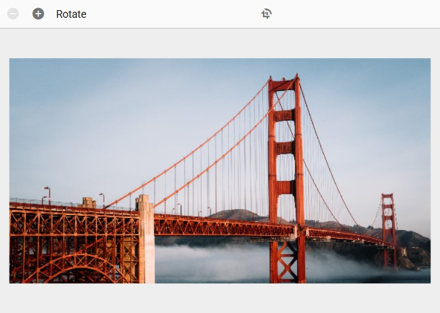
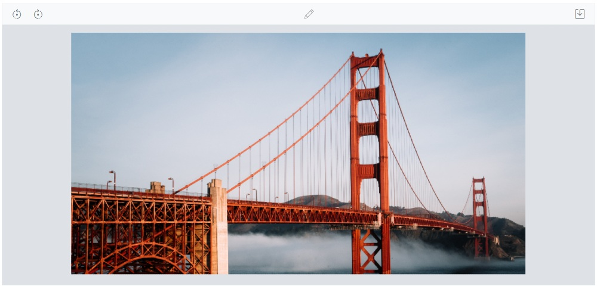
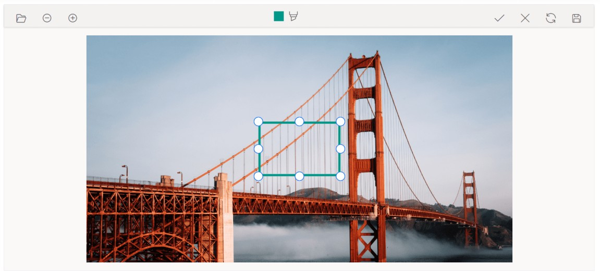
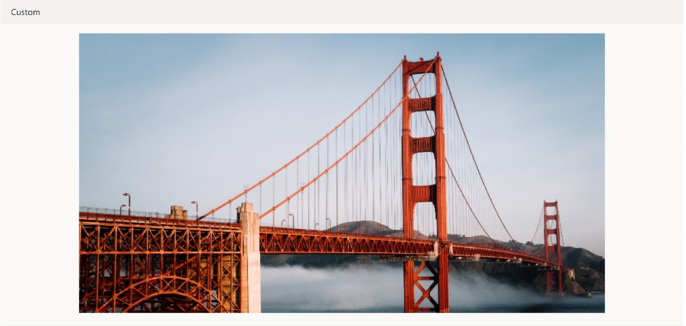
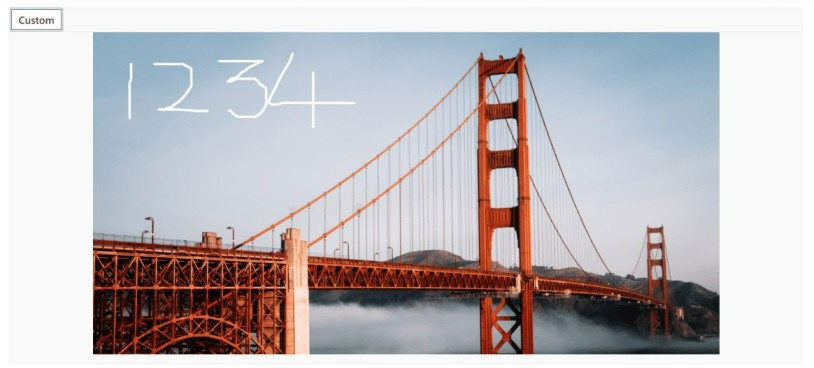

# Toolbar in the ##Platform_Name## Image Editor control

The toolbars in the Image Editor are a key component for interacting with and editing images. They provide a range of tools and options that can be customized to suit the needs and preferences. Add or remove items from the toolbar to create a personalized set of tools, or they can even create their own custom toolbar from scratch. This flexibility and customization allow them to create a unique image editing experience that is tailored to their specific needs and workflow. 

In the Image Editor, the toolbar property provides the ability to customize the toolbar by adding or removing items, as well as defining a completely custom toolbar. This feature is valuable for creating a personalized image editing experience that aligns with specific requirements and workflows. 

## Built-in toolbar items

Specifies the toolbar items to perform UI interactions. Refer to the built-in toolbar items for the default value.

* Open
* Undo
* Redo
* ZoomIn
* ZoomOut
* Crop
* RotateLeft
* RotateRight
* HorizontalFlip
* VerticalFlip
* Straightening
* Annotate
* Finetune
* Filter
* Frame
* Resize
* Redact
* Reset
* Save

## Add a custom toolbar item

The `toolbar` property in the Image Editor allows to add or remove toolbar items to include only the tools they frequently use, streamlining the editing process and reducing clutter. 

Here is an example of adding custom toolbar items to rotate and flip transformation using `toolbar` property. 
























Output be like the below.

## Show or hide a toolbar 

The [`toolbar`](https://help.syncfusion.com/cr/aspnetmvc-js2/Syncfusion.EJ2.ImageEditor.ImageEditor.html#Syncfusion_EJ2_ImageEditor_ImageEditor_Toolbar) property controls the visibility of the toolbar in the Image Editor. When the toolbar property is set to an empty list, the toolbar is hidden. Conversely, if the toolbar property contains a list of items, the toolbar is shown, displaying the specified items. This feature provides flexibility for users to personalize their image editing experience. 

Here is an example of hiding the toolbar of the image editor using `toolbar` property.
























Output be like the below.

## Show or hide a toolbar item

The [`toolbar`](https://help.syncfusion.com/cr/aspnetmvc-js2/Syncfusion.EJ2.ImageEditor.ImageEditor.html#Syncfusion_EJ2_ImageEditor_ImageEditor_Toolbar) property is utilized to control the visibility of toolbar items in the Image Editor. By default, the toolbar property includes the default toolbar items. So, if you wish to hide the default toolbar items then you need to explicitly define the required items using `toolbar` property. This allows you to customize the toolbar by displaying only the specific items you require, tailoring the editing experience to your preferences.

Here is an example of hiding the cropping and selection toolbar items using `toolbar` property.
























Output be like the below.

## Enable or disable a toolbar item

The [`toolbar`](https://help.syncfusion.com/cr/aspnetmvc-js2/Syncfusion.EJ2.ImageEditor.ImageEditor.html#Syncfusion_EJ2_ImageEditor_ImageEditor_Toolbar) property is employed to enable or disable toolbar items in the Image Editor. By default, the `toolbar` property includes the default toolbar items, and these items cannot be disabled. However, if you have defined custom toolbar items using the toolbarItemModel, you can enable or disable them by configuring their respective properties within the `toolbar` property. This provides the flexibility to control the availability and functionality of custom toolbar items based on your specific requirements. 

Here is an example of disabling the custom toolbar item using `toolbar` property.
























Output be like the below.

## Enable or disable a contextual toolbar item

The toolbarItems property in the toolbarEventArgs is used to enable or disable contextual toolbar items in the Image Editor. To enable or disable the default toolbar items, you can accomplish this by setting the Disabled property to true in the ImageEditorToolbarItemModel within the ToolbarItems property. This allows you to selectively enable or disable specific default toolbar items based on your requirements, providing a customized toolbar experience in the Image Editor.

## Customize contextual toolbar

The [`toolbarUpdating`](https://help.syncfusion.com/cr/aspnetmvc-js2/Syncfusion.EJ2.ImageEditor.ImageEditor.html#Syncfusion_EJ2_ImageEditor_ImageEditor_ToolbarUpdating) event is triggered when inserting or selecting annotations, which opens the contextual toolbar in the Image Editor. Within this event, the `toolbarItems` property in the `ToolbarEventArgs` is utilized to add or remove contextual toolbar items.

In the following example, the contextual toolbar for freehand drawing will be rendered with only the stroke color, while the stroke width, remove, and separator options are excluded using the toolbarUpdating event.
























Output be like the below.

## Add an additional contextual Toolbar item to text shape 

The contextual toolbar that appears when inserting annotations in the Image Editor is customizable using the [`toolbarUpdating`](https://help.syncfusion.com/cr/aspnetmvc-js2/Syncfusion.EJ2.ImageEditor.ImageEditor.html#Syncfusion_EJ2_ImageEditor_ImageEditor_ToolbarUpdating) event. This event is triggered when the contextual toolbar is rendered, allowing you to modify its contents. To add additional toolbar items to the contextual toolbar, you can access the `toolbarItems` property of the object within the event handler. By adding or removing items from the `toolbarItems` property based on the Item property, you can customize the options available in the contextual toolbar according to your needs. This gives you the ability to extend the functionality of the contextual toolbar and provide additional tools and options for working with inserted annotations.  

Here is an example of adding the custom toolbar item to the contextual toolbar. 
























Output be like the below.

## Toolbar created event 

The [`toolbarCreated`](https://help.syncfusion.com/cr/aspnetmvc-js2/Syncfusion.EJ2.ImageEditor.ImageEditor.html#Syncfusion_EJ2_ImageEditor_ImageEditor_ToolbarCreated) event is triggered after the toolbar is created in the Image Editor. This event can be useful when you need to perform any actions or make modifications to the toolbar once it is fully initialized and ready for interaction. By subscribing to the `toolbarCreated` event, you can access the toolbar object and perform tasks such as adding event handlers, customizing the appearance, or configuring additional functionality.

## Toolbar item clicked event 

The [`toolbarItemClicked`](https://help.syncfusion.com/cr/aspnetmvc-js2/Syncfusion.EJ2.ImageEditor.ImageEditor.html#Syncfusion_EJ2_ImageEditor_ImageEditor_ToolbarItemClicked) event is triggered when a toolbar item is clicked in the Image Editor. This event is particularly useful when you have added custom options to both the main toolbar and contextual toolbar, as it allows you to capture the user's interaction with those custom options. By subscribing to the `toolbarItemClicked` event, you can execute specific actions or handle logic based on the toolbar item that was clicked.

Here is an example of toolbar item clicking event using `toolbarItemClicked` property.
























Output be like the below.

## Toolbar template

The [`toolbarTemplate`](https://help.syncfusion.com/cr/aspnetmvc-js2/Syncfusion.EJ2.ImageEditor.ImageEditor.html#Syncfusion_EJ2_ImageEditor_ImageEditor_ToolbarTemplate) property in the Image Editor provides the capability to fully customize the toolbar by supplying a custom template. This feature is valuable when you want to create a distinct and personalized image editing experience that goes beyond the default toolbar or the customizable toolbar options offered by the Image Editor. By defining a custom template for the toolbar, you have complete control over its layout, appearance, and functionality. This empowers you to design a unique and tailored toolbar that aligns perfectly with your specific requirements and desired user experience. 

Here is an example of using `toolbarTemplate` to render only the button to toggle the freehand draw option. 
The toolbar of the Image Editor can be replaced with the user specific UI using the `toolbarTemplate` property.
























Output be like the below.

