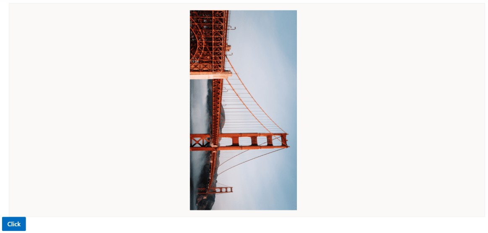
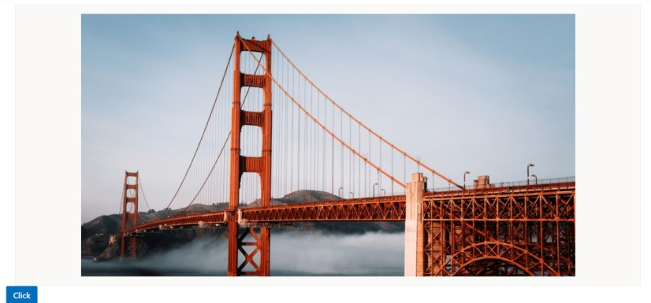
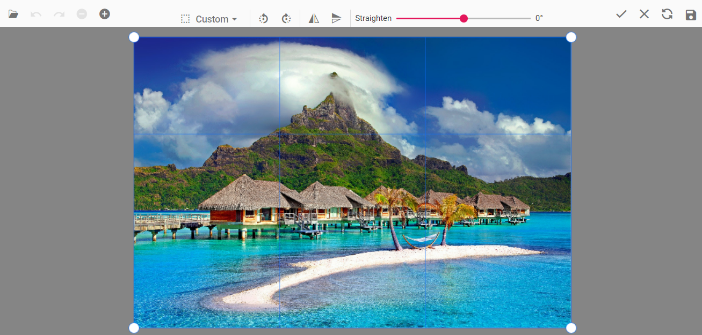
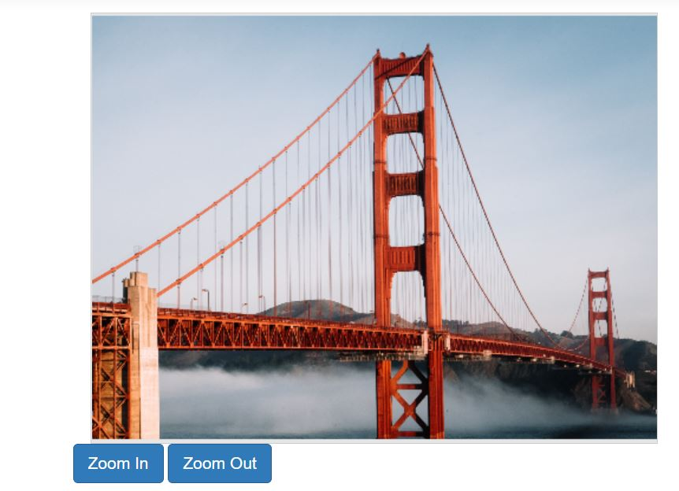

# Transform in the ##Platform_Name## Image Editor control

The Image Editor provides a range of transformation options for manipulating both the image and its annotations. These options include rotation, flipping, zooming, and panning. These transformations offer flexibility in adjusting the image and enhancing its visual appearance. 

## Rotate an image

The Image Editor allows to rotate the image and its annotations by a specific number of degrees clockwise or anti-clockwise using `rotate` method. This method takes a single parameter: the angle of rotation in degrees. A positive value will rotate the image clockwise, while a negative value will rotate it anti-clockwise.

`Note:` It is recommended to pass values in multiples of 90° (e.g., 90, 180, -90) for proper rotation alignment.

Here is an example of rotating an image in a button click event.
























Output be like the below.

## Flip an image

The Image Editor provides the `flip` method, which allows you to flip both the image and its annotations either horizontally or vertically. This method takes a single parameter of type ImageEditorDirection, which specifies the direction in which the flip operation should be applied. 

The `Direction` parameter accepts two values: 'Horizontal' and 'Vertical'. When you choose 'Horizontal', the image and annotations will be flipped along the horizontal axis, resulting in a mirror effect. On the other hand, selecting 'Vertical' will flip them along the vertical axis, producing a vertical mirror effect. 

Here is an example of flipping an image in a button click event. 
























Output be like the below.

## Straighten an image

The straightening feature in an Image Editor allows users to adjust an image by rotating it clockwise or counter clockwise. The rotating degree value should be within the range of -45 to +45 degrees for accurate straightening. Positive values indicate clockwise rotation, while negative values indicate counter clockwise rotation. The Image Editor control includes a `straightenImage` method, which allows you to adjust the degree of an image. This method takes one parameter that define how the straightening should be carried out:

* degree: Specifies the amount of rotation for straightening the image. Positive values indicate clockwise rotation, while negative values indicate counterclockwise rotation.

Here is an example of straightening the image.
























Output be like the below.

## Zoom in or out an image 

The Image Editor allows to magnify an image using the `zoom` method. This method allows one to zoom in and out of the image and provides a more detailed view of the image's hidden areas. This method takes two parameters to perform zooming. 

* zoomFactor - Specifies a value to controlling the level of magnification applied to the image. 

* zoomPoint - Specifies x and y coordinates of a point as ImageEditorPoint on image to perform zooming. 

### Minimum and maximum zoom level 

The `minZoomFactor` property allows you to specify the minimum level of zoom that is allowed for an image. By setting this property, you can prevent the image from being zoomed out beyond a certain point, ensuring that it remains visible and usable even at the smallest zoom level. 

By default, the `minZoomFactor` value is set to 0.1, meaning that the image can be zoomed out up to 10 times its original size.

The `maxZoomFactor` property is a useful feature in the Image Editor that allows you to define the maximum level of zoom permitted for an image. This property sets a limit on how much the image can be magnified, preventing excessive zooming that may result in a loss of image quality or visibility. 

By default, the `maxZoomFactor` value is set to 10, meaning that the image can be zoomed in up to 10 times its original size. This ensures that the zooming functionality remains within reasonable bounds and maintains the integrity of the image. 

Here is an example of specifying `minZoomFactor` and `maxZoomFactor` property in `zoomSettings` options in an image editor.
























Output be like the below.

## Panning an image

The Image Editor allows to pan an image when the image exceeds the canvas size or selection range. When zooming in on an image or applying a selection for cropping, it is common for the image to exceed the size of the canvas or exceed the selection range. So, the panning is used to view the entire image, by clicking on the canvas and dragging it in the direction they want to move.
























Output be like the below.

## Panning event 

The `panning` event is activated when the user begins dragging the image within the canvas. This event provide an opportunity to perform specific actions, like adjusting the position of an image, in response to the gesture of panning. And these event uses `panEventArgs` to handle the panning action when the user starts dragging the image. 

The parameter available in the `panEventArgs` events are, 

* PanEventArgs.startPoint - The x and y coordinates as ImageEditorPoint for the start point. 

* PanEventArgs.endpoint - The x and y coordinates as ImageEditorPoint for the end point. 

* PanEventArgs.cancel – Specifies the boolean value to cancel the panning action. 

## Zooming event 

The [`zooming`](https://help.syncfusion.com/cr/aspnetmvc-js2/Syncfusion.EJ2.ImageEditor.ImageEditor.html#Syncfusion_EJ2_ImageEditor_ImageEditor_Zooming) event is triggered when performing zooming the image. This event can be used to perform certain actions, such as updating the position of the image. This event is passed an object that contains information about the zooming event, such as the amount of zooming performed. And this event uses `ZoomEventArgs` to handle the zooming action in the image.

The parameter available in the Zooming event is, 

* ZoomEventArgs.zoomPoint - The x and y coordinates as ImageEditorPoint for the zoom point. 

* ZoomEventArgs.previousZoomFactor - The previous zoom factor applied in the image editor. 

* ZoomEventArgs.currentZoomFactor - The current zoom factor to be applied in the image editor. 

* ZoomEventArgs.cancel – Specify a boolean value to cancel the zooming action. 

* ZoomEventArgs.zoomTrigger - The type of zooming performed in the image editor. 

## Rotating event 

The [`rotating`](https://help.syncfusion.com/cr/aspnetmvc-js2/Syncfusion.EJ2.ImageEditor.ImageEditor.html#Syncfusion_EJ2_ImageEditor_ImageEditor_Rotating) event is triggered when performing rotating the image. This event is passed an object that contains information about the rotating event, such as the amount of rotation performed. And this event uses `RotateEventArgs` to handle the rotating action in the image.

The parameter available in the Rotating event is, 

* RotateEventArgs.previousDegree: The degree of rotation before the recent rotation action was applied in the Image Editor. 

* RotateEventArgs.currentDegree: The current degree of rotation after the rotation action has been performed in the Image Editor. 

RotateEventArgs.cancel – Specifies a boolean value to cancel the rotating action. 

## Flipping event 

The [`flipping`](https://help.syncfusion.com/cr/aspnetmvc-js2/Syncfusion.EJ2.ImageEditor.ImageEditor.html#Syncfusion_EJ2_ImageEditor_ImageEditor_Flipping) event is triggered when performing flipping the image. This event is passed an object that contains information about the flipping event, such as the amount of flip performed. And this event uses `FlipEventArgs` to handle the flipping action in the image.

The parameter available in the `flipping` event is, 

* FlipEventArgs.direction - The flip direction as ImageEditorDirection to be applied in the image editor. 

* FlipEventArgs.cancel - Specifies a boolean value to cancel the flip action. 
