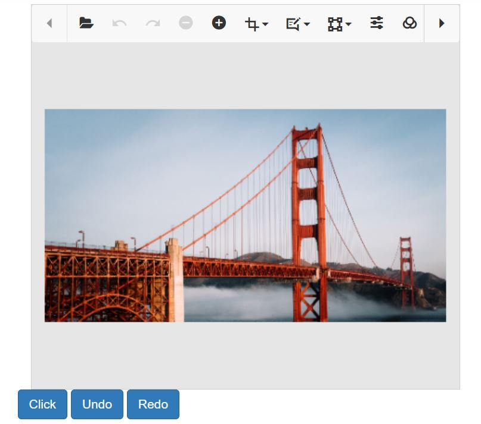

# Undo Redo in the ##Platform_Name## Image Editor control

The undo and redo functionalities provide a way to reverse and repeat editing actions performed on an image. These features are essential for maintaining control and flexibility during the editing process. 

In an image editor, the undo and redo history typically have a limited capacity, and the number of steps that can be stored is 16 steps, meaning that the editor keeps track of the most recent 16 actions performed on the image. Once the history reaches its maximum capacity, any new actions beyond the 16th step will result in the removal of the oldest action from the history.

## Undo the action 

The undo action in an image editor allows users to revert the most recent editing action or a series of actions back to their previous state. When the undo command is triggered, the image editor undoes the last applied modification, effectively restoring the image to its state before the action was performed. The undo action is useful for correcting mistakes, removing unwanted changes, or exploring different editing options without permanently altering the image.

## Redo the action

The redo action in an image editor allows users to reapply previously undone actions or modifications to the image. When the redo command is triggered, the image editor reapplies the last action that was undone, bringing the image back to the state it was in after the action was initially applied. The redo is useful when users want to repeat an action that was previously undone or restore changes that were temporarily reversed.

Here is an example of undoing and redoing the action using the `undo` and `redo` method.
























Output be like the below.

