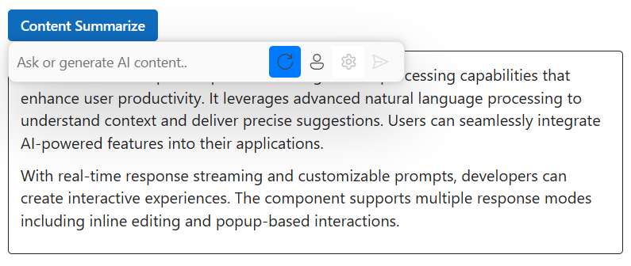
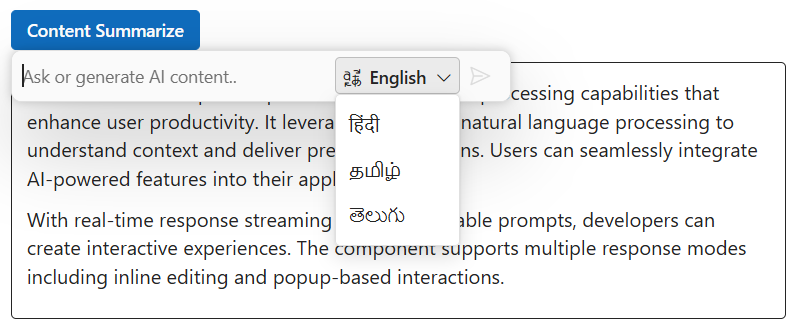
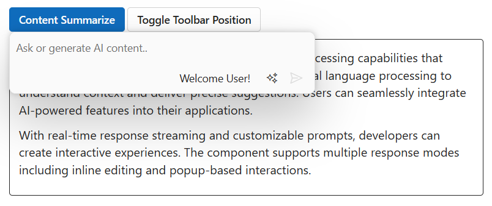

# Inline toolbar configuration in ##Platform_Name## Inline AI Assist control

You can render the inline toolbar items by using the [Items](https://help.syncfusion.com/cr/aspnetmvc-js2/Syncfusion.EJ2.InteractiveChat.InlineAIAssistInlineToolbarSettings.html#Syncfusion_EJ2_InteractiveChat_InlineAIAssistInlineToolbarSettings_Items) property in the [InlineToolbarSettings](https://help.syncfusion.com/cr/aspnetmvc-js2/Syncfusion.EJ2.InteractiveChat.InlineAIAssistInlineToolbarSettings.html) property.

## Built-in toolbar items

By default, the inline toolbar renders the `send` item which allows users to send the prompt text.

## Adding custom items

You can use the `InlineToolbarSettings` property to add custom items for the inline toolbar in the Inline AI Assist. The custom items will be added with the existing built-in items in the inline toolbar.

> To know more about the items, please refer to the [Items](#Items) section.

## Items

The Inline AI Assist toolbar can be rendered by defining an array of items. Items can be constructed with the following built-in command types or item template.

### Adding iconCss

You can customize the toolbar icons by using the `IconCss` property.

### Setting item type

You can change the toolbar item type by using the `Type` property. The `Type` supports three types of items such as `Button`, `Separator` and `Input`. By default, the type is `Button`.

In the following example, toolbar item type is set as `Button`.

### Setting text

You can use the `Text` property to set the text for toolbar item.

### Show or hide toolbar item

You can use the `Visible` property to specify whether to show or hide the toolbar item. By default, its value is `true`.

### Setting disabled

You can use the `Disabled` property to disable the toolbar item. By default, its value is `false`.

### Setting tooltip text

You can use the `Tooltip` property to specify the tooltip text to be displayed on hovering the toolbar item.

### Setting cssClass

You can use the `CssClass` property to customize the toolbar item.

### Setting alignment

You can change the alignment of toolbar item by using the `Align` property. It supports three types of alignments such as `Left`, `Center` and `Right`. By default, the value is `Left`.

The following example demonstrates the `inlineToolbarSettings` configuration with items










### Enabling tab key navigation in toolbar

The `TabIndex` property of a Toolbar item is used to enable tab key navigation for the item. By default, the user can switch between items using the arrow keys, but the `TabIndex` property allows you to switch between items using the Tab and Shift+Tab keys as well.

To use the `TabIndex` property, you need to set it for each Toolbar item that you want to enable tab key navigation. The `TabIndex` property should be set to a positive integer value. A value of 0 or a negative value will disable tab key navigation for the item.

For example, to enable tab key navigation for two Toolbar items, you can use the following code:




 @Html.EJS().InlineAIAssist("inlineAIAssist").InlineToolbarSettings(new InlineAIAssistInlineToolbarSettings() { Items = ViewBag.ToolbarItems }).Render()
....




public List<ToolbarItem> Items = new List<ToolbarItem>();

public ActionResult Index()
{
    Items.Add(new ToolbarItem { Text = "Item 1", TabIndex = 1 });
    Items.Add(new ToolbarItem { Text = "Item 2", TabIndex = 2 });
    ViewBag.ToolbarItems = Items;
}
....




With the above code, the user can switch between the two Toolbar items using the Tab and Shift+Tab keys, in addition to using the arrow keys. The items will be navigated in the order specified by the `TabIndex` values.

If you set the `TabIndex` value to 0 for all Toolbar items, tab key navigation will be based on the element order rather than the `TabIndex` values. For example:




 @Html.EJS().InlineAIAssist("inlineAIAssist").InlineToolbarSettings(new InlineAIAssistInlineToolbarSettings() { Items = ViewBag.ToolbarItems }).Render()
....




public List<ToolbarItem> Items = new List<ToolbarItem>();

public ActionResult Index()
{
    Items.Add(new ToolbarItem { Text = "Item 1", TabIndex = 0 });
    Items.Add(new ToolbarItem { Text = "Item 2", TabIndex = 0 });
    ViewBag.ToolbarItems = Items;
}
....




In this case, the user can switch between the two Toolbar items using the Tab and Shift+Tab keys, and the items will be navigated in the order in which they appear in the DOM.

### Setting template

You can use the `Template` property to add custom toolbar item in the Inline AI Assist.










## Toolbar positioning

You can use the `ToolbarPosition` property to customize footer toolbar position. It has two modes such as `Inline`, and `Bottom`. By default, the toolbarPosition is `Inline`.

By settings toolbarPosition as `Bottom`, footer items will be rendered at the bottom with a dedicated footer area.

## Item click

The [ItemClick](https://help.syncfusion.com/cr/aspnetmvc-js2/Syncfusion.EJ2.InteractiveChat.InlineAIAssistInlineToolbarSettings.html#Syncfusion_EJ2_InteractiveChat_InlineAIAssistInlineToolbarSettings_ItemClick) event is triggered when the inline toolbar item is clicked.

The below example demonstrates the `ToolbarPosition` and `ItemClick` properties










