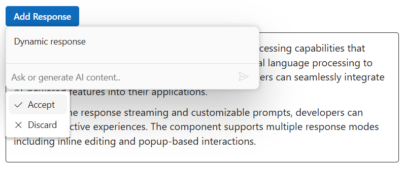
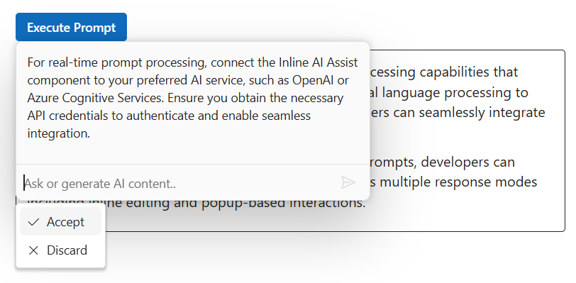
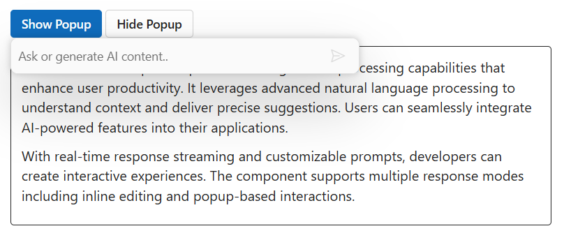
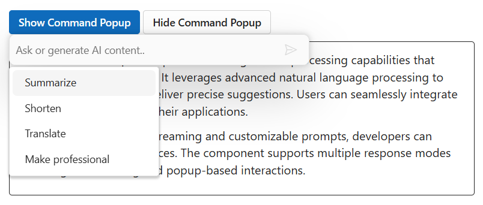

# Methods in ##Platform_Name## Inline AI Assist control

## Adding response

You can use the `addResponse` public method to add the response to the Inline AI Assist.










## Executing prompt

You can use the `executePrompt` method to execute the prompts dynamically in the Inline AI Assist. It accepts prompts as string values, which triggers the `promptRequest` event and performs the callback actions.










## Showing popup

You can use `showPopup` method to open the Inline AI Assist popup and optionally position it at specified coordinates.

## Hiding popup

You can use `hidePopup` method to close the Inline AI Assist popup.










## Showing command popup

Use `showCommandPopup` to open the command action popup; it only opens when the Inline AI Assist popup is already opened.

## Hiding command popup

You can use `hideCommandPopup` to close the command action popup in the Inline AI Assist control.










