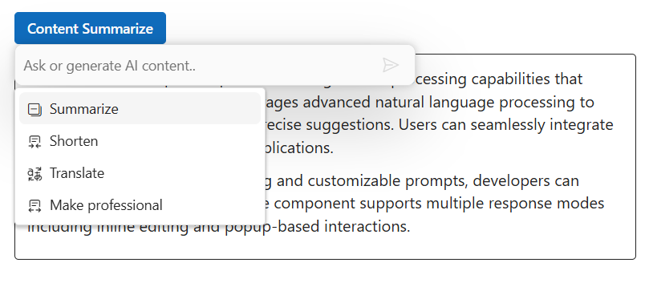

# Commands configuration in ##Platform_Name## Inline AI Assist control

You can render and use the command action popup by using the [commands](https://help.syncfusion.com/cr/aspnetcore-js2/Syncfusion.EJ2.InteractiveChat.InlineAIAssistCommandSettings.html#Syncfusion_EJ2_InteractiveChat_InlineAIAssistCommandSettings_Commands) property in the `e-inlineaiassist-commandsettings` tag helper. This property helps to supply commands, control popup dimensions, and customize behavior.

## Configure command items

You can use the `commandSettings` property to add commands that populate the command popup. Each command item can perform a quick request based on the configured `prompt`.

### Setting id

You can use the `id` property to assign a unique identifier to each command item; detect the selected command and perform the corresponding action.

### Adding iconCss

Include icons by using `iconCss` property on a command item to show an icon alongside the label.

### Setting disabled

You can use the `disabled` property to disable a command, preventing it from being selected. By default, its value is `false`.

### Configure prompt

You can use the `prompt` property to execute a prompt when the command is selected in the command action popup.

### Setting label

You can use the `label` property to specify the visible text for a command; this text appears in the command popup and describes the action that will be performed when selected.

### Configure groupBy

To visually group commands, use the `groupBy` property on command items. The popup will group items by the `groupBy` value and render group headers.

### Setting tooltip text

You can use the `tooltip` property to specify the tooltip text to be displayed on hovering the command item in the popup.

## Setting popup width

Control the popup width with [popupWidth](https://help.syncfusion.com/cr/aspnetcore-js2/Syncfusion.EJ2.InteractiveChat.InlineAIAssistCommandSettings.html#Syncfusion_EJ2_InteractiveChat_InlineAIAssistCommandSettings_PopupWidth) property in the commandSettings. Accepts CSS values or number (px).

## Setting popup height

Control the popup height with [PopupHeight](https://help.syncfusion.com/cr/aspnetcore-js2/Syncfusion.EJ2.InteractiveChat.InlineAIAssistCommandSettings.html#Syncfusion_EJ2_InteractiveChat_InlineAIAssistCommandSettings_PopupHeight) property in the commandSettings. Use this to enable scrollable lists when many commands exist.

## Configure item select

The [itemSelect](https://help.syncfusion.com/cr/aspnetcore-js2/Syncfusion.EJ2.InteractiveChat.InlineAIAssistCommandSettings.html#Syncfusion_EJ2_InteractiveChat_InlineAIAssistCommandSettings_ItemSelect) event is triggered when a command item is selected from the command popup in the Inline AI Assist control.

The below sample demonstrates the `CommandSettings` property.







