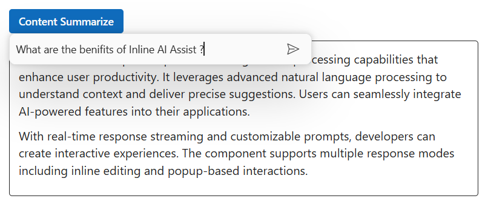
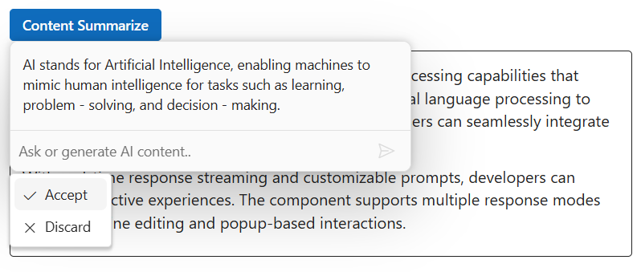
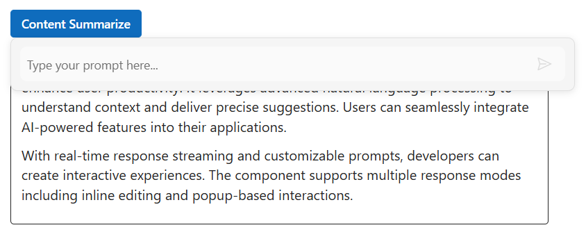

# Inline assist configurations in ##Platform_Name## Inline AI Assist control

## Setting prompt text

You can use the [prompt](https://help.syncfusion.com/cr/aspnetcore-js2/Syncfusion.EJ2.InteractiveChat.InlineAIAssist.html#Syncfusion_EJ2_InteractiveChat_InlineAIAssist_Prompt) property to define the prompt text for the Inline AI Assist control.







## Prompt-response collection

You can use the [prompts](https://help.syncfusion.com/cr/aspnetcore-js2/Syncfusion.EJ2.InteractiveChat.InlineAIAssist.html#Syncfusion_EJ2_InteractiveChat_InlineAIAssist_Prompts) property to retrieve the responses for the associated prompts.

> The `prompts` collection stores all the prompts and responses generated.







## Setting prompt placeholder

You can use the [placeholder](https://help.syncfusion.com/cr/aspnetcore-js2/Syncfusion.EJ2.InteractiveChat.InlineAIAssist.html#Syncfusion_EJ2_InteractiveChat_InlineAIAssist_Placeholder) property to set the placeholder text for the prompt textarea. The default value is `Ask or generate AI content..`.

## Setting z-index

You can use the [zIndex](https://help.syncfusion.com/cr/aspnetcore-js2/Syncfusion.EJ2.InteractiveChat.InlineAIAssist.html#Syncfusion_EJ2_InteractiveChat_InlineAIAssist_ZIndex) property to set z-index for the Inline AI Assist popup. The default value is `1000`.

## Setting popup width

You can use the [popupWidth](https://help.syncfusion.com/cr/aspnetcore-js2/Syncfusion.EJ2.InteractiveChat.InlineAIAssist.html#Syncfusion_EJ2_InteractiveChat_InlineAIAssist_PopupWidth) property to set the width of the Inline AI Assist. The default value is `400px`.

## Setting popup height

You can use the [popupHeight](https://help.syncfusion.com/cr/aspnetcore-js2/Syncfusion.EJ2.InteractiveChat.InlineAIAssist.html#Syncfusion_EJ2_InteractiveChat_InlineAIAssist_PopupHeight) property to set the height of the Inline AI Assist. The default value is `auto`.

## cssClass

You can customize the appearance of the Inline AI Assist control by using the [cssClass](https://help.syncfusion.com/cr/aspnetcore-js2/Syncfusion.EJ2.InteractiveChat.InlineAIAssist.html#Syncfusion_EJ2_InteractiveChat_InlineAIAssist_CssClass) property.

The below example shows the usecase of the properties such as `Placeholder`, `Zindex`, `PopupWidth`, `PopupHeight` and `CssClass`.







