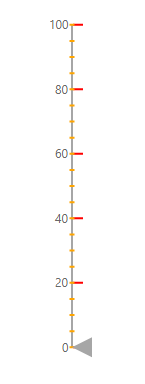
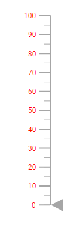
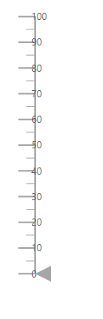
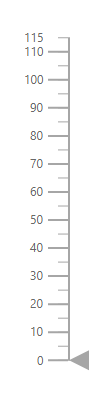
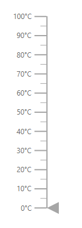
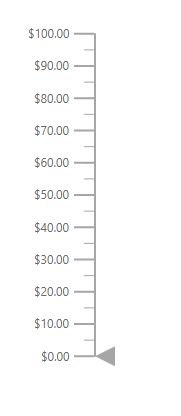
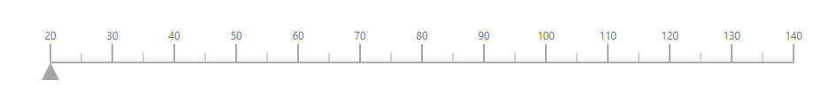
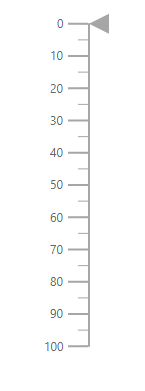

# Axis in ASP.NET MVC Linear Gauge

Axis is used to indicate the numeric values in the linear scale. The Linear Gauge component can have any number of axes. The sub-elements of an axis are line, ticks, labels, ranges, and pointers.

## Setting the start value and end value of the axis

The start value and end value for the Linear Gauge can be set using the [`Minimum`](https://help.syncfusion.com/cr/aspnetmvc-js2/Syncfusion.EJ2.LinearGauge.LinearGaugeAxis.html#Syncfusion_EJ2_LinearGauge_LinearGaugeAxis_Minimum) and [`Maximum`](https://help.syncfusion.com/cr/aspnetmvc-js2/Syncfusion.EJ2.LinearGauge.LinearGaugeAxis.html#Syncfusion_EJ2_LinearGauge_LinearGaugeAxis_Maximum) properties in the [`LinearGaugeAxis`](https://help.syncfusion.com/cr/aspnetmvc-js2/Syncfusion.EJ2.LinearGauge.LinearGaugeAxis.html) respectively. By default, the start value of the axis is **0** and the end value of the axis is **100**.





## Line Customization

The following properties in the [`LinearGaugeLine`](https://help.syncfusion.com/cr/aspnetmvc-js2/Syncfusion.EJ2.LinearGauge.LinearGaugeLine.html) can be used to customize the axis line in the Linear Gauge.

* [`Height`](https://help.syncfusion.com/cr/aspnetmvc-js2/Syncfusion.EJ2.LinearGauge.LinearGaugeLine.html#Syncfusion_EJ2_LinearGauge_LinearGaugeLine_Height) - To set the length of the axis line.
* [`Width`](https://help.syncfusion.com/cr/aspnetmvc-js2/Syncfusion.EJ2.LinearGauge.LinearGaugeLine.html#Syncfusion_EJ2_LinearGauge_LinearGaugeLine_Width) -  To set the thickness of the axis line.
* [`Color`](https://help.syncfusion.com/cr/aspnetmvc-js2/Syncfusion.EJ2.LinearGauge.LinearGaugeLine.html#Syncfusion_EJ2_LinearGauge_LinearGaugeLine_Color) - To set the color of the axis line.
* [`Offset`](https://help.syncfusion.com/cr/aspnetmvc-js2/Syncfusion.EJ2.LinearGauge.LinearGaugeLine.html#Syncfusion_EJ2_LinearGauge_LinearGaugeLine_Offset) - To render the axis line with the specified distance from the Linear Gauge.





## Ticks Customization

Ticks are used to specify the interval in the axis. Ticks are of two types, major ticks and minor ticks. The following properties in the [`LinearGaugeMajorTicks`](https://help.syncfusion.com/cr/aspnetmvc-js2/Syncfusion.EJ2.LinearGauge.LinearGaugeAxis.html#Syncfusion_EJ2_LinearGauge_LinearGaugeAxis_MajorTicks) and [`LinearGaugeMinorTicks`](https://help.syncfusion.com/cr/aspnetmvc-js2/Syncfusion.EJ2.LinearGauge.LinearGaugeAxis.html#Syncfusion_EJ2_LinearGauge_LinearGaugeAxis_MinorTicks) can be used to customize the major ticks and minor ticks respectively.

* [`Height`](https://help.syncfusion.com/cr/aspnetmvc-js2/Syncfusion.EJ2.LinearGauge.LinearGaugeTick.html#Syncfusion_EJ2_LinearGauge_LinearGaugeTick_Height) - To set the length of the major and minor ticks in pixel values.
* [`Color`](https://help.syncfusion.com/cr/aspnetmvc-js2/Syncfusion.EJ2.LinearGauge.LinearGaugeTick.html#Syncfusion_EJ2_LinearGauge_LinearGaugeTick_Color) - To set the color of the major and minor ticks of the Linear Gauge.
* [`Width`](https://help.syncfusion.com/cr/aspnetmvc-js2/Syncfusion.EJ2.LinearGauge.LinearGaugeTick.html#Syncfusion_EJ2_LinearGauge_LinearGaugeTick_Width) -  To set the thickness of the major and minor ticks in pixel values.
* [`Interval`](https://help.syncfusion.com/cr/aspnetmvc-js2/Syncfusion.EJ2.LinearGauge.LinearGaugeTick.html#Syncfusion_EJ2_LinearGauge_LinearGaugeTick_Interval) - To set the interval for the major ticks and minor ticks in the Linear Gauge.

<!-- markdownlint-disable MD036 -->





### Positioning the ticks

The minor and major ticks can be positioned by using the [`Offset`](https://help.syncfusion.com/cr/aspnetmvc-js2/Syncfusion.EJ2.LinearGauge.LinearGaugeTick.html#Syncfusion_EJ2_LinearGauge_LinearGaugeTick_Offset) and [`Position`](https://help.syncfusion.com/cr/aspnetmvc-js2/Syncfusion.EJ2.LinearGauge.LinearGaugeTick.html#Syncfusion_EJ2_LinearGauge_LinearGaugeTick_Position) properties. The [`Offset`](https://help.syncfusion.com/cr/aspnetmvc-js2/Syncfusion.EJ2.LinearGauge.LinearGaugeTick.html#Syncfusion_EJ2_LinearGauge_LinearGaugeTick_Offset) is used to render the ticks with the specified distance from the axis. By default, the offset value is **0**. The possible values of the [`Position`](https://help.syncfusion.com/cr/aspnetmvc-js2/Syncfusion.EJ2.LinearGauge.LinearGaugeTick.html#Syncfusion_EJ2_LinearGauge_LinearGaugeTick_Position) property are **Inside**, **Outside**, **Cross**, and **Auto**. By default, the ticks will be placed inside the axis.





## Labels Customization

The style of the labels can be customized using the following properties in [`LinearGaugeFont`](https://help.syncfusion.com/cr/aspnetmvc-js2/Syncfusion.EJ2.LinearGauge.LinearGaugeFont.html) in the [`LinearGaugeLabel`](https://help.syncfusion.com/cr/aspnetmvc-js2/Syncfusion.EJ2.LinearGauge.LinearGaugeLabel.html).

* [`Color`](https://help.syncfusion.com/cr/aspnetmvc-js2/Syncfusion.EJ2.LinearGauge.LinearGaugeFont.html#Syncfusion_EJ2_LinearGauge_LinearGaugeFont_Color) - To set the color of the axis label.
* [`FontFamily`](https://help.syncfusion.com/cr/aspnetmvc-js2/Syncfusion.EJ2.LinearGauge.LinearGaugeFont.html#Syncfusion_EJ2_LinearGauge_LinearGaugeFont_FontFamily) - To set the font family of the axis label.
* [`FontStyle`](https://help.syncfusion.com/cr/aspnetmvc-js2/Syncfusion.EJ2.LinearGauge.LinearGaugeFont.html#Syncfusion_EJ2_LinearGauge_LinearGaugeFont_FontStyle) - To set the font style of the axis label.
* [`FontWeight`](https://help.syncfusion.com/cr/aspnetmvc-js2/Syncfusion.EJ2.LinearGauge.LinearGaugeFont.html#Syncfusion_EJ2_LinearGauge_LinearGaugeFont_FontWeight) - To set the font weight of the axis label.
* [`Opacity`](https://help.syncfusion.com/cr/aspnetmvc-js2/Syncfusion.EJ2.LinearGauge.LinearGaugeFont.html#Syncfusion_EJ2_LinearGauge_LinearGaugeFont_Opacity) - To set the opacity of the axis label.
* [`Size`](https://help.syncfusion.com/cr/aspnetmvc-js2/Syncfusion.EJ2.LinearGauge.LinearGaugeFont.html#Syncfusion_EJ2_LinearGauge_LinearGaugeFont_Size) - To set the size of the axis label.

<!-- markdownlint-disable MD036 -->





### Positioning the axis label

Labels can be positioned by using [`Offset`](https://help.syncfusion.com/cr/aspnetmvc-js2/Syncfusion.EJ2.LinearGauge.LinearGaugeLabel.html#Syncfusion_EJ2_LinearGauge_LinearGaugeLabel_Offset) and [`Position`](https://help.syncfusion.com/cr/aspnetmvc-js2/Syncfusion.EJ2.LinearGauge.LinearGaugeLabel.html#Syncfusion_EJ2_LinearGauge_LinearGaugeLabel_Position) properties in the [`LinearGaugeLabel`](https://help.syncfusion.com/cr/aspnetmvc-js2/Syncfusion.EJ2.LinearGauge.LinearGaugeLabel.html). The [`Offset`](https://help.syncfusion.com/cr/aspnetmvc-js2/Syncfusion.EJ2.LinearGauge.LinearGaugeLabel.html#Syncfusion_EJ2_LinearGauge_LinearGaugeLabel_Offset) defines the distance between the labels and ticks. By default, the offset value is **0**. The possible values of [`Position`](https://help.syncfusion.com/cr/aspnetmvc-js2/Syncfusion.EJ2.LinearGauge.LinearGaugeLabel.html#Syncfusion_EJ2_LinearGauge_LinearGaugeLabel_Position) property are **Inside**, **Outside**, **Cross**, and **Auto**. By default, the labels will be placed inside the axis.





### Customizing the display of the last label

If the last label is not in the visible range, it will be hidden by default. The last label can be made visible by setting the [`ShowLastLabel`](https://help.syncfusion.com/cr/aspnetmvc-js2/Syncfusion.EJ2.LinearGauge.LinearGaugeAxis.html#Syncfusion_EJ2_LinearGauge_LinearGaugeAxis_ShowLastLabel) property as **true** in the [`LinearGaugeAxis`](https://help.syncfusion.com/cr/aspnetmvc-js2/Syncfusion.EJ2.LinearGauge.LinearGaugeAxis.html).

<!-- markdownlint-disable MD036 -->





<!-- markdownlint-disable MD036 -->

### Label Format

Axis labels in the Linear Gauge control can be formatted using the [`Format`](https://help.syncfusion.com/cr/aspnetmvc-js2/Syncfusion.EJ2.LinearGauge.LinearGaugeLabel.html#Syncfusion_EJ2_LinearGauge_LinearGaugeLabel_Format) property in [`LinearGaugeLabel`](https://help.syncfusion.com/cr/aspnetmvc-js2/Syncfusion.EJ2.LinearGauge.LinearGaugeLabel.html).  It is used to render the axis labels in a certain format or to add a user-defined unit in the label. It works with the help of placeholder like **{value}°C**, where **value** represents the axis value. For example, 20°C.





### Displaying numeric format in labels

The numeric formats such as currency, percentage, and so on can be displayed in the labels of the Linear Gauge using the [`Format`](https://help.syncfusion.com/cr/aspnetmvc-js2/Syncfusion.EJ2.LinearGauge.LinearGauge.html#Syncfusion_EJ2_LinearGauge_LinearGauge_Format) property in the Linear Gauge component. The following table describes the result of applying some commonly used label formats on numeric values.

<!-- markdownlint-disable MD033 -->
<table>
<tr>
<td><b>Label Value</b></td>
<td><b>Label Format property value</b></td>
<td><b>Result </b></td>
<td><b>Description </b></td>
</tr>
<tr>
<td>1000</td>
<td>n1</td>
<td>1000.0</td>
<td>The number is rounded to 1 decimal place.</td>
</tr>
<tr>
<td>1000</td>
<td>n2</td>
<td>1000.00</td>
<td>The number is rounded to 2 decimal place.</td>
</tr>
<tr>
<td>1000</td>
<td>n3</td>
<td>1000.000</td>
<td>The number is rounded to 3 decimal place.</td>
</tr>
<tr>
<td>0.01</td>
<td>p1</td>
<td>1.0%</td>
<td>The number is converted to percentage with 1 decimal place.</td>
</tr>
<tr>
<td>0.01</td>
<td>p2</td>
<td>1.00%</td>
<td>The number is converted to percentage with 2 decimal place.</td>
</tr>
<tr>
<td>0.01</td>
<td>p3</td>
<td>1.000%</td>
<td>The number is converted to percentage with 3 decimal place.</td>
</tr>
<tr>
<td>1000</td>
<td>c1</td>
<td>$1,000.0</td>
<td>The currency symbol is appended to number and number is rounded to 1 decimal place.</td>
</tr>
<tr>
<td>1000</td>
<td>c2</td>
<td>$1,000.00</td>
<td>The currency symbol is appended to number and number is rounded to 2 decimal place.</td>
</tr>
</table>





## Orientation

By default, the Linear Gauge is rendered vertically. To change its orientation, the [`Orientation`](https://help.syncfusion.com/cr/aspnetmvc-js2/Syncfusion.EJ2.LinearGauge.LinearGauge.html#Syncfusion_EJ2_LinearGauge_LinearGauge_Orientation) property must be set to **Horizontal**.





## Inverted Axis

The axis of the Linear Gauge component can be inversed by setting the [`IsInversed`](https://help.syncfusion.com/cr/aspnetmvc-js2/Syncfusion.EJ2.LinearGauge.LinearGaugeAxis.html#Syncfusion_EJ2_LinearGauge_LinearGaugeAxis_IsInversed) property to **true** in the [`LinearGaugeAxis`](https://help.syncfusion.com/cr/aspnetmvc-js2/Syncfusion.EJ2.LinearGauge.LinearGaugeAxis.html).





## Opposed Axis

To place an axis opposite from its original position, [`OpposedPosition`](https://help.syncfusion.com/cr/aspnetmvc-js2/Syncfusion.EJ2.LinearGauge.LinearGaugeAxis.html#Syncfusion_EJ2_LinearGauge_LinearGaugeAxis_OpposedPosition) property in the [`LinearGaugeAxis`](https://help.syncfusion.com/cr/aspnetmvc-js2/Syncfusion.EJ2.LinearGauge.LinearGaugeAxis.html) must be set as **true**.





## Multiple Axes

Multiple axes can be added to the Linear Gauge by adding multiple [`LinearGaugeAxis`](https://help.syncfusion.com/cr/aspnetmvc-js2/Syncfusion.EJ2.LinearGauge.LinearGaugeAxis.html) in the [`LinearGaugeAxes`](https://help.syncfusion.com/cr/aspnetmvc-js2/Syncfusion.EJ2.LinearGauge.LinearGaugeAxes.html) and customization can be done with the [`LinearGaugeAxis`](https://help.syncfusion.com/cr/aspnetmvc-js2/Syncfusion.EJ2.LinearGauge.LinearGaugeAxis.html). Each axis can be customized separately as shown in the following example.





