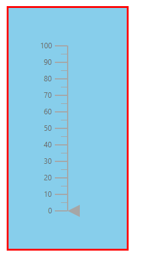
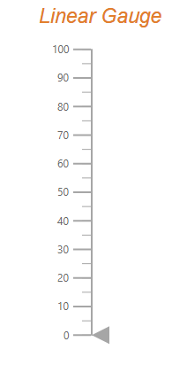
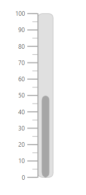

# Appearance in ASP.NET Core Linear Gauge

## Customizing the Linear Gauge area

The following property and classes are available in the [`ejs-lineargauge`](https://help.syncfusion.com/cr/aspnetcore-js2/Syncfusion.EJ2.LinearGauge.LinearGauge.html) to customize the Linear Gauge area.

* [`Background`](https://help.syncfusion.com/cr/aspnetcore-js2/Syncfusion.EJ2.LinearGauge.LinearGauge.html#Syncfusion_EJ2_LinearGauge_LinearGauge_Background) - Applies the background color for the Linear gauge.
* [`e-lineargauge-border`](https://help.syncfusion.com/cr/aspnetcore-js2/Syncfusion.EJ2.LinearGauge.LinearGaugeBorder.html) - To customize the color and width of the border in Linear Gauge.
* [`e-lineargauge-margin`](https://help.syncfusion.com/cr/aspnetcore-js2/Syncfusion.EJ2.LinearGauge.LinearGaugeMargin.html) - To customize the margins of the Linear Gauge.





## Setting up the Linear Gauge title

The title for the Linear Gauge can be set using [`Title`](https://help.syncfusion.com/cr/aspnetcore-js2/Syncfusion.EJ2.LinearGauge.LinearGauge.html#Syncfusion_EJ2_LinearGauge_LinearGauge_Title) property in [`ejs-lineargauge`](https://help.syncfusion.com/cr/aspnetcore-js2/Syncfusion.EJ2.LinearGauge.LinearGauge.html). Its appearance can be customized using the [`TitleStyle`](https://help.syncfusion.com/cr/aspnetcore-js2/Syncfusion.EJ2.LinearGauge.LinearGaugeTitleStyleLinearGauge.html) with the below properties.

* [`Color`](https://help.syncfusion.com/cr/aspnetcore-js2/Syncfusion.EJ2.LinearGauge.LinearGaugeFont.html#Syncfusion_EJ2_LinearGauge_LinearGaugeFont_Color) - Specifies the text color of the title.
* [`FontFamily`](https://help.syncfusion.com/cr/aspnetcore-js2/Syncfusion.EJ2.LinearGauge.LinearGaugeFont.html#Syncfusion_EJ2_LinearGauge_LinearGaugeFont_FontFamily) - Specifies font family of the title.
* [`FontStyle`](https://help.syncfusion.com/cr/aspnetcore-js2/Syncfusion.EJ2.LinearGauge.LinearGaugeFont.html#Syncfusion_EJ2_LinearGauge_LinearGaugeFont_FontStyle) - Specifies font style of the title.
* [`FontWeight`](https://help.syncfusion.com/cr/aspnetcore-js2/Syncfusion.EJ2.LinearGauge.LinearGaugeFont.html#Syncfusion_EJ2_LinearGauge_LinearGaugeFont_FontWeight) - Specifies font weight of the title.
* [`Opacity`](https://help.syncfusion.com/cr/aspnetcore-js2/Syncfusion.EJ2.LinearGauge.LinearGaugeFont.html#Syncfusion_EJ2_LinearGauge_LinearGaugeFont_Opacity) - Specifies the opacity of the title.
* [`Size`](https://help.syncfusion.com/cr/aspnetcore-js2/Syncfusion.EJ2.LinearGauge.LinearGaugeFont.html#Syncfusion_EJ2_LinearGauge_LinearGaugeFont_Size) - Specifies the font size of the title.





## Customizing the Linear Gauge container

The area used to render the ranges and pointers at the center position of the gauge is called container. The following types of container to be applicable for Linear Gauge.

* Normal
* Rounded Rectangle
* Thermometer

The type of the container can be modified by using the [`Type`](https://help.syncfusion.com/cr/aspnetcore-js2/Syncfusion.EJ2.LinearGauge.LinearGaugeContainer.html#Syncfusion_EJ2_LinearGauge_LinearGaugeContainer_Type) property in [`e-lineargauge-container`](https://help.syncfusion.com/cr/aspnetcore-js2/Syncfusion.EJ2.LinearGauge.LinearGaugeContainer.html). The container can be customized by using the following properties and class in [`e-lineargauge-container`](https://help.syncfusion.com/cr/aspnetcore-js2/Syncfusion.EJ2.LinearGauge.LinearGaugeContainer.html).

* [`Offset`](https://help.syncfusion.com/cr/aspnetcore-js2/Syncfusion.EJ2.LinearGauge.LinearGaugeContainer.html#Syncfusion_EJ2_LinearGauge_LinearGaugeContainer_Offset) - To place the container with the specified distance from the axis of the Linear Gauge.
* [`Width`](https://help.syncfusion.com/cr/aspnetcore-js2/Syncfusion.EJ2.LinearGauge.LinearGaugeContainer.html#Syncfusion_EJ2_LinearGauge_LinearGaugeContainer_Width) - To set the thickness of the container.
* [`Height`](https://help.syncfusion.com/cr/aspnetcore-js2/Syncfusion.EJ2.LinearGauge.LinearGaugeContainer.html#Syncfusion_EJ2_LinearGauge_LinearGaugeContainer_Height) - To set the length of the container.
* [`BackgroundColor`](https://help.syncfusion.com/cr/aspnetcore-js2/Syncfusion.EJ2.LinearGauge.LinearGaugeContainer.html#Syncfusion_EJ2_LinearGauge_LinearGaugeContainer_BackgroundColor) - To set the background color of the container.
* [`Border`](https://help.syncfusion.com/cr/aspnetcore-js2/Syncfusion.EJ2.LinearGauge.LinearGaugeContainer.html#Syncfusion_EJ2_LinearGauge_LinearGaugeContainer_Border) - To set the color and width for the border of the container.

### Normal

The "[**Normal**](https://help.syncfusion.com/cr/aspnetcore-js2/Syncfusion.EJ2.LinearGauge.ContainerType.html#Syncfusion_EJ2_LinearGauge_ContainerType_Normal)" type will render the container as a rectangle and this is the default container type.





### Rounded Rectangle

The [**RoundedRectangle**](https://help.syncfusion.com/cr/aspnetcore-js2/Syncfusion.EJ2.LinearGauge.ContainerType.html#Syncfusion_EJ2_LinearGauge_ContainerType_RoundedRectangle) type will render the container as a rectangle with rounded corner radius. The rounded corner radius of the container can be customized using the [`RoundedCornerRadius`](https://help.syncfusion.com/cr/aspnetcore-js2/Syncfusion.EJ2.LinearGauge.LinearGaugeContainer.html#Syncfusion_EJ2_LinearGauge_LinearGaugeContainer_RoundedCornerRadius) property in [`LinearGaugeContainer`](https://help.syncfusion.com/cr/aspnetcore-js2/Syncfusion.EJ2.LinearGauge.LinearGaugeContainer.html).





### Thermometer

The [**Thermometer**](https://help.syncfusion.com/cr/aspnetcore-js2/Syncfusion.EJ2.LinearGauge.ContainerType.html#Syncfusion_EJ2_LinearGauge_ContainerType_Thermometer) type will render the container similar to the appearance of thermometer.





## Fitting the Linear Gauge to the control

The Linear Gauge component is rendered with margin by default. To remove the margin around the Linear Gauge, the [`AllowMargin`](https://help.syncfusion.com/cr/aspnetcore-js2/Syncfusion.EJ2.LinearGauge.LinearGauge.html#Syncfusion_EJ2_LinearGauge_LinearGauge_AllowMargin) property in [`ejs-lineargauge`](https://help.syncfusion.com/cr/aspnetcore-js2/Syncfusion.EJ2.LinearGauge.LinearGauge.html) is set as **false**.





>To use this feature, set the [`AllowMargin`](https://help.syncfusion.com/cr/aspnetcore-js2/Syncfusion.EJ2.LinearGauge.LinearGauge.html#Syncfusion_EJ2_LinearGauge_LinearGauge_AllowMargin) property to **false**, the [`Width`](https://help.syncfusion.com/cr/aspnetcore-js2/Syncfusion.EJ2.LinearGauge.LinearGauge.html#Syncfusion_EJ2_LinearGauge_LinearGauge_Width) property to **100%** and the properties of [`e-lineargauge-margin`](https://help.syncfusion.com/cr/aspnetcore-js2/Syncfusion.EJ2.LinearGauge.LinearGaugeMargin.html) to **0**.