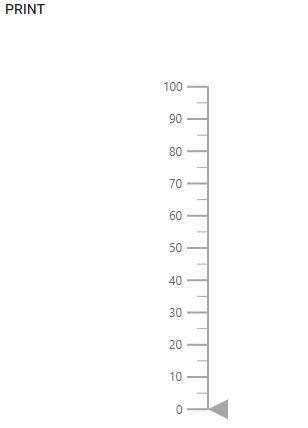

# Print and Export in ASP.NET Core Linear Gauge

## Print

The rendered Linear Gauge can be printed directly from the browser by calling the [`print`](https://ej2.syncfusion.com/documentation/api/linear-gauge/#print) method. To use the print functionality, set the [`AllowPrint`](https://help.syncfusion.com/cr/aspnetcore-js2/Syncfusion.EJ2.LinearGauge.LinearGauge.html#Syncfusion_EJ2_LinearGauge_LinearGauge_AllowPrint) property as **true**.





## Export

### Image Export

To use the image export functionality, set the [`AllowImageExport`](https://help.syncfusion.com/cr/aspnetcore-js2/Syncfusion.EJ2.LinearGauge.LinearGauge.html#Syncfusion_EJ2_LinearGauge_LinearGauge_AllowImageExport) property as **true**. The rendered Linear Gauge can be exported as an image using the [`export`](https://ej2.syncfusion.com/documentation/api/linear-gauge/#export) method. This method requires two parameters: export type and file name. The Linear Gauge can be exported as an image with the following formats.

* JPEG
* PNG
* PDF





### PDF Export

To use the PDF export functionality, set the [`AllowPdfExport`](https://help.syncfusion.com/cr/aspnetcore-js2/Syncfusion.EJ2.LinearGauge.LinearGauge.html#Syncfusion_EJ2_LinearGauge_LinearGauge_AllowPdfExport) property as **true**. The rendered Linear Gauge can be exported as PDF using the [`export`](https://ej2.syncfusion.com/documentation/api/linear-gauge/#export) method. The [`export`](https://ej2.syncfusion.com/documentation/api/linear-gauge/#export) method requires three parameters: file type, file name, and orientation of the PDF document. The orientation of the PDF document can be set as **Portrait** or **Landscape**.





### Exporting Linear Gauge as base64 string of the file

The Linear Gauge can be exported as base64 string for the JPEG, PNG and PDF formats. The rendered Linear Gauge can be exported as base64 string of the exported image or PDF document used in the [`export`](https://ej2.syncfusion.com/documentation/api/linear-gauge/#export) method. The arguments that are required for this method is export type, file name, orientation of the exported PDF document and **allowDownload** boolean value that is set as **false** to return base64 string. The value for the orientation of the exported PDF document is set as **null** for image export and **Portrait** or **Landscape** for the PDF document.





>The exporting of the Linear Gauge as base64 string is not applicable for the SVG format.