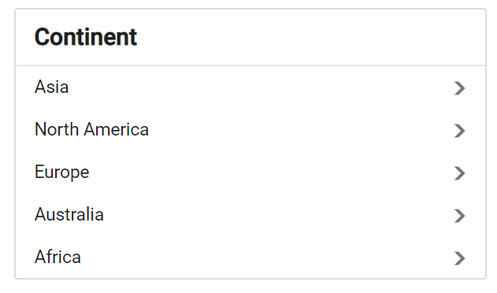

# Accessibility

## Keyboard interaction

The following key shortcuts are used to access the ListView component without any interruption.

| Keyboard shortcuts | Actions |
|------------|-------------------|
| <kbd>Arrow Up</kbd> | Move to the previous list item. |
| <kbd>Arrow Down</kbd> | Move to the next list item. |
| <kbd>Select</kbd> | Select the targeted list from the whole list. |
| <kbd>Back</kbd> | Get back to the previous lists if it is in nested list. |
























Output be like the below.

## ARIA attributes

The following ARIA attributes are applicable for ListView component based on its state.

| Properties | Functionality |
| ------------ | ----------------------- |
| aria-selected | It indicates the selected list from the whole list. |
| aria-level | It defines the hierarchical structure of a list item. |
