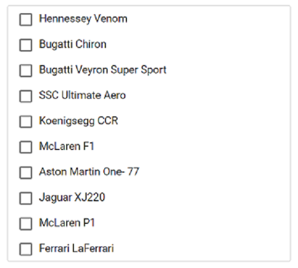
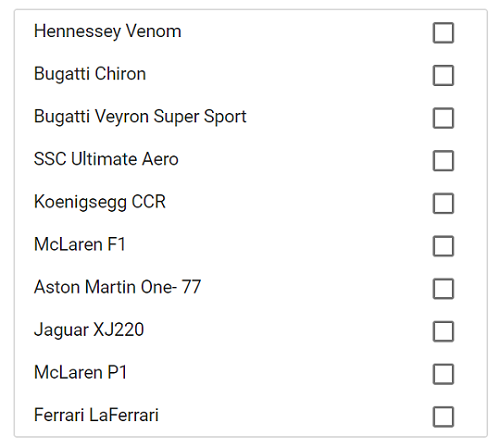

# Checklist in ##Platform_Name## ListView Control

The ListView supports checkbox in default and group-lists which is used to select multiple items. The checkbox can be enabled by the [`showCheckBox`](https://help.syncfusion.com/cr/aspnetcore-js2/Syncfusion.EJ2.Lists.ListView.html#Syncfusion_EJ2_Lists_ListView_ShowCheckBox) property.

The Checkbox will be useful in the scenario where we need to select multiple options. For Example, in Shipping cart we can be able to select or unselect the desired items before checkout and also it will be useful in selecting multiple items that belongs to same category using the group list.
























Output be like the below.

## Checkbox Position

In ListView the checkbox can be positioned into either `Left` or `Right` side of the list-item text. This can be achieved by [`checkBoxPositon`](https://help.syncfusion.com/cr/aspnetcore-js2/Syncfusion.EJ2.Lists.ListView.html#Syncfusion_EJ2_Lists_ListView_CheckBoxPosition) property. By default, checkbox will be positioned to `Left` of list-item text.
























Output be like the below.

