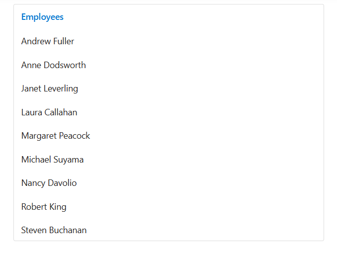

# Data binding

ListView provides an option to load the data either from local dataSource or remote data services. This can be done through the dataSource property that supports the data type of array or [`DataManager`](https://help.syncfusion.com/cr/aspnetcore-js2/Syncfusion.EJ2.DataManager.html).

ListView supports different kind of data services such as OData, OData V4, and Web API, and data formats like XML, JSON, and, JSONP with the help of DataManager Adaptors.

| Fields | Type | Description |
|------|------|-------------|
| id | string | Specifies ID attribute of list item, mapped in dataSource. |
| text | string | Specifies list item display text field. |
| isChecked | string | Specifies checked status of list item. |
| isVisible | string | Specifies visibility state of list item. |
| enabled | string | Specifies enabled state of list item. |
| iconCss | string | Specifies the icon class of each list item that will be added before to the list item text. |
| child | string | Specifies child dataSource fields. |
| tooltip | string | Specifies tooltip title text field. |
| groupBy | string | Specifies category of each list item. |
| sortBy | string | Specifies sorting field, that is used to sort the listview data. |
| htmlAttributes | string | Specifies list item html attributes field. |

> When complex data bind to ListView, you should map the fields properly. Otherwise, the ListView properties remain as undefined or null.

## Bind to local data

Local data can be represented in two ways, they are as follows:

* Array of simple data.
* Array of JSON data.

### Array of simple data

ListView supports to load the array of primitive data like string and numbers. Here, both value and text field act as same.
























### Array of JSON data

ListView can generate its list items through an array of complex data. To get it work properly, you should map the appropriate columns to the field property.

In the following example, role column is mapped with the text field.
























## Bind to remote data

The ListView supports to retrieve the data from remote data services with the help of DataManager component. The Query property allows to fetch data and return it to the ListView from the database.

In the following sample, first 6 products from the Product table of NorthWind data service are displayed.
























Output be like the below.

