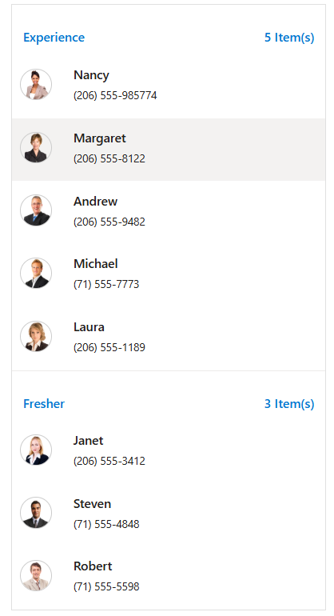

# How to show items count in group header of ##Platform_Name## ListView

The ListView control supports wrapping list items into a group based on the category. The category of each list item can be mapped with groupBy field of the data source. You can display grouped list items count in the list-header using the group header template. Refer to the following code sample to display grouped list item count.
























Output be like the below.

