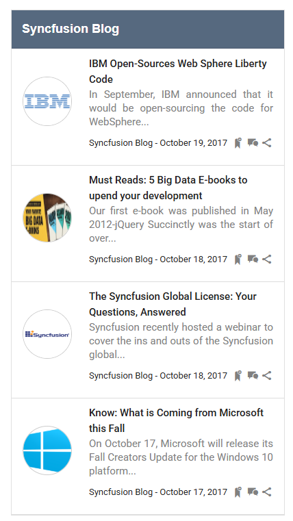

# Use Dynamic templates in ListView based on device

The Syncfusion&reg; Essential&reg; JS2 controls are desktop and mobile-friendly. So, you can use Syncfusion&reg; controls in both modes. The control templates are not always fixed. Applications may need to load various templates depending upon the device.

## Integration

In the ListView control, template support is being used. In some cases, the control wrapper is always responsive across all devices, but the template contents are dynamically changed with unspecified (sample side) dimensions. CSS customization is also needed in sample-side to align template content responsively in both mobile and desktop modes. Here, two templates have been loaded for mobile and desktop modes. To check the device mode, a `browser module` has been imported from the [ej2-base](https://ej2.syncfusion.com/documentation/api/base/overview/) package.
























Output be like the below.

