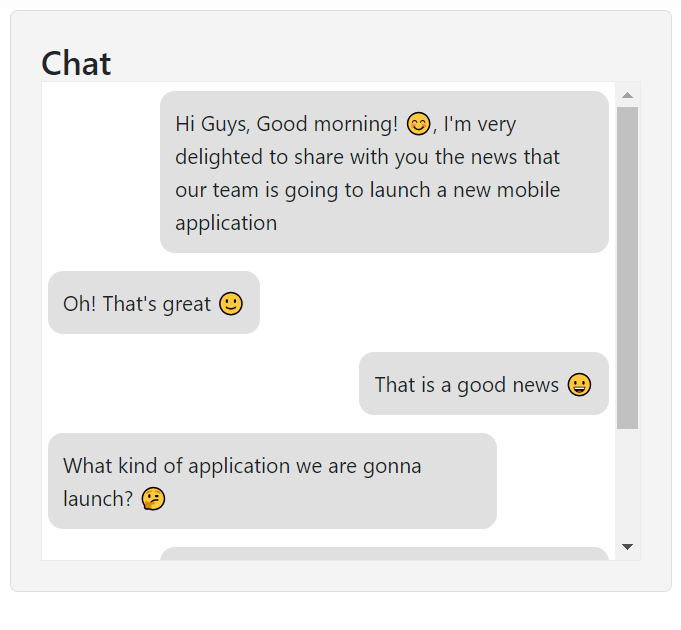

# Scrolling in ##Platform_Name## ListView Control

Scrolling is a technique that allows you to load more items as the user scrolls through a list, providing a seamless and dynamic user experience.

Render the ListView with `dataSource`, and bind the [`scroll`](https://help.syncfusion.com/cr/aspnetmvc-js2/Syncfusion.EJ2.Lists.ListView.html#Syncfusion_EJ2_Lists_ListView_Scroll) event. Within the scroll event, you can access information such as the scroll direction, event name and the distance from the scrollbar to the top and bottom ends through the distanceY parameter.

In the given example, new data is seamlessly added while scrolling. When you scrolls to the bottom and the distance scrolled is less than 100 pixels, it dynamically loads a batch of items into the list as long as there are more items to render.
























Output be like the below.

