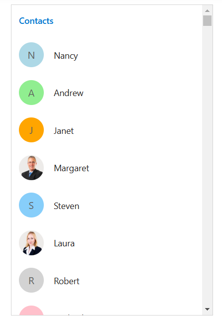
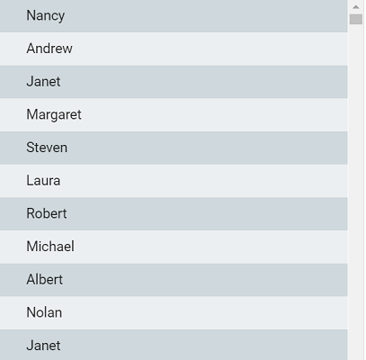

# UI Virtualization

UI virtualization loads only viewable list items in a view port, which will improve the ListView performance while loading a large number of data.

## Getting started

UI virtualization can be enabled in the ListView by setting the
[`enableVirtualization`](https://help.syncfusion.com/cr/aspnetcore-js2/Syncfusion.EJ2.Lists.ListView.html#Syncfusion_EJ2_Lists_ListView_EnableVirtualization)
property to true.

It has two types of scrollers as follows:

**Window scroll**: This scroller is used in the ListView by default.

**Container scroll**: This scroller is used, when the height property of the ListView is set.
























Output be like the below.

We can use `template` property to customize list items in UI virtualization.
























Output be like the below.

## Conditional rendering

The following conditional rendering support is provided for the template and groupTemplate.

| Name | Syntax |
| --- | --- | --- |
| conditional class | `

`  |
| conditional attribute | `

`  |
| conditional text content | `
${ $id % 2 === 0 ? 'even-list' : 'odd-list'}
`  |

In the following sample, the light blue is applied for the even list and light coral is applied for the odd list based on the conditional class.
























Output be like the below.

