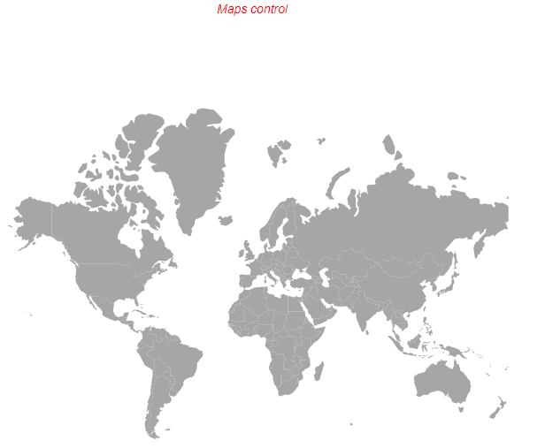
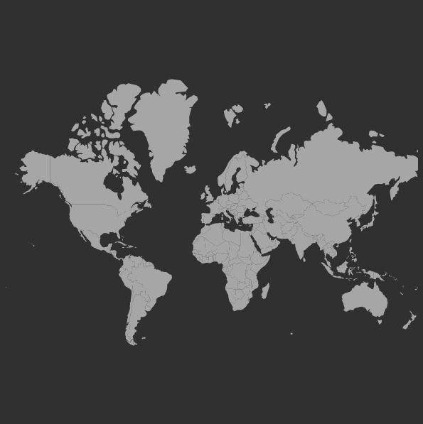
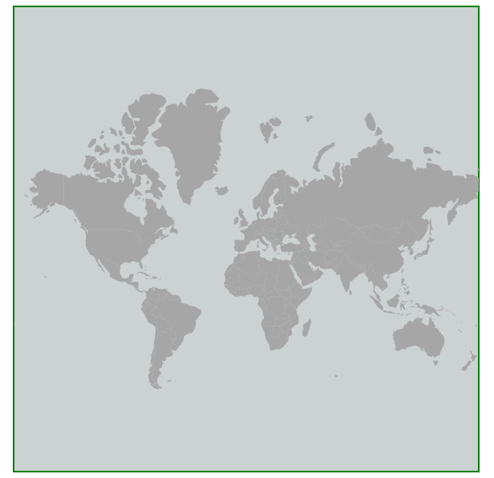
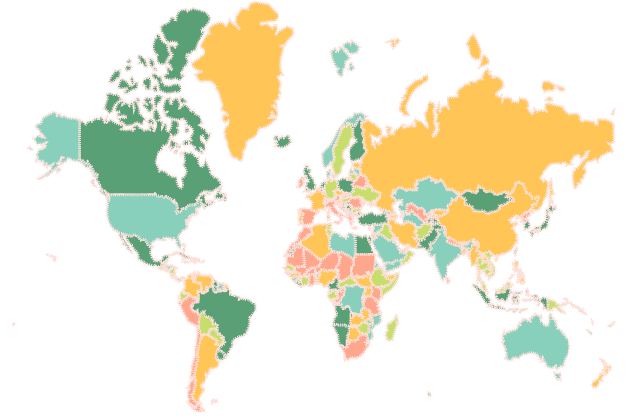
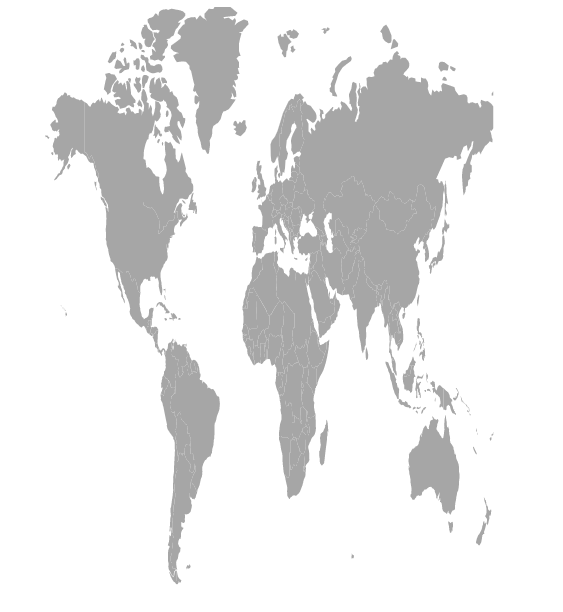

# Customization

## Setting the size for Maps

The width and height of the Maps can be set using the `Width` and `Height` properties in the Maps component. Percentage or pixel values can be used for the height and width values.





## Maps title

The title for the Maps can be set using the `MapsTitleSettings`. It can be customized using the following properties.

* `Alignment` - To customize the alignment for the text in the title for the Maps. The possible values are **Center**, **Near** and **Far**.
* `Description` - To set the description of the title in Maps.
* `Text` - To set the text for the title in Maps.
* `TextStyle` - To customize the text of the title in Maps.
* `SubtitleSettings` - To customize the subtitle for the Maps.





## Setting theme

The Maps control supports following themes.

* Material
* Fabric
* Bootstrap
* Highcontrast
* MaterialDark
* FabricDark
* BootstrapDark
* Bootstrap4
* HighContrastLight
* Tailwind

By default, the Maps are rendered by the **Material** theme. The theme of the Maps component is changed using the `Theme` property.





## Customizing Maps container

The following properties are available to customize the container in the Maps.

* `Background` - To apply the background color to the container in the Maps.
* `Border` - To customize the color, width and opacity of the border of the Maps.
* `Margin` - To customize the margins of the Maps.





## Customizing Maps area

By default, the background color of the shape maps is set as **white**. To modify the background color of the Maps area, the `Background` property in the `MapsMapsAreaSettings` is used. The border of the Maps area can be customized using the `Border` property in the `MapsMapsAreaSettings` class.





## Customizing the shapes

The following properties are available in `MapsShapeSettings` class to customize the shapes of the Maps component.

* `Fill` - To apply the color to the shapes.
* `Autofill` - To apply the palette colors to the shapes if it is set as true.
* `Palette` - To set the custom palette for the shapes.
* `DashArray` - To define the pattern of dashes and gaps that is applied to the outline of the shapes.
* `Opacity` - To customize the transparency for the shapes.
* `Border` - To customize the color, width and opacity of the border of the shapes.





## Setting color to the shapes from the data source

The color for each shape in the Maps can be set using the `ColorValuePath` property of `MapsShapeSettings` class. The value for the `ColorValuePath` property is the field name from the data source of the `MapsShapeSettings` class which contains the color values.





## Applying border to individual shapes

The border of each shape in the Maps can be customized using the `BorderColorValuePath` and `BorderWidthValuePath` properties to modify the color and the width of the border respectively. The field name in the data source of the layer which contains the color and the width values must be set in the `BorderColorValuePath` and `BorderWidthValuePath` properties respectively. If the values of `BorderWidthValuePath` and `BorderColorValuePath` do not match with the field name from the data source, then the color and width of the border will be applied to the shapes using the `Border` property in the `MapsShapeSettings` class.





## Projection type

The Maps control supports the following projection types:

* Mercator
* Equirectangular
* Miller
* Eckert3
* Eckert5
* Eckert6
* Winkel3
* AitOff

By default, the Maps are rendered by the **Mercator** projection type in which the Maps are rendered based on the coordinates. So, the Maps is not stretched. To change the type of projection in the Maps, the `ProjectionType` property is used.





