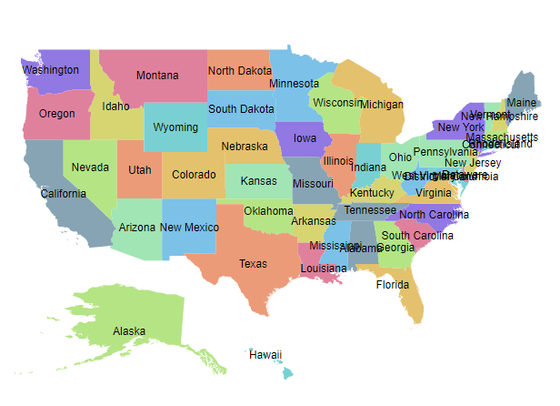
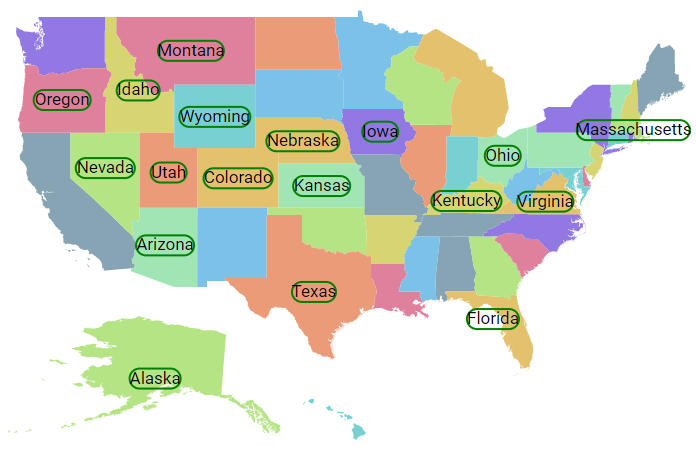
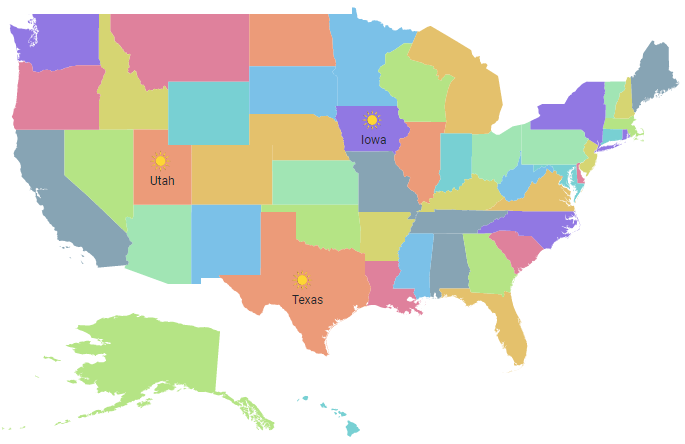

# Data labels

Data labels provide information to users about the shapes of the Maps component. It can be enabled by setting the `Visible` property of the `MapsDataLabelSettings` to **true**.

## Adding data labels

To display data labels in the Maps, the `LabelPath` property of `MapsDataLabelSettings` must be used. The value of the `LabelPath` property can be taken from the field name in the shape data or data source. In the following example, the value of the `LabelPath` property is the field name in the shape data of the Maps layer.
























In the following example, the value of `LabelPath` property is set from the field name in the data source of the layer settings.
























## Customization

The following properties are available in the `MapsDataLabelSettings` to customize the data label of the Maps component.

* `Border` - To customize the color, width and opacity for the border of the data labels in Maps.
* `Fill` - To apply the color of the data labels in Maps.
* `Opacity` - To customize the transparency of the data labels in Maps.
* `TextStyle` - To customize the text style of the data labels in Maps.
























## Smart labels

The Maps component provides an option to handle the labels when they intersect with the corresponding shape borders using the `SmartLabelMode` property. The following options are available in the `SmartLabelMode` property.

* None
* Hide
* Trim
























## Intersect action

The Maps component provides an option to handle the labels when a label intersects with another label using the `IntersectionAction` property. The following options are available in the `IntersectionAction` property.

* None
* Hide
* Trim
























## Adding data label as a template

The data label can be added as a template in the Maps component. The `Template` property of `MapsDataLabelSettings` is used to set the data label as a template. Any text or HTML element can be added as the template in data labels.

>The customization properties of data label, `SmartLabelMode` and `IntersectionAction` properties are not applicable to `Template` property. The styles can be applied to the label template using the CSS styles of the template element.
























