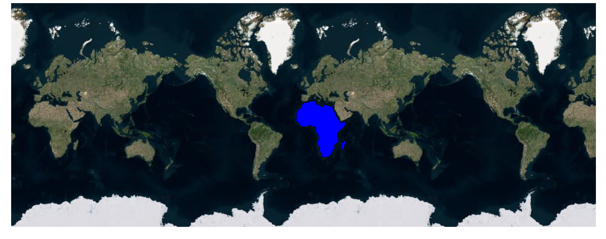

# Display geometry shape in bing maps

Usually bing map displays the Maps in satellite view in which you can't make changes as per your requirement. To over come this, you can add maps shape as sublayer over the bing map and you can customize it as per your requirement. Kindly follow the below steps to add geometry shapes as sublayer in bing maps.

**Step 1**:

To render the Maps control as bing map, set the `ShapeLayerType` as **Bing** and also provide the key for the bing map.
























**Step 2**:

The geometry shape can be added in the bing map using sublayer concept. In the below example, Africa continent can be set as the sublayer in bing map using the `Type` property.
























