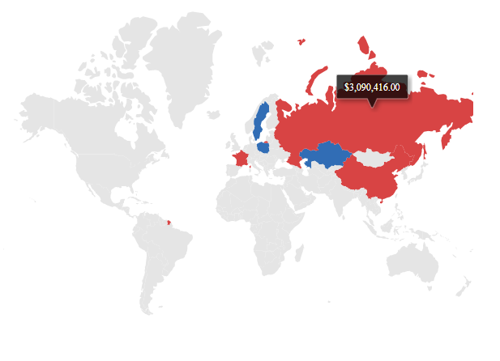

# Internationalization

Maps provide support for internationalization for the below elements.

* Data label
* Tooltip

For more information about number and date formatter, refer to the
[`internationalization`](http://ej2.syncfusion.com/documentation/base/intl.html) section.

<!-- markdownlint-disable MD036 -->

## Globalization

Globalization is the process of designing and developing a component that works in different
cultures/locales. Internationalization library is used to globalize number, date, time values in
Maps component using `Format` property in the `Maps`.

## Numeric format

The numeric formats such as currency, percentage and so on can be displayed in the tooltip and data labels of the Maps using the `Format` property in the `Maps`. In the below example, the tooltip is globalized to **German** culture. When setting the `UseGroupingSeparator` property as **true**, the numeric text in the Maps separates with the comma separator.
























