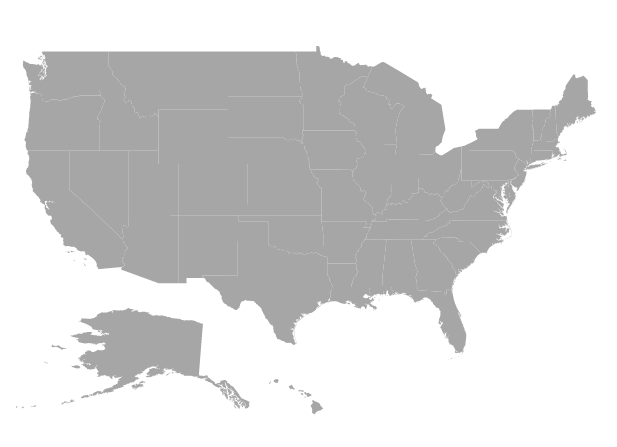

# Layers

The Maps control is rendered through [`Layers`](https://help.syncfusion.com/cr/aspnetcore-js2/Syncfusion.EJ2.Maps.Maps.html#Syncfusion_EJ2_Maps_Maps_Layers) and any number of layers can be added to the Maps.

## Multilayer

The Multilayer support allows loading multiple shape files and map providers in a single container, enabling Maps to display more information. The shape layer or map providers are the main layers of the Maps. Multiple layers can be added as **SubLayer** over the main layers using the [`Type`](https://help.syncfusion.com/cr/aspnetcore-js2/Syncfusion.EJ2.Maps.Type.html) property of [`Layers`](https://help.syncfusion.com/cr/aspnetcore-js2/Syncfusion.EJ2.Maps.Maps.html#Syncfusion_EJ2_Maps_Maps_Layers).

## Sublayer

Sublayer is a type of shape file layer. It allows loading multiple shape files in a single map view. For example, a sublayer can be added over the main layer to view geographic features such as rivers, valleys and cities in a map of a country. Similar to the main layer, elements in the Maps such as markers, bubbles, color mapping and legends can be added to the sub-layer.

In this example, the United States map shape is used as shape data by utilizing **usa.ts** file, and **texas.ts** and **california.ts** files are used as sub-layers in the United States map.
























## Displaying different layer in the view

Multiple shape files and map providers can be loaded simultaneously in Maps. The `BaseLayerIndex` property is used to determine which layer on the user interface should be displayed. This property is used for the Maps drill-down feature, so when the `BaseLayerIndex` value is changed, the corresponding shape is loaded. In this example, two layers can be loaded with the World map and the United States map. Based on the given `BaseLayerIndex` value the corresponding shape will be loaded in the user interface. If the `BaseLayerIndex` value is set to **0**, then the world map will be loaded.
























