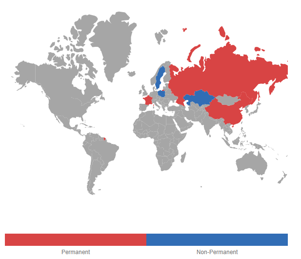
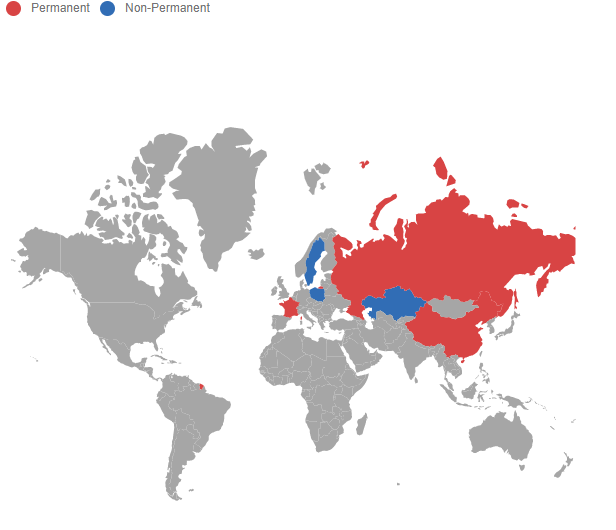
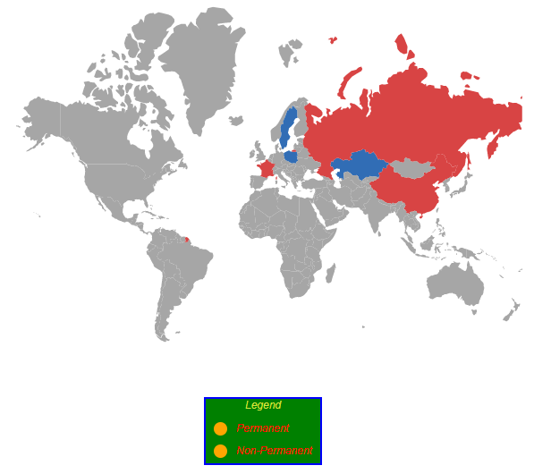
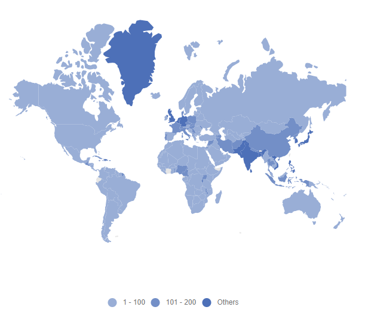
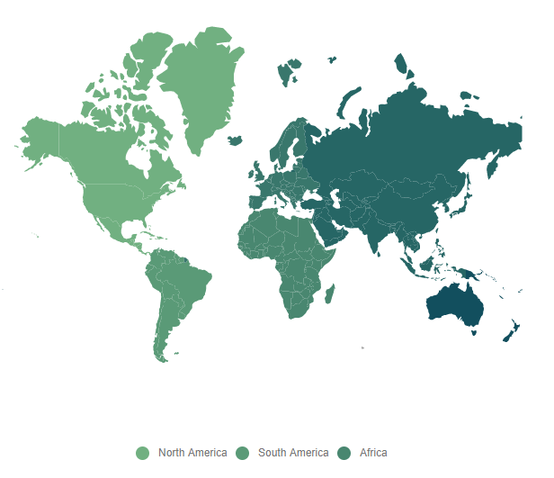
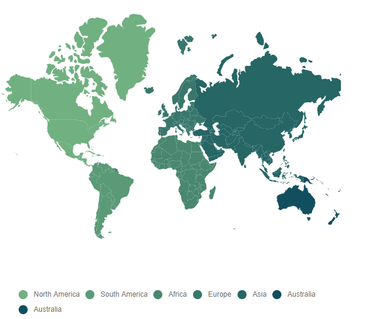
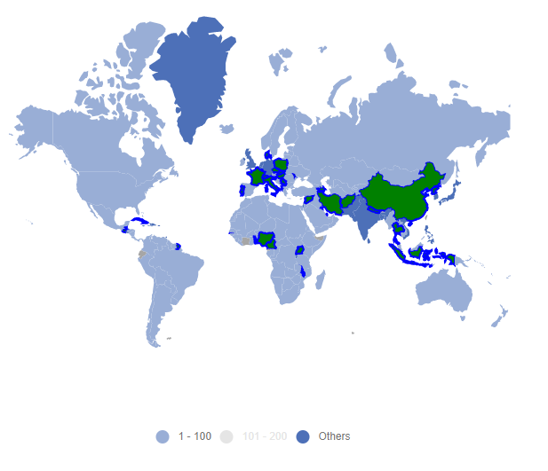
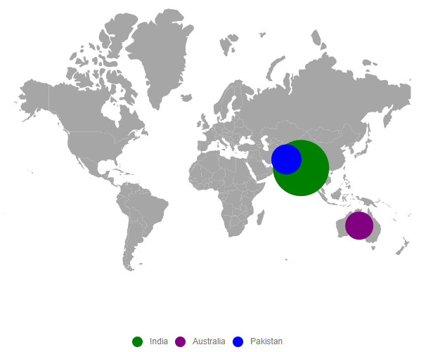
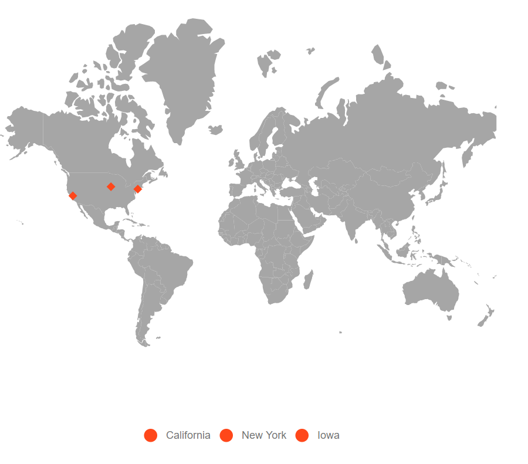

# Legend

A Legend is a visual representation of the symbols used on the Maps. It can be represented in various colors, shapes or other identifiers based on the data and provides valuable information for interpreting what the Maps are displaying. It explains what each symbol in the Maps represents. Legends are enabled by setting the `Visible` property of `MapsLegendSettings` to **true**.

## Modes of legend

Legend had two types of mode.
1. **Default** mode
2. **Interactive** mode

### Default mode

Default mode legends having symbols with legend labels, used to identify the shape or bubble or marker color. To enable this option by setting the `Mode` property of `MapsLegendSettings` as **Default**.

### Interactive mode

The legends can be made interactive with an arrow mark indicating the exact range color in the legend when the mouse hovers over the corresponding shapes. To enable this type of mode by setting the `Mode` property of `MapsLegendSettings` as **Interactive**. The `InvertedPointer` property is used to enable or disable the visibility of the inverted pointer in interactive legend in Maps.



























## Positioning of the legend

The legend can be positioned in the following two ways:

* Absolute position
* Dock position

<b>Absolute position</b>

The legend of the Maps can be positioned using the `Location` property in the `MapsLegendSettings`. For positioning the legend based on co-ordinates corresponding to a Maps, the `Position` property is set as **Float**.

<b>Dock position</b>

Legends are positioned in the following locations within the container. The `Position` property in `MapsLegendSettings` is used to set these options in Maps.

* Top
* Left
* Bottom
* Right

The above four positions can be aligned with combination of **Near**, **Center** and **Far** using `Alignment` property in `MapsLegendSettings`. So, the legend can be aligned to 12 positions.



























## Legend for shapes

Legend for shapes can be generated from color mapping types such as equal color mapping, range color mapping and desaturation color mapping.

The below code snippet demonstrate the equal color mapping legends for the shapes. To bind the given data source to the `DataSource` property of `MapsLayer`. Set the value of `ShapePropertyPath` to **name** and `ShapeDataPath` to **Country**. To enable equal color mapping, set the multiple `MapsColorMapping` to the `MapsShapeSettings`. Finally, set the `Visible` property of `MapsLegendSettings` as **true**. The `Label` property in `MapsColorMapping` is used to set the text name for legend in Maps.

























### Legend shape

Maps supports the following types of legend shapes. The `Shape` property in the `MapsLegendSettings` class can be used to change the type of legend shapes.

* Circle
* Rectangle
* Triangle
* Diamond
* Cross
* Star
* HorizontalLine
* VerticalLine
* Pentagon
* InvertedTriangle

The shape of legends can be customized by using the `ShapeWidth`, `ShapeHeight`, `ShapeBorder` and `ShapePadding` properties.

### Customization

The following properties are available in legend to customize the legend shape and legend text in Maps.

* `Background` - To customize the background color of the Legend.
* `Border` - To customize the color, width and opacity of the border for the Legend.
* `Fill` - To apply the color for the Legend.
* `LabelDisplayMode` - To customize the display mode for the Legend text.
* `LabelPosition` - To customize the position of the Legend text.
* `Orientation` - To customize the orientation of the Legend.
* `TextStyle` - To customize the text style for Legend.
* `Title` - To apply the title for the Legend.
* `TitleStyle` - To customize the style of the title for the Legend.
* `Height` - To customize the height of the Legend.
* `Width` - To customize the width of the Legend.
* `Opacity` - To apply the opacity to the Legend.



























### Legend for items excluded from color mapping

The legend can be enabled for items excluded from the color mapping using the `Color` property in `MapsColorMapping`. Refer to the **population_density** data which demonstrates the population density of some countries.

```sh
 [
    ...
    {
        'code': 'AE',
        'value': 90,
        'name': 'United Arab Emirates',
        'population': 8264070,
        'density': 99
    },
    {
        'code': 'GB',
        'value': 257,
        'name': 'United Kingdom',
        'population': 62041708,
        'density': 255
    },
    {
        'code': 'US',
        'value': 34,
        'name': 'United States',
        'population': 325020000,
        'density': 33
    }
    ...
    ];
```

In the following example, color mapping is added for the ranges from **0** to **200**. If there are any records in the data source that are outside of this range, the color mapping will not be applied. To apply the color for these excluded items, set the `Color` property alone in the `MapsColorMapping`. To enable legend for these items, set the `Visible` property of `MapsLegendSettings` to **true**.



























### Hide desired legend items

Use the `ShowLegend` property in the `MapsColorMapping` to show or hide the desired legend items in Maps. If the `ShowLegend` property is set to **false**, the legend item will be hidden. otherwise, it will be visible.

























### Hide legend items based on data source value

Depending on the boolean values provided in the data source, the legend items will be hidden or visible. Bind the field name that contains the visibility state in the data source to the `ShowLegendPath` property of the `MapsLegendSettings` class to achieve this.



























### Binding legend item text from data source

To show the legend text based on values provided in the data source, use the `ValuePath` property in the `MapsLegendSettings`.



























### Hide duplicate legend items

To hide the duplicate legend items in Maps, set the `RemoveDuplicateLegend` property to **true** in the `MapsLegendSettings`.

























### Toggle option in legend

The toggle option has been provided for legend. If the legend can be toggled, the given color will be changed to the corresponding Maps shape item. To enable the toggle options in Legend, set the `Enable` property of the `MapsToggleLegendSettings` to **true**.

The following properties are available to customize the toggle option in legend.

* `ApplyShapeSettings` – To apply the `Fill` property value to the shape of the Maps when toggling the legend items.
* `Fill` - To apply the color to the shape of the Maps for which legend item is toggled.
* `Opacity` – To customize the transparency for the shapes for which legend item is toggled.
* `Border` – To customize the color, width and opacity of the border of the shapes in Maps.



























## Enable legend for bubbles

To enable the legend for the bubble by setting the `Visible` property of `MapsLegendSettings` as **true** and `Type` property of `MapsLegendSettings` as **Bubbles**.



























## Enable legend for markers

To enable legend for marker by setting the `Visible` property of `MapsLegendSettings` as **true** and `Type` property of `MapsLegendSettings` as **Markers**. The `LegendText` property in the `MapsMarker` can be used to show the legend text based on values provided in the data source.

























