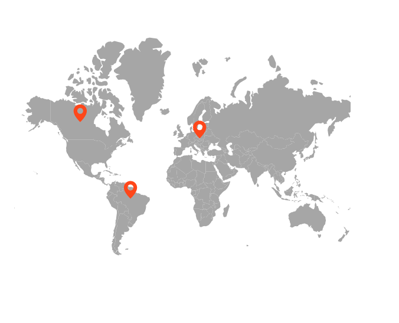
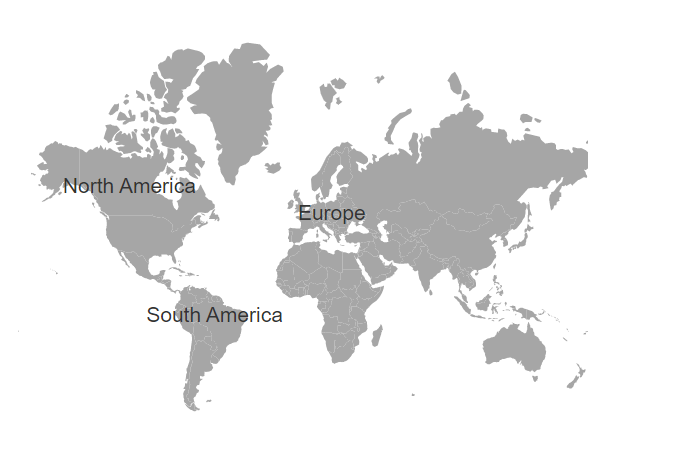
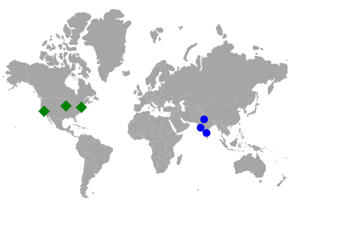
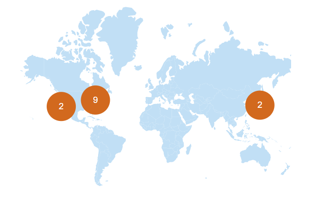
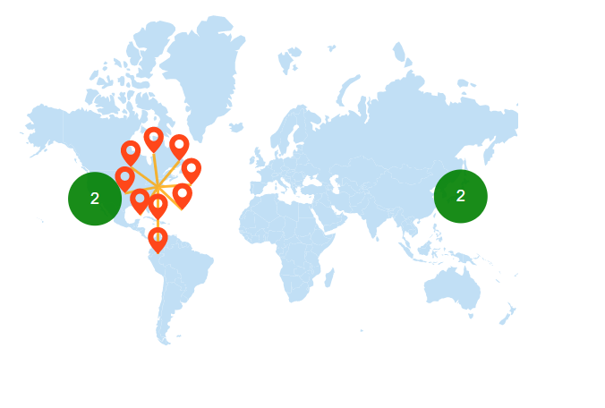

# Markers

Markers are notes that are used to leave a message on the Maps. It indicates or marks a specific location with desired symbols on the Maps. It can be enabled by setting the `Visible` property of the `MapsMarker` to **true**.

## Adding marker

To add the markers, the `DataSource` property of the `MapsMarker` has a list of objects that contains the data for markers. Using this property, any number of markers can be added to the layers of the Maps. By default, it displays the markers based on the specified latitude and longitude in the given data source. Each data source object contains the following list of properties.

* latitude - The latitude point which determines the X location of the marker.
* longitude - The longitude point which determines the Y location of the marker.
























## Adding marker template

The Marker can be added as a template in the Maps component. The `Template` property of the `MapsMarker` is used to set the HTML element or id of an element as a template.
























## Customization

The following properties are available in `MapsMarker` class to customize the Markers of the Maps component.

* `Border` - To customize the color, width and opacity of the border for the markers in Maps.
* `Fill` - To apply the color for markers in Maps.
* `DashArray` - To define the pattern of dashes and gaps that is applied to the outline of the markers in Maps.
* `Height` - To customize the height of the markers in Maps.
* `Width` - To customize the width of the markers in Maps.
* `Offset` - To customize the position of the markers in Maps.
* `Opacity` - To customize the transparency of the markers in Maps.
* `AnimationDelay` - To change the time delay in the transition for markers.
* `AnimationDuration` - To change the time duration of animation for markers.
























## Marker shapes

The Maps component supports the following marker shapes. To set the shape of the marker, the `Shape` property in `MapsMarker` is used.

* Balloon
* Circle
* Cross
* Diamond
* Image
* Rectangle
* Start
* Triangle
* VerticalLine
* HorizontalLine

### Rendering marker shape as image

To render a marker as an image in Maps, set the `Shape` property of `MapsMarker` as **Image** and specify the path of the image to `ImageUrl` property. There is another way to render a marker as an image using the `ImageUrlValuePath` property of the `MapsMarker`. Bind the field name that contains the path of the image in the data source to the `ImageUrlValuePath` property.
























## Multiple marker groups

Multiple groups of markers can be added in the Maps by adding multiple `MapsMarker` in the `MapsMarkers` and customization for the markers can be done with the `MapsMarker`.
























## Customize marker shapes from data source

### Bind different colors and shapes to the marker from data source

Using the `ShapeValuePath` and `ColorValuePath` properties, the color and shape of the marker can be applied from the given data source. Bind the data source to the `DataSource` property of the `MapsMarker` class and set the field names that contains the shape and color values in the data source to the `ShapeValuePath` and `ColorValuePath` properties.
























### Setting value path from the data source

The latitude and longitude values are used to determine the location of each marker in the Maps. The `LatitudeValuePath` and `LongitudeValuePath` properties are used to specify the value path that presents in the data source of the marker. In the following example, the field name from the data source is set to the `LatitudeValuePath` and `LongitudeValuePath` properties.
























## Marker zooming

The Maps can be initially scaled to the center value based on the marker distance. This can be achieved by setting the `ShouldZoomInitially` property in `MapsZoomSettings` as **true**.
























## Marker clustering

Maps provide support to cluster the markers when they overlap each other. The number on a cluster indicates how many overlapped markers it contains. If zooming is performed on any of the cluster locations in Maps, the number on the cluster will decrease, and the individual markers will be seen on the map. When zooming out, the overlapping marker will increase. So that it can cluster again and increase the count over the cluster.

To enable clustering in markers, set the `AllowClustering` property of `MapsMarkerClusterSettings` as **true** and customization of clustering can be done with the `MapsMarkerClusterSettings`.
























## Customization of marker cluster

The following properties are available to customize the marker clustering in the Maps component.

* `Border` - To customize the color, width and opacity of the border of cluster in Maps.
* `ConnectorLineSettings` - To customize the connector line in cluster separating the markers.
* `DashArray` - To customize the dash array for the marker cluster in Maps.
* `Fill` - Applies the color of the cluster in Maps.
* `Height` - To customize the height of the marker cluster in Maps.
* `ImageUrl` - To customize the URL path for the marker cluster when the cluster shape is set as image in Maps.
* `LabelStyle` - To customize the text in marker cluster.
* `Offset` - To customize the offset position for the marker cluster in Maps.
* `Opacity` - To customize the opacity of the marker cluster.
* `Shape` - To customize the shape for the cluster of markers.
* `Width` - To customize the width of the marker cluster in Maps.
























## Expanding the marker cluster

The cluster is formed by grouping an identical and non-identical marker from the surrounding area. By clicking on the cluster and setting the `AllowClusterExpand` property in `MapsMarkerClusterSettings` as **true** to expand the identical markers. If zooming is performed in any of the locations of the cluster, the number on the cluster will decrease and the overlapping marker will be split into an individual marker on the map. When performing zoom out, it will increase the marker count and then cluster it again.
























## Tooltip for marker

Tooltip is used to display more information about a marker on mouse over or touch end event. This can be enabled separately for marker by setting the `Visible` property of `MapsTooltipSettings` to **true**. The `ValuePath` property in the `MapsTooltipSettings` takes the field name that presents in dataSource and displays that value as tooltip text.
























