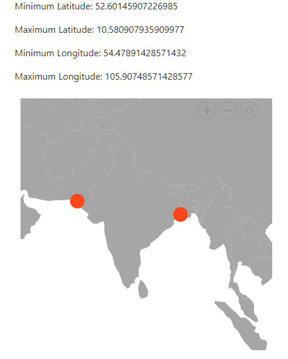

# Methods in ##Platform_Name## Maps component

## Methods

This section explains the methods used in the Maps component.

## getMinMaxLatitudeLongitude

The `getMinMaxLatitudeLongitude` method returns the minimum and maximum latitude and longitude values of the Maps visible area. This method returns a `IMinMaxLatitudeLongitude` object that contains the Maps minimum and maximum latitude and longitude coordinates.
























