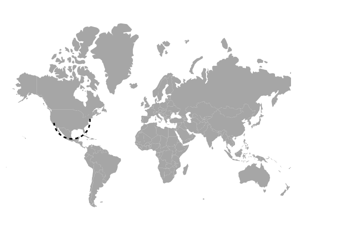

# Navigation lines

The navigation lines are used to denote the path between two locations. This feature can be used to draw flight or sea routes. Navigation lines are enabled by setting the `Visible` property of the `MapsNavigationLine` to **true**.

## Customization

The following properties are available in `MapsNavigationLine` to customize the navigation line of the Maps component.

* `Color` - To apply the color for navigation lines in Maps.
* `DashArray` - To define the pattern of dashes and gaps that is applied to the outline of the navigation lines.
* `Width` - To customize the width of the navigation lines.
* `Angle` - To customize the angle of the navigation lines.
* `HighlightSettings` - To customize the highlight settings of the navigation line.
* `SelectionSettings` - To customize the selection settings of the navigation line.

To navigate the line between two cities on the world map, `Latitude` and `Longitude` values are used to indicate the start and end points of navigation lines drawn on Maps.
























## Enabling the arrows

To enable the arrow in the navigation line, set the `ShowArrow` property of `MapsArrow` to **true**. The following properties are available in `MapsArrow` to customize the arrow of the navigation lines.

* `Color` - To apply the color for arrow of the navigation line.
* `OffSet` - To customize the offset position of the arrow of the navigation line.
* `Position` - To customize the position of the arrow in navigation line. The possible values can be **Start** and **End**.
* `Size` - To customize the size of the arrow in pixels.
























