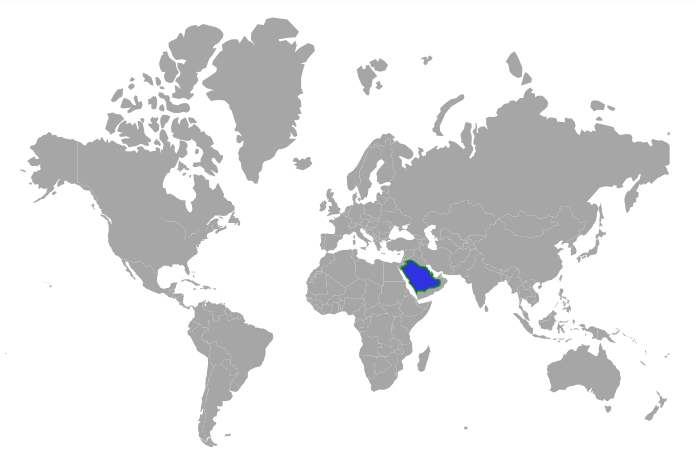
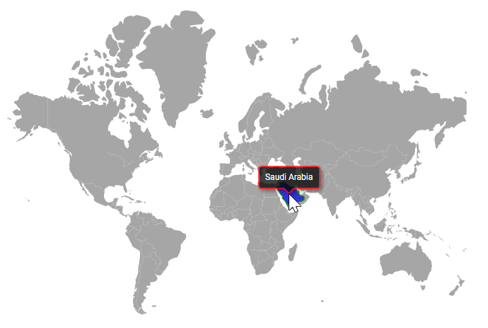
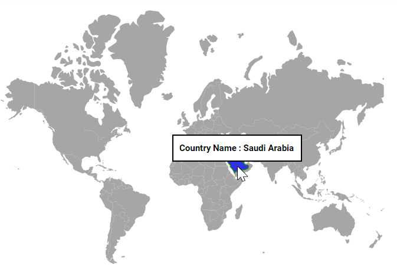

# Polygon shape in ##Platform_Name## Maps component



The Maps component allows you to add polygon shape to a geometry map or an online map by using the properties in the [polygons](https://help.syncfusion.com/cr/aspnetcore-js2/Syncfusion.EJ2.Maps.MapsPolygonSettings.html#Syncfusion_EJ2_Maps_MapsPolygonSettings_Polygons). This section describes how to add polygon shape to the map and customize them.

The polygon shape can be rendered over the map layer by defining the [points](https://help.syncfusion.com/cr/aspnetcore-js2/Syncfusion.EJ2.Maps.MapsPolygon.html#Syncfusion_EJ2_Maps_MapsPolygon_Points) property in the `polygons` of the Maps component. The `points` property uses a collection of latitude and longitude values to define the polygon shape.

The `polygons` provides the following properties for customizing the polygon shape of the Maps component.

* [fill](https://help.syncfusion.com/cr/aspnetcore-js2/Syncfusion.EJ2.Maps.MapsPolygon.html#Syncfusion_EJ2_Maps_MapsPolygon_Fill) - It is used to change the color of the polygon shape.
* [opacity](https://help.syncfusion.com/cr/aspnetcore-js2/Syncfusion.EJ2.Maps.MapsPolygon.html#Syncfusion_EJ2_Maps_MapsPolygon_Opacity) - It is used to change the opacity of the polygon shape.
* [borderColor](https://help.syncfusion.com/cr/aspnetcore-js2/Syncfusion.EJ2.Maps.MapsPolygon.html#Syncfusion_EJ2_Maps_MapsPolygon_BorderColor) - It is used to change the color of the border in the polygon shape.
* [borderWidth](https://help.syncfusion.com/cr/aspnetcore-js2/Syncfusion.EJ2.Maps.MapsPolygon.html#Syncfusion_EJ2_Maps_MapsPolygon_BorderWidth) - It is used to change the width of the border in the polygon shape.
* [borderOpacity](https://help.syncfusion.com/cr/aspnetcore-js2/Syncfusion.EJ2.Maps.MapsPolygon.html#Syncfusion_EJ2_Maps_MapsPolygon_BorderOpacity) - It is used to change the opacity of the border in the polygon shape.

> You can also include “n” polygon shapes using the [polygons](https://help.syncfusion.com/cr/aspnetcore-js2/Syncfusion.EJ2.Maps.MapsPolygonSettings.html#Syncfusion_EJ2_Maps_MapsPolygonSettings_Polygons) property.

The following example shows how to customize the polygon shape over the geometry map.












The Maps component allows you to add polygon shape to a geometry map or an online map by using the properties in the [Polygons](https://help.syncfusion.com/cr/aspnetmvc-js2/Syncfusion.EJ2.Maps.MapsPolygonSettings.html#Syncfusion_EJ2_Maps_MapsPolygonSettings_Polygons). This section describes how to add polygon shape to the map and customize them.

The polygon shape can be rendered over the map layer by defining the [Points](https://help.syncfusion.com/cr/aspnetmvc-js2/Syncfusion.EJ2.Maps.MapsPolygon.html#Syncfusion_EJ2_Maps_MapsPolygon_Points) property in the `Polygons` of the Maps component. The `Points` property uses a collection of latitude and longitude values to define the polygon shape.

The `Polygons` provides the following properties for customizing the polygon shape of the Maps component.

* [Fill](https://help.syncfusion.com/cr/aspnetmvc-js2/Syncfusion.EJ2.Maps.MapsPolygon.html#Syncfusion_EJ2_Maps_MapsPolygon_Fill) - It is used to change the color of the polygon shape.
* [Opacity](https://help.syncfusion.com/cr/aspnetmvc-js2/Syncfusion.EJ2.Maps.MapsPolygon.html#Syncfusion_EJ2_Maps_MapsPolygon_Opacity) - It is used to change the opacity of the polygon shape.
* [BorderColor](https://help.syncfusion.com/cr/aspnetmvc-js2/Syncfusion.EJ2.Maps.MapsPolygon.html#Syncfusion_EJ2_Maps_MapsPolygon_BorderColor) - It is used to change the color of the border in the polygon shape.
* [BorderWidth](https://help.syncfusion.com/cr/aspnetmvc-js2/Syncfusion.EJ2.Maps.MapsPolygon.html#Syncfusion_EJ2_Maps_MapsPolygon_BorderWidth) - It is used to change the width of the border in the polygon shape.
* [BorderOpacity](https://help.syncfusion.com/cr/aspnetmvc-js2/Syncfusion.EJ2.Maps.MapsPolygon.html#Syncfusion_EJ2_Maps_MapsPolygon_BorderOpacity) - It is used to change the opacity of the border in the polygon shape.

> You can also include “n” polygon shapes using the [Polygons](https://help.syncfusion.com/cr/aspnetmvc-js2/Syncfusion.EJ2.Maps.MapsPolygonSettings.html#Syncfusion_EJ2_Maps_MapsPolygonSettings_Polygons) property.

The following example shows how to customize the polygon shape over the geometry map.











## Tooltip



Tooltip is used to display more information about a polygon shape during a mouse or touch interaction. Tooltip and tooltip template can be enabled by setting the `visible` property to **true** in the [tooltipSettings](https://help.syncfusion.com/cr/aspnetcore-js2/Syncfusion.EJ2.Maps.MapsPolygonSettings.html#Syncfusion_EJ2_Maps_MapsPolygonSettings_TooltipSettings). Additionally, you need to set the desired content as a value to the [tooltipText](https://help.syncfusion.com/cr/aspnetcore-js2/Syncfusion.EJ2.Maps.MapsPolygon.html#Syncfusion_EJ2_Maps_MapsPolygon_TooltipText) property in the `polygons` property to show the tooltip. If you add 'n' numbers of polygon shapes, you can add the `tooltipText` property to each polygon, which will display the tooltip for the associated polygon shape.

### Tooltip customization

The following properties are available in the [tooltipSettings](https://help.syncfusion.com/cr/aspnetcore-js2/Syncfusion.EJ2.Maps.MapsPolygonSettings.html#Syncfusion_EJ2_Maps_MapsPolygonSettings_TooltipSettings) to customize the appearance of the tooltip.

* `border` - To change the color, width, and opacity of the border of the tooltip in the polygon shape.
* `fill` - Applies the color of the tooltip in the polygon shape.
* `textStyle` - To change the style of the text in the tooltip of the polygon shape.












Tooltip is used to display more information about a polygon shape during a mouse or touch interaction. Tooltip and tooltip template can be enabled by setting the `Visible` property to **true** in the [TooltipSettings](https://help.syncfusion.com/cr/aspnetmvc-js2/Syncfusion.EJ2.Maps.MapsPolygonSettings.html#Syncfusion_EJ2_Maps_MapsPolygonSettings_TooltipSettings). Additionally, you need to set the desired content as a value to the [TooltipText](https://help.syncfusion.com/cr/aspnetmvc-js2/Syncfusion.EJ2.Maps.MapsPolygon.html#Syncfusion_EJ2_Maps_MapsPolygon_TooltipText) property in the `Polygons` property to show the tooltip. If you add 'n' numbers of polygon shapes, you can add the `TooltipText` property to each polygon, which will display the tooltip for the associated polygon shape.

### Tooltip customization

The following properties are available in the [TooltipSettings](https://help.syncfusion.com/cr/aspnetmvc-js2/Syncfusion.EJ2.Maps.MapsPolygonSettings.html#Syncfusion_EJ2_Maps_MapsPolygonSettings_TooltipSettings) to customize the appearance of the tooltip.

* `Border` - To change the color, width, and opacity of the border of the tooltip in the polygon shape.
* `Fill` - Applies the color of the tooltip in the polygon shape.
* `TextStyle` - To change the style of the text in the tooltip of the polygon shape.











### Tooltip template



Any HTML element can be rendered in the tooltip of the polygon shapes using the [tooltipTemplate](https://help.syncfusion.com/cr/aspnetcore-js2/Syncfusion.EJ2.Maps.MapsPolygon.html#Syncfusion_EJ2_Maps_MapsPolygon_TooltipTemplate) property of the `polygons`. If you add 'n' numbers of polygon shapes, you can add the `tooltipTemplate` property to each polygon, which will display the tooltip for the associated polygon shape.












Any HTML element can be rendered in the tooltip of the polygon shapes using the [TooltipTemplate](https://help.syncfusion.com/cr/aspnetmvc-js2/Syncfusion.EJ2.Maps.MapsPolygon.html#Syncfusion_EJ2_Maps_MapsPolygon_TooltipTemplate) property of the `Polygons`. If you add 'n' numbers of polygon shapes, you can add the `TooltipTemplate` property to each polygon, which will display the tooltip for the associated polygon shape.











