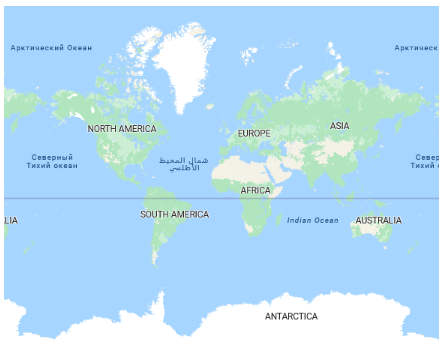
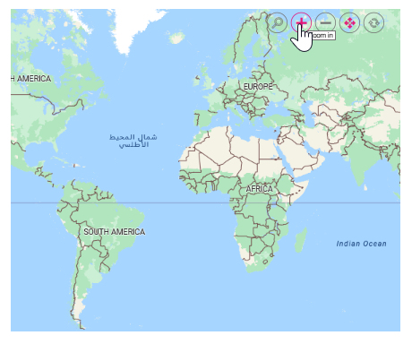
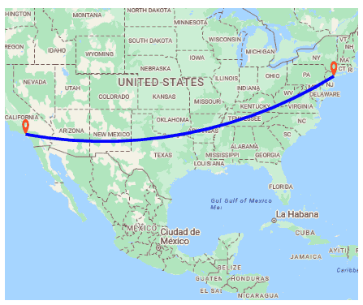
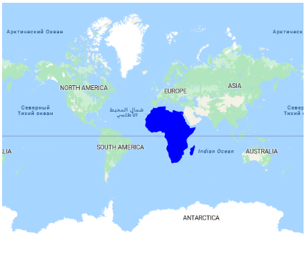
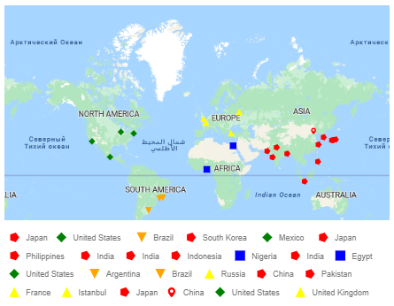

# Azure Maps in ##Platform_Name## Maps Component



Azure Maps, an online map service owned by Microsoft, provides map tile images based on user requests. The Syncfusion Maps component combines these images into a single view to display the map. You can display Azure Maps by specifying their tile service URL in the [urlTemplate](https://help.syncfusion.com/cr/aspnetcore-js2/Syncfusion.EJ2.Maps.MapsLayer.html#Syncfusion_EJ2_Maps_MapsLayer_UrlTemplate) property.



Azure Maps, an online map service owned by Microsoft, provides map tile images based on user requests. The Syncfusion Maps component combines these images into a single view to display the map. You can display Azure Maps by specifying their tile service URL in the [UrlTemplate](https://help.syncfusion.com/cr/aspnetmvc-js2/Syncfusion.EJ2.Maps.MapsLayer.html#Syncfusion_EJ2_Maps_MapsLayer_UrlTemplate) property.



## Displaying Azure Maps

The Azure map tile service can be accessed via the following URL:
https://atlas.microsoft.com/map/tile?api-version=2024-04-01&tilesetId=microsoft.base.road&zoom={zoom}&x={x}&y={y}&subscription-key=Your_Key

In the above URL template,

* {zoom} - It represents the zoom level of the map.
* {x} - It represents the horizontal position of the tile.
* {y} - It represents the vertical position of the tile. 

These placeholders are replaced by **level**, **tileX**, and **tileY**, respectively, to retrieve the correct map tile.

N> You can refer this documentation [link](https://learn.microsoft.com/en-us/rest/api/maps/render/get-map-tile?view=rest-maps-2024-04-01&tabs=HTTP) for the latest tile service URL for Azure Maps.

The **subscription_key** is required and must be included in the URL to authenticate and access the map tiles. Follow the steps in this [link](https://docs.microsoft.com/en-us/azure/search/search-security-api-keys) to generate an API key, and then add this key to the URL.

N> Refer to [Azure Maps Licensing](https://azure.microsoft.com/en-in/support/legal/).

You can customize various tile types in Azure Maps by modifying the **tilesetId** value in the URL. In the example below, the **microsoft.base.road** tile type is specified in the URL, allowing these tile images to be displayed in the Syncfusion Maps component. To explore the available tile types in Azure Maps, follow the link below.

https://learn.microsoft.com/en-us/rest/api/maps/render/get-map-tile?view=rest-maps-2023-06-01&tabs=HTTP#tilesetid
 
N> Syncfusion Maps only support displaying maps with raster images in **PNG** or **JPG** formats.



In the following example, Azure Maps can be rendered using the [urlTemplate](https://help.syncfusion.com/cr/aspnetcore-js2/Syncfusion.EJ2.Maps.MapsLayer.html#Syncfusion_EJ2_Maps_MapsLayer_UrlTemplate) property with its tile server URL.












In the following example, Azure Maps can be rendered using the [UrlTemplate](https://help.syncfusion.com/cr/aspnetmvc-js2/Syncfusion.EJ2.Maps.MapsLayer.html#Syncfusion_EJ2_Maps_MapsLayer_UrlTemplate) property with its tile server URL.











## Enabling zooming and panning

The Azure Maps layer supports both zooming and panning. Zooming allows you to take a closer look at a particular area on the map for in-depth analysis, while panning enables you to move the map around to focus on the target area.
























## Adding markers and navigation line



Markers can be added to Azure Maps layer by setting the latitude and longitude coordinates of the desired location using [MarkerSettings](https://help.syncfusion.com/cr/aspnetcore-js2/Syncfusion.EJ2.Maps.MapsLayer.html#Syncfusion_EJ2_Maps_MapsLayer_MarkerSettings). Additionally, navigation lines can be added on top of the Azure Maps layer to highlight paths between various places by specifying the corresponding latitude and longitude coordinates in the [NavigationLineSettings](https://help.syncfusion.com/cr/aspnetcore-js2/Syncfusion.EJ2.Maps.MapsLayer.html#Syncfusion_EJ2_Maps_MapsLayer_NavigationLineSettings).












Markers can be added to Azure Maps layer by setting the latitude and longitude coordinates of the desired location using [MarkerSettings](https://help.syncfusion.com/cr/aspnetmvc-js2/Syncfusion.EJ2.Maps.MapsLayer.html#Syncfusion_EJ2_Maps_MapsLayer_MarkerSettings). Additionally, navigation lines can be added on top of the Azure Maps layer to highlight paths between various places by specifying the corresponding latitude and longitude coordinates in the [NavigationLineSettings](https://help.syncfusion.com/cr/aspnetmvc-js2/Syncfusion.EJ2.Maps.MapsLayer.html#Syncfusion_EJ2_Maps_MapsLayer_NavigationLineSettings).











## Adding sublayer



Any GeoJSON shape can be rendered as a sublayer on top of the Azure Maps layer to highlight a particular continent or country. This is achieved by adding another layer and setting the [Type](https://help.syncfusion.com/cr/aspnetcore-js2/Syncfusion.EJ2.Maps.MapsLayer.html#Syncfusion_EJ2_Maps_MapsLayer_Type) property of Maps layer to **SubLayer**.












Any GeoJSON shape can be rendered as a sublayer on top of the Azure Maps layer to highlight a particular continent or country. This is achieved by adding another layer and setting the [Type](https://help.syncfusion.com/cr/aspnetmvc-js2/Syncfusion.EJ2.Maps.MapsLayer.html#Syncfusion_EJ2_Maps_MapsLayer_Type) property of Maps layer to **SubLayer**.











## Enabling legend



The legend can be added to the tile Maps by setting the [Visible](https://help.syncfusion.com/cr/aspnetcore-js2/Syncfusion.EJ2.Maps.MapsLegendSettings.html#Syncfusion_EJ2_Maps_MapsLegendSettings_Visible) property of [LegendSettings](https://help.syncfusion.com/cr/aspnetcore-js2/Syncfusion.EJ2.Maps.Maps.html#Syncfusion_EJ2_Maps_Maps_LegendSettings) to **true**.

In the example below, the legend is added to the markers on the Azure Maps layer.












The legend can be added to the tile Maps by setting the [Visible](https://help.syncfusion.com/cr/aspnetmvc-js2/Syncfusion.EJ2.Maps.MapsLegendSettings.html#Syncfusion_EJ2_Maps_MapsLegendSettings_Visible) property of [LegendSettings](https://help.syncfusion.com/cr/aspnetmvc-js2/Syncfusion.EJ2.Maps.Maps.html#Syncfusion_EJ2_Maps_Maps_LegendSettings) to **true**.

In the example below, the legend is added to the markers on the Azure Maps layer.











