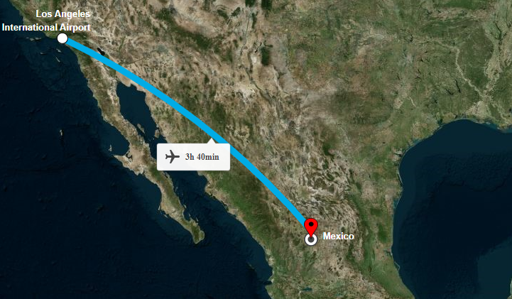
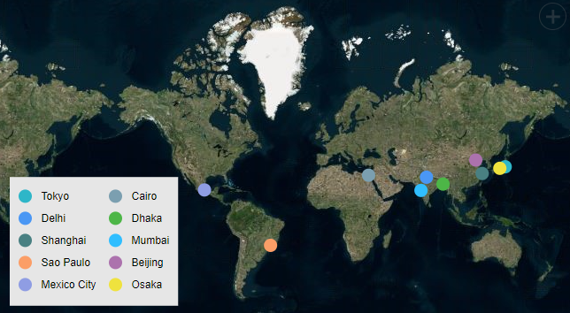

# Azure Maps in ##Platform_Name## Maps Component

Azure Maps is yet another online Maps provider, owned by Microsoft. As like OSM and Bing Maps, it provides Maps tile images based on our requests and combines those images into a single one to display Maps area.

## Adding Azure Maps



The Azure Maps can be rendered using the [`UrlTemplate`](https://help.syncfusion.com/cr/aspnetcore-js2/Syncfusion.EJ2.Maps.MapsLayer.html#Syncfusion_EJ2_Maps_MapsLayer_UrlTemplate) property with the tile server URL provided by online map providers. In the meantime, a subscription key is required for Azure Maps. Follow the steps in this [`link`](https://docs.microsoft.com/en-us/azure/search/search-security-api-keys) to generate an API key, and then added the key to the URL.

>Refer to [Azure Maps Licensing](https://azure.microsoft.com/en-in/support/legal/).












The Azure Maps can be rendered using the [`UrlTemplate`](https://help.syncfusion.com/cr/aspnetmvc-js2/Syncfusion.EJ2.Maps.MapsLayer.html#Syncfusion_EJ2_Maps_MapsLayer_UrlTemplate) property with the tile server URL provided by online map providers. In the meantime, a subscription key is required for Azure Maps. Follow the steps in this [`link`](https://docs.microsoft.com/en-us/azure/search/search-security-api-keys) to generate an API key, and then added the key to the URL.

>Refer to [Azure Maps Licensing](https://azure.microsoft.com/en-in/support/legal/).











## Enabling zooming and panning

The Azure Maps layer can be zoomed and panned. Zooming helps to get a closer look at a particular area on a map for in-depth analysis. Panning helps to move a map around to focus the targeted area.
























## Adding markers and navigation line



Markers can be added to the layers of Azure Maps by setting the corresponding location's coordinates of latitude and longitude using [`MarkerSettings`](https://help.syncfusion.com/cr/aspnetcore-js2/Syncfusion.EJ2.Maps.MapsLayer.html#Syncfusion_EJ2_Maps_MapsLayer_MarkerSettings). Navigation lines can be added on top of the Azure Maps layer for highlighting a path among various places by setting the corresponding location's coordinates of latitude and longitude in the [`NavigationLineSettings`](https://help.syncfusion.com/cr/aspnetcore-js2/Syncfusion.EJ2.Maps.MapsLayer.html#Syncfusion_EJ2_Maps_MapsLayer_NavigationLineSettings).












Markers can be added to the layers of Azure Maps by setting the corresponding location's coordinates of latitude and longitude using [`MarkerSettings`](https://help.syncfusion.com/cr/aspnetmvc-js2/Syncfusion.EJ2.Maps.MapsLayer.html#Syncfusion_EJ2_Maps_MapsLayer_MarkerSettings). Navigation lines can be added on top of the Azure Maps layer for highlighting a path among various places by setting the corresponding location's coordinates of latitude and longitude in the [`NavigationLineSettings`](https://help.syncfusion.com/cr/aspnetmvc-js2/Syncfusion.EJ2.Maps.MapsLayer.html#Syncfusion_EJ2_Maps_MapsLayer_NavigationLineSettings).











## Adding sublayer



Any GeoJSON shape can be rendered as a sublayer on top of the Azure Maps layer for highlighting a particular continent or country in Azure Maps by adding another layer and specifying the [`Type`](https://help.syncfusion.com/cr/aspnetcore-js2/Syncfusion.EJ2.Maps.MapsLayer.html#Syncfusion_EJ2_Maps_MapsLayer_Type) property of Maps layer to **SubLayer**.












Any GeoJSON shape can be rendered as a sublayer on top of the Azure Maps layer for highlighting a particular continent or country in Azure Maps by adding another layer and specifying the [`Type`](https://help.syncfusion.com/cr/aspnetmvc-js2/Syncfusion.EJ2.Maps.MapsLayer.html#Syncfusion_EJ2_Maps_MapsLayer_Type) property of Maps layer to **SubLayer**.











## Enabling legend



The legend can be added to the tile Maps by setting the [`Visible`](https://help.syncfusion.com/cr/aspnetcore-js2/Syncfusion.EJ2.Maps.MapsLegendSettings.html#Syncfusion_EJ2_Maps_MapsLegendSettings_Visible) property of [`LegendSettings`](https://help.syncfusion.com/cr/aspnetcore-js2/Syncfusion.EJ2.Maps.Maps.html#Syncfusion_EJ2_Maps_Maps_LegendSettings) to **true**.












The legend can be added to the tile Maps by setting the [`Visible`](https://help.syncfusion.com/cr/aspnetmvc-js2/Syncfusion.EJ2.Maps.MapsLegendSettings.html#Syncfusion_EJ2_Maps_MapsLegendSettings_Visible) property of [`LegendSettings`](https://help.syncfusion.com/cr/aspnetmvc-js2/Syncfusion.EJ2.Maps.Maps.html#Syncfusion_EJ2_Maps_Maps_LegendSettings) to **true**.











