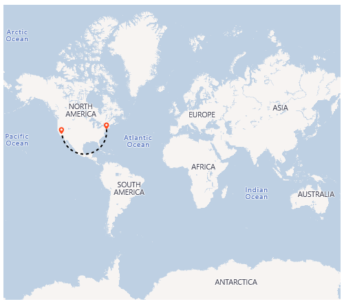
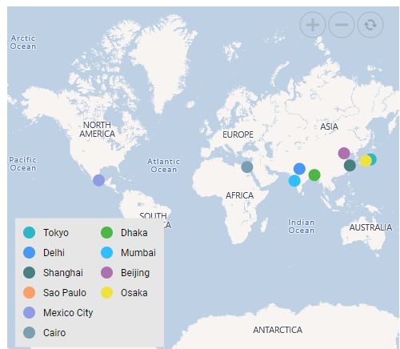

# Bing Maps

Bing Maps is a online Maps provider, owned by Microsoft. As like OSM, it provide Maps tile images based on our requests and combines those images into a single one to display Maps area.

## Adding Bing Maps

The Bing Maps can be rendered using the `UrlTempalte`property, which is based on the URL generated by the `GetBingUrlTemplate` method in the Maps. The format of the required URL of Bing Maps varies from other online map providers. As a result, a built-in `GetBingUrlTemplate` method has been included that returns the URL in a generic format. In the meantime, a subscription key is required for Bing Maps. The Bing Maps key can be obtained from [here](https://www.microsoft.com/en-us/maps/create-a-bing-maps-key), then append it to the Bing Maps URL before passing it to the `GetBingUrlTemplate` method. The URL returned by this method must be passed to the `UrlTemplate` property.
























## Types of Bing Maps

Bing Maps provides different types of Maps and it is supported in the Maps component.

* **Aerial** - Displays satellite images to highlight roads and major landmarks for easy identification.
* **AerialWithLabel** - Displays aerial Maps with labels for the continent, country, ocean, etc.
* **Road** - Displays the default Maps view of roads, buildings, and geography.
* **CanvasDark** - Displays dark version of the road Maps.
* **CanvasLight** - Displays light version of the road Maps.
* **CanvasGray** - Displays grayscale version of the road Maps.

To render the light version of the road Maps, set the `CanvasLight` value is passed via the URL into the `GetBingUrlTemplate` method demonstrated in the following code sample.
























## Enabling zooming and panning

Bing Maps layer can be zoomed and panned. Zooming helps to get a closer look at a particular area on a Maps for in-depth analysis. Panning helps to move a Maps around to focus the targeted area.
























## Adding markers and navigation line

Markers can be added to the layers of Bing Maps by setting the corresponding location's coordinates of latitude and longitude using `MarkerSettings`. Navigation lines can be added on top of an Bing Maps layer for highlighting a path among various places by setting the corresponding location's coordinates of latitude and longitude in the `NavigationLineSettings`.
























## Adding sublayer

Any GeoJSON shape can be rendered as a sublayer on top of the Bing Maps layer for highlighting a particular continent or country in Bing Maps by adding another layer and specifying the `Type` property of Maps layer to **SubLayer**.
























## Enabling legend

The legend can be added to the tile Maps by setting the `Visible` property of `MapsLegendSettings` to **true**.
























