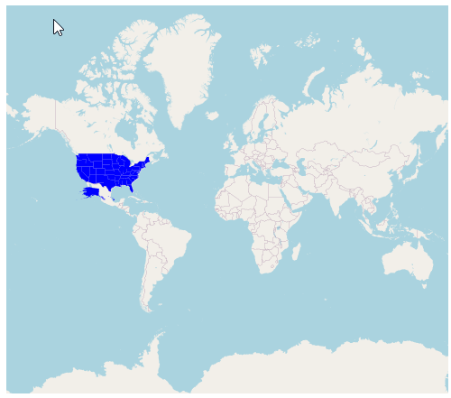
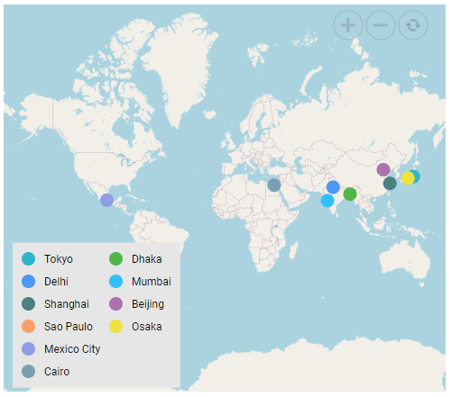

# OpenStreetMaps in ##Platform_Name## Maps Component

The OpenStreetMap (OSM) is the online Maps provider built by a community of developers; it is free to use under an open license. It allows to view geographical data in a collaborative way from anywhere on the earth. The OSM Maps provides small tile images based on our requests and combines those images into a single image to display the Maps area in the Maps component.

## Adding OpenStreetMap



The OSM Maps can be rendered using the [`UrlTemplate`](https://help.syncfusion.com/cr/aspnetcore-js2/Syncfusion.EJ2.Maps.MapsLayer.html#Syncfusion_EJ2_Maps_MapsLayer_UrlTemplate) property.












The OSM Maps can be rendered using the [`UrlTemplate`](https://help.syncfusion.com/cr/aspnetmvc-js2/Syncfusion.EJ2.Maps.MapsLayer.html#Syncfusion_EJ2_Maps_MapsLayer_UrlTemplate) property.











### Changing the tile server of the OpenStreetMap

The OSM tile server can be changed by setting the tile URL in the `UrlTemplate` property. For more details about the OSM tile server, refer [here](https://wiki.openstreetmap.org/wiki/Tiles).

## Enabling zooming and panning

The OSM Maps layer can be zoomed and panned. Zooming helps to get a closer look at a particular area on a Maps for in-depth analysis. Panning helps to move a Maps around to focus the targeted area.
























## Adding markers and navigation line



Markers can be added to the layers of OSM Maps by setting the corresponding location's coordinates of latitude and longitude using [`MarkerSettings`](https://help.syncfusion.com/cr/aspnetcore-js2/Syncfusion.EJ2.Maps.MapsLayer.html#Syncfusion_EJ2_Maps_MapsLayer_MarkerSettings). Navigation lines can be added on top of an OSM Maps layer for highlighting a path among various places by setting the corresponding location's coordinates of latitude and longitude in the [`NavigationLineSettings`](https://help.syncfusion.com/cr/aspnetcore-js2/Syncfusion.EJ2.Maps.MapsLayer.html#Syncfusion_EJ2_Maps_MapsLayer_NavigationLineSettings).












Markers can be added to the layers of OSM Maps by setting the corresponding location's coordinates of latitude and longitude using [`MarkerSettings`](https://help.syncfusion.com/cr/aspnetmvc-js2/Syncfusion.EJ2.Maps.MapsLayer.html#Syncfusion_EJ2_Maps_MapsLayer_MarkerSettings). Navigation lines can be added on top of an OSM Maps layer for highlighting a path among various places by setting the corresponding location's coordinates of latitude and longitude in the [`NavigationLineSettings`](https://help.syncfusion.com/cr/aspnetmvc-js2/Syncfusion.EJ2.Maps.MapsLayer.html#Syncfusion_EJ2_Maps_MapsLayer_NavigationLineSettings).











## Adding sublayer



Any GeoJSON shape can be rendered as a sublayer on top of the OSM Maps layer for highlighting a particular continent or country in OSM Maps by adding another layer and specifying the [`Type`](https://help.syncfusion.com/cr/aspnetcore-js2/Syncfusion.EJ2.Maps.MapsLayer.html#Syncfusion_EJ2_Maps_MapsLayer_Type) property of Maps layer to **SubLayer**.












Any GeoJSON shape can be rendered as a sublayer on top of the OSM Maps layer for highlighting a particular continent or country in OSM Maps by adding another layer and specifying the [`Type`](https://help.syncfusion.com/cr/aspnetmvc-js2/Syncfusion.EJ2.Maps.MapsLayer.html#Syncfusion_EJ2_Maps_MapsLayer_Type) property of Maps layer to **SubLayer**.











## Enabling legend



The legend can be added to the tile Maps by setting the [`Visible`](https://help.syncfusion.com/cr/aspnetcore-js2/Syncfusion.EJ2.Maps.MapsLegendSettings.html#Syncfusion_EJ2_Maps_MapsLegendSettings_Visible) property of [`LegendSettings`](https://help.syncfusion.com/cr/aspnetcore-js2/Syncfusion.EJ2.Maps.Maps.html#Syncfusion_EJ2_Maps_Maps_LegendSettings) to **true**.












The legend can be added to the tile Maps by setting the [`Visible`](https://help.syncfusion.com/cr/aspnetmvc-js2/Syncfusion.EJ2.Maps.MapsLegendSettings.html#Syncfusion_EJ2_Maps_MapsLegendSettings_Visible) property of [`LegendSettings`](https://help.syncfusion.com/cr/aspnetmvc-js2/Syncfusion.EJ2.Maps.Maps.html#Syncfusion_EJ2_Maps_Maps_LegendSettings) to **true**.











