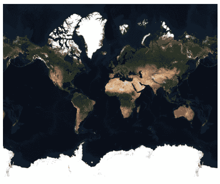
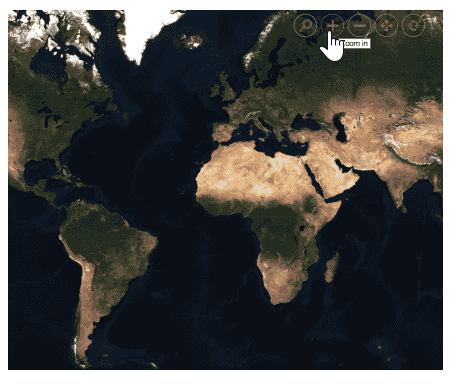
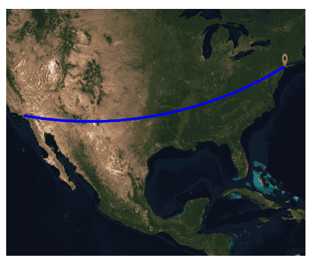
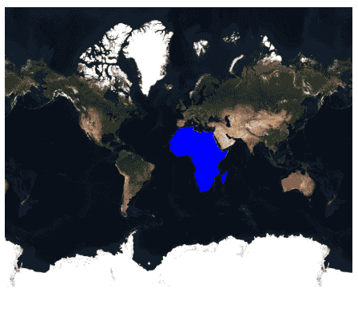
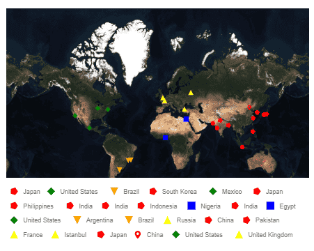

# MapTiler in ##Platform_Name## Maps Component



MapTiler, an online map provider, owned by MapTiler AG, a Swiss companyoffers map tile images based on user requests. The Syncfusion EJ2 Maps control then combines these images into a single display to present the map. To display an MapTiler map, you can specify its tile service URL in the [urlTemplate](https://help.syncfusion.com/cr/aspnetcore-js2/Syncfusion.EJ2.Maps.MapsLayer.html#Syncfusion_EJ2_Maps_MapsLayer_UrlTemplate) property.



MapTiler, an online map provider, owned by MapTiler AG, a Swiss company, offers map tile images based on user requests. The Syncfusion EJ2 Maps control then combines these images into a single display to present the map. To display an MapTiler map, you can specify its tile service URL in the [UrlTemplate](https://help.syncfusion.com/cr/aspnetmvc-js2/Syncfusion.EJ2.Maps.MapsLayer.html#Syncfusion_EJ2_Maps_MapsLayer_UrlTemplate) property.



## Displaying MapTiler

The MapTiler map tile service can be accessed via the following URL:
https://api.maptiler.com/tiles/satellite-v2/{z}/{x}/{y}.jpg?key=Your_Key

In the above URL template,

* {z} - It represents the zoom level of the map.
* {x} - It represents the horizontal position of the tile.
* {y} - It represents the vertical position of the tile. 

These placeholders are replaced by **level**, **tileX**, and **tileY**, respectively, to retrieve the correct map tile.

N> You can refer this documentation [link](https://docs.maptiler.com/cloud/api/tiles/#xyz-tiles) for the latest URL template for MapTiler.

The **subscription_key** is required and must be included in the URL to authenticate and access the map tiles. Follow the steps in this [link](https://docs.maptiler.com/cloud/api/authentication-key/#api-key) to generate an API key, and then add this key to the URL.



In the following example, the MapTiler map is displayed by setting [urlTemplate](https://help.syncfusion.com/cr/aspnetcore-js2/Syncfusion.EJ2.Maps.MapsLayer.html#Syncfusion_EJ2_Maps_MapsLayer_UrlTemplate) property with its tile server URL.












In the following example, the MapTiler can be rendered using the [UrlTemplate](https://help.syncfusion.com/cr/aspnetmvc-js2/Syncfusion.EJ2.Maps.MapsLayer.html#Syncfusion_EJ2_Maps_MapsLayer_UrlTemplate) property with its tile server URL.











## Enabling zooming and panning

The MapTiler map layer supports both zooming and panning. Zooming allows you to take a closer look at a particular area on the map for in-depth analysis, while panning enables you to move the map around to focus on the target area.
























## Adding markers and navigation line



Markers can be added to the MapTiler map layer by setting the latitude and longitude coordinates of the desired location using [MarkerSettings](https://help.syncfusion.com/cr/aspnetcore-js2/Syncfusion.EJ2.Maps.MapsLayer.html#Syncfusion_EJ2_Maps_MapsLayer_MarkerSettings).Additionally, navigation lines can be added on top of the MapTiler map layer to highlight paths between various places by specifying the corresponding latitude and longitude coordinates in the [NavigationLineSettings](https://help.syncfusion.com/cr/aspnetcore-js2/Syncfusion.EJ2.Maps.MapsLayer.html#Syncfusion_EJ2_Maps_MapsLayer_NavigationLineSettings).












Markers can be added to the MapTiler map layer by setting the latitude and longitude coordinates of the desired location using [MarkerSettings](https://help.syncfusion.com/cr/aspnetmvc-js2/Syncfusion.EJ2.Maps.MapsLayer.html#Syncfusion_EJ2_Maps_MapsLayer_MarkerSettings). Additionally, navigation lines can be added on top of the MapTiler map layer to highlight paths between various places by specifying the corresponding latitude and longitude coordinates in the [NavigationLineSettings](https://help.syncfusion.com/cr/aspnetmvc-js2/Syncfusion.EJ2.Maps.MapsLayer.html#Syncfusion_EJ2_Maps_MapsLayer_NavigationLineSettings).











## Adding sublayer



Any GeoJSON shape can be rendered as a sublayer on top of the MapTiler layer to highlight a particular continent or country. This is achieved by adding another layer and setting the [Type](https://help.syncfusion.com/cr/aspnetcore-js2/Syncfusion.EJ2.Maps.MapsLayer.html#Syncfusion_EJ2_Maps_MapsLayer_Type) property of Maps layer to **SubLayer**.












Any GeoJSON shape can be rendered as a sublayer on top of the MapTiler layer to highlight a particular continent or country. This is achieved by adding another layer and setting the [Type](https://help.syncfusion.com/cr/aspnetmvc-js2/Syncfusion.EJ2.Maps.MapsLayer.html#Syncfusion_EJ2_Maps_MapsLayer_Type) property of Maps layer to **SubLayer**.











## Enabling legend



The legend can be added to the tile Maps by setting the [Visible](https://help.syncfusion.com/cr/aspnetcore-js2/Syncfusion.EJ2.Maps.MapsLegendSettings.html#Syncfusion_EJ2_Maps_MapsLegendSettings_Visible) property of [LegendSettings](https://help.syncfusion.com/cr/aspnetcore-js2/Syncfusion.EJ2.Maps.Maps.html#Syncfusion_EJ2_Maps_Maps_LegendSettings) to **true**.

In the example below, the legend is added to the markers on the MapTiler map layer.












The legend can be added to the tile Maps by setting the [Visible](https://help.syncfusion.com/cr/aspnetmvc-js2/Syncfusion.EJ2.Maps.MapsLegendSettings.html#Syncfusion_EJ2_Maps_MapsLegendSettings_Visible) property of [LegendSettings](https://help.syncfusion.com/cr/aspnetmvc-js2/Syncfusion.EJ2.Maps.Maps.html#Syncfusion_EJ2_Maps_Maps_LegendSettings) to **true**.

In the example below, the legend is added to the markers on the MapTiler map layer.











