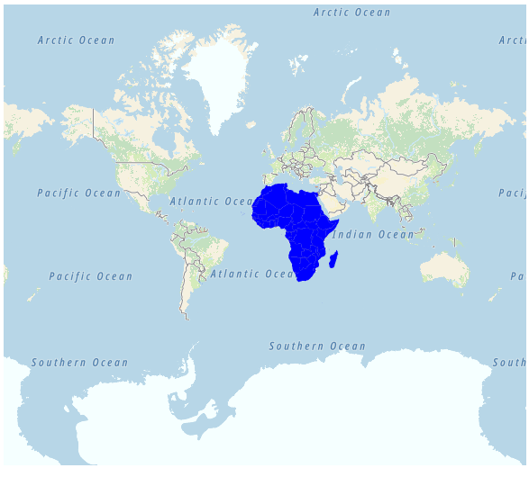
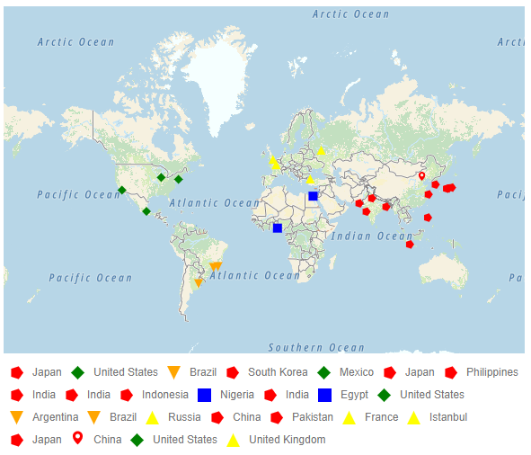

# Other Maps providers



Apart from OpenStreetMap and Bing Maps, you can also render Maps from other online map service providers by specifying the URL provided by those providers in the [UrlTemplate](https://help.syncfusion.com/cr/aspnetcore-js2/Syncfusion.EJ2.Maps.MapsLayer.html#Syncfusion_EJ2_Maps_MapsLayer_UrlTemplate) property. The URL template concept has been implemented in such a way that any online map service providers using the following template can benefit from previewing their Map in the Syncfusion ##Platform_Name## Maps component.

<!-- markdownlint-disable MD034 -->

Sample Template: https://< domain_name >/maps/basic/{z}/{x}/{y}.PNG

* "${z}" - It represents zoom factor (level).
* "${x}" - It indicates tile image x-position (tileX).
* "${y}" - It indicates tile image y-position (tileY).

In this case, the key generated for those online map service providers can also be appended to the URL. This allows to create personalized Maps with your own content and imagery.

Below is the example of adding TomTom map. You can follow the steps in this [link](https://developer.tomtom.com/map-display-api/documentation/product-information/introduction) to generate an API key, and then added the key to the URL.












Apart from OpenStreetMap and Bing Maps, you can also render Maps from other online map service providers by specifying the URL provided by those providers in the [UrlTemplate](https://help.syncfusion.com/cr/aspnetmvc-js2/Syncfusion.EJ2.Maps.MapsLayer.html#Syncfusion_EJ2_Maps_MapsLayer_UrlTemplate) property. The URL template concept has been implemented in such a way that any online map service providers using the following template can benefit from previewing their Map in the Syncfusion ##Platform_Name## Maps component.

<!-- markdownlint-disable MD034 -->

Sample Template: https://< domain_name >/maps/basic/{z}/{x}/{y}.PNG

* "${z}" - It represents zoom factor (level).
* "${x}" - It indicates tile image x-position (tileX).
* "${y}" - It indicates tile image y-position (tileY).

In this case, the key generated for those online map service providers can also be appended to the URL. This allows to create personalized Maps with your own content and imagery.

Below is the example of adding TomTom map. You can follow the steps in this [link](https://developer.tomtom.com/map-display-api/documentation/product-information/introduction) to generate an API key, and then added the key to the URL.











## Enabling zooming and panning

Tile Maps layer can be zoomed and panned. Zooming helps to get a closer look at a particular area on a Maps for in-depth analysis. Panning helps to move a Maps around to focus the targeted area.
























## Adding markers and navigation line



Markers can be added to the layers of tile Maps by setting the corresponding location's coordinates of latitude and longitude using [MarkerSettings](https://help.syncfusion.com/cr/aspnetcore-js2/Syncfusion.EJ2.Maps.MapsLayer.html#Syncfusion_EJ2_Maps_MapsLayer_MarkerSettings). Navigation lines can be added on top of an tile Maps layer for highlighting a path among various places by setting the corresponding location's coordinates of latitude and longitude in the [NavigationLineSettings](https://help.syncfusion.com/cr/aspnetcore-js2/Syncfusion.EJ2.Maps.MapsLayer.html#Syncfusion_EJ2_Maps_MapsLayer_NavigationLineSettings).












Markers can be added to the layers of tile Maps by setting the corresponding location's coordinates of latitude and longitude using [MarkerSettings](https://help.syncfusion.com/cr/aspnetmvc-js2/Syncfusion.EJ2.Maps.MapsLayer.html#Syncfusion_EJ2_Maps_MapsLayer_MarkerSettings). Navigation lines can be added on top of an tile Maps layer for highlighting a path among various places by setting the corresponding location's coordinates of latitude and longitude in the [NavigationLineSettings](https://help.syncfusion.com/cr/aspnetmvc-js2/Syncfusion.EJ2.Maps.MapsLayer.html#Syncfusion_EJ2_Maps_MapsLayer_NavigationLineSettings).











## Adding sublayer



Any GeoJSON shape can be rendered as a sublayer on top of the tile Maps layer for highlighting a particular continent or country in tile Maps by adding another layer and specifying the [Type](https://help.syncfusion.com/cr/aspnetcore-js2/Syncfusion.EJ2.Maps.MapsLayer.html#Syncfusion_EJ2_Maps_MapsLayer_Type) property of Maps layer to **SubLayer**.












Any GeoJSON shape can be rendered as a sublayer on top of the tile Maps layer for highlighting a particular continent or country in tile Maps by adding another layer and specifying the [Type](https://help.syncfusion.com/cr/aspnetmvc-js2/Syncfusion.EJ2.Maps.MapsLayer.html#Syncfusion_EJ2_Maps_MapsLayer_Type) property of Maps layer to **SubLayer**.











## Enabling legend



The legend can be added to the tile Maps by setting the [Visible](https://help.syncfusion.com/cr/aspnetcore-js2/Syncfusion.EJ2.Maps.MapsLegendSettings.html#Syncfusion_EJ2_Maps_MapsLegendSettings_Visible) property of [LegendSettings](https://help.syncfusion.com/cr/aspnetcore-js2/Syncfusion.EJ2.Maps.Maps.html#Syncfusion_EJ2_Maps_Maps_LegendSettings) to **true**.












The legend can be added to the tile Maps by setting the [Visible](https://help.syncfusion.com/cr/aspnetmvc-js2/Syncfusion.EJ2.Maps.MapsLegendSettings.html#Syncfusion_EJ2_Maps_MapsLegendSettings_Visible) property of [LegendSettings](https://help.syncfusion.com/cr/aspnetmvc-js2/Syncfusion.EJ2.Maps.Maps.html#Syncfusion_EJ2_Maps_Maps_LegendSettings) to **true**.











