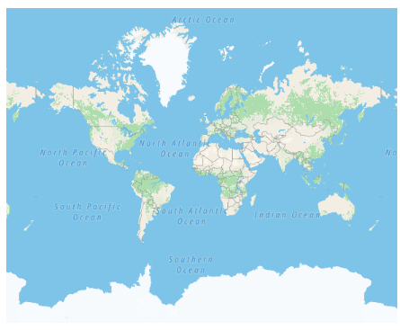

# TomTom Map in ##Platform_Name## Maps Component



TomTom Map is another online Maps provider, owned by TomTom N.V.(Naamloze Vennootschap). As like OSM and Bing Maps, it provides Maps tile images based on our requests and combines those images into a single one to display Maps area. The TomTom Map can be rendered from online map service providers by specifying the URL provided by those providers in the [urlTemplate](https://help.syncfusion.com/cr/aspnetcore-js2/Syncfusion.EJ2.Maps.MapsLayer.html#Syncfusion_EJ2_Maps_MapsLayer_UrlTemplate) property. The URL template is designed to enable seamless integration of TomTom Map online map services, allowing users to preview their maps in the Syncfusion EJ2 Maps Component.



TomTom Map is another online Maps provider, owned by TomTom N.V.(Naamloze Vennootschap). As like OSM and Bing Maps, it provides Maps tile images based on our requests and combines those images into a single one to display Maps area. The TomTom Map can be rendered from online map service providers by specifying the URL provided by those providers in the [UrlTemplate](https://help.syncfusion.com/cr/aspnetmvc-js2/Syncfusion.EJ2.Maps.MapsLayer.html#Syncfusion_EJ2_Maps_MapsLayer_UrlTemplate) property. The URL template is designed to enable seamless integration of TomTom Map online map services, allowing users to preview their maps in the Syncfusion EJ2 Maps Component.



## Adding TomTom Map

The TomTom map tile service can be accessed via the following URL:
https://api.tomtom.com/maps/orbis/map-display/tile/{zoom}/{X}/{Y}.png?apiVersion=1&style=street-light&key=Your_Key

In the above URL template,

* {zoom} - It represents the zoom level of the map.
* {X} - It represents the horizontal position of the tile.
* {Y} - It represents the vertical position of the tile. 

These placeholders are replaced by **level**, **tileX**, and **tileY**, respectively, to fetch the correct map tile.

>You can refer this documentation [link](https://developer.tomtom.com/map-display-api/documentation/tomtom-orbis-maps/raster-tile) for the latest URL template for TomTom Map.

The subscription_key is required and must be included in the URL to authenticate and access the map tiles. Follow the steps in this [link](https://developer.tomtom.com/platform/documentation/dashboard/api-key-management#start-using-your-api-key) to generate an API key, and then added the key to the URL.

You can customize the tile types in TomTom Map by adjusting the **style** parameter in the URL. For example, setting the style to **street-light** in the URL displays light-themed tiles, which can be rendered in the Syncfusion Maps Component. Similarly, setting the style to **street-dark** switches to dark-themed tiles.



In the follwing example, the TomTom Map can be rendered using the [urlTemplate](https://help.syncfusion.com/cr/aspnetcore-js2/Syncfusion.EJ2.Maps.MapsLayer.html#Syncfusion_EJ2_Maps_MapsLayer_UrlTemplate) property with the tile server URL provided by online map providers.












In the follwing example, the TomTom Map can be rendered using the [UrlTemplate](https://help.syncfusion.com/cr/aspnetmvc-js2/Syncfusion.EJ2.Maps.MapsLayer.html#Syncfusion_EJ2_Maps_MapsLayer_UrlTemplate) property with the tile server URL provided by online map providers.











## Enabling zooming and panning

The TomTom Map layer can be zoomed and panned. Zooming helps to get a closer look at a particular area on a map for in-depth analysis. Panning helps to move a map around to focus the targeted area.
























## Adding markers and navigation line



Markers can be added to the layers of TomTom Map by setting the corresponding location's coordinates of latitude and longitude using [MarkerSettings](https://help.syncfusion.com/cr/aspnetcore-js2/Syncfusion.EJ2.Maps.MapsLayer.html#Syncfusion_EJ2_Maps_MapsLayer_MarkerSettings). Navigation lines can be added on top of the TomTom Map layer for highlighting a path among various places by setting the corresponding location's coordinates of latitude and longitude in the [NavigationLineSettings](https://help.syncfusion.com/cr/aspnetcore-js2/Syncfusion.EJ2.Maps.MapsLayer.html#Syncfusion_EJ2_Maps_MapsLayer_NavigationLineSettings).












Markers can be added to the layers of TomTom Map by setting the corresponding location's coordinates of latitude and longitude using [MarkerSettings](https://help.syncfusion.com/cr/aspnetmvc-js2/Syncfusion.EJ2.Maps.MapsLayer.html#Syncfusion_EJ2_Maps_MapsLayer_MarkerSettings). Navigation lines can be added on top of the TomTom Map layer for highlighting a path among various places by setting the corresponding location's coordinates of latitude and longitude in the [NavigationLineSettings](https://help.syncfusion.com/cr/aspnetmvc-js2/Syncfusion.EJ2.Maps.MapsLayer.html#Syncfusion_EJ2_Maps_MapsLayer_NavigationLineSettings).











## Adding sublayer



Any GeoJSON shape can be rendered as a sublayer on top of the TomTom Map layer for highlighting a particular continent or country in TomTom Map by adding another layer and specifying the [Type](https://help.syncfusion.com/cr/aspnetcore-js2/Syncfusion.EJ2.Maps.MapsLayer.html#Syncfusion_EJ2_Maps_MapsLayer_Type) property of Maps layer to **SubLayer**.












Any GeoJSON shape can be rendered as a sublayer on top of the TomTom Map layer for highlighting a particular continent or country in TomTom Map by adding another layer and specifying the [Type](https://help.syncfusion.com/cr/aspnetmvc-js2/Syncfusion.EJ2.Maps.MapsLayer.html#Syncfusion_EJ2_Maps_MapsLayer_Type) property of Maps layer to **SubLayer**.











## Enabling legend



The legend can be added to the tile Maps by setting the [Visible](https://help.syncfusion.com/cr/aspnetcore-js2/Syncfusion.EJ2.Maps.MapsLegendSettings.html#Syncfusion_EJ2_Maps_MapsLegendSettings_Visible) property of [LegendSettings](https://help.syncfusion.com/cr/aspnetcore-js2/Syncfusion.EJ2.Maps.Maps.html#Syncfusion_EJ2_Maps_Maps_LegendSettings) to **true**.












The legend can be added to the tile Maps by setting the [Visible](https://help.syncfusion.com/cr/aspnetmvc-js2/Syncfusion.EJ2.Maps.MapsLegendSettings.html#Syncfusion_EJ2_Maps_MapsLegendSettings_Visible) property of [LegendSettings](https://help.syncfusion.com/cr/aspnetmvc-js2/Syncfusion.EJ2.Maps.Maps.html#Syncfusion_EJ2_Maps_Maps_LegendSettings) to **true**.











